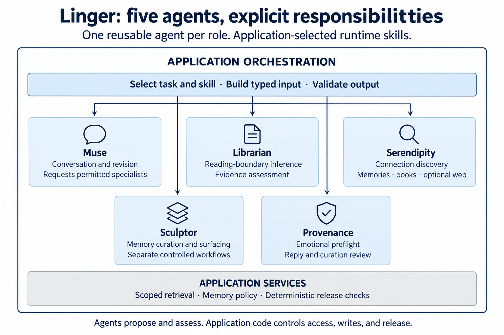
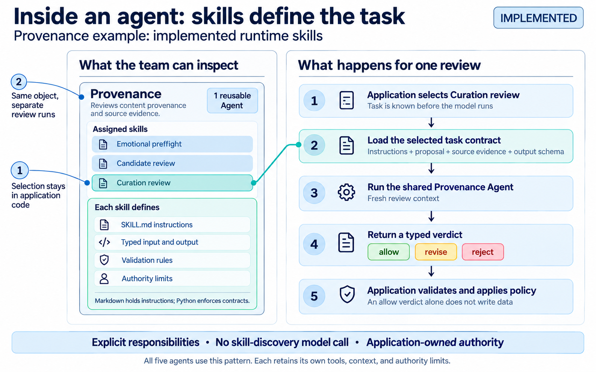

# Linger

Linger is a multi-agent AI systems project developed for the NUS-ISS Graduate
Certificate in Architecting AI Systems. It investigates how specialised agents
can coordinate reasoning, tool use, and memory with traceable decisions and
explicit security and privacy controls.

The application is a personal reflection and memory companion. It aims to help
people understand why an idea or experience mattered, preserve that meaning,
and rediscover relevant connections over time, starting with conversations and
a small literary corpus.

## Multi-agent architecture



**Muse** conducts the conversation and requests specialist assistance.
**Librarian** assesses reading boundaries and book evidence. **Serendipity**
explores connections across memories, books, and authorised web sources.
**Sculptor** proposes memory curation and surfacing decisions in separate
controlled workflows. **Provenance** reviews emotional boundaries, reply
candidates, and curation proposals.

Each role uses one reusable PydanticAI Agent with application-selected runtime
skills. Typed task contracts keep each invocation's context and permissions
explicit. Application code coordinates the handoffs and controls retrieval,
memory writes, and user-visible output. See the
[agent runtime architecture](docs/agent-skills.md) for the contracts and consumers.

The project explores evidence-backed connection discovery, retrieval constrained
by reading progress, and memory curation that preserves original records.
Human-reviewed synthetic scenarios evaluate coordination, security boundaries,
and decisions to clarify or decline. Automated tests and privacy-conscious
tracing support verification and diagnosis.

<details>
<summary>How runtime skills work</summary>



Provenance illustrates the shared pattern. The application selects a skill and
supplies its instructions, evidence, and output schema before the model runs.
Each review uses fresh context through the same Agent object. An `allow` verdict
still requires application validation before any memory change. Other roles
retain their own tools and context rules, including Muse's session history.

</details>

## Current prototype

The local app supports chat, book-grounded reflection, and connections to
available memories and optional public-web sources. Interactive memory capture
is disabled, and the app exposes no memory-management actions. Controlled
workflows support capture and curation; the full conversational capture,
curation, and later surfacing sequence remains a target.

This is a single-user prototype with no end-user authentication. Conversation
history lives in the backend process and disappears on restart. Chat content
is sent to the configured model provider. Optional backend telemetry records
metadata rather than conversation content. Synthetic evaluations may also
record synthetic inputs and outputs. See the [telemetry contract](docs/telemetry.md).

The stack is Python, FastAPI, Pydantic AI, and React.

## Run locally

### Prerequisites

- [Python](https://www.python.org/) 3.12 or later
- [uv](https://docs.astral.sh/uv/) for Python environments and locked dependencies
- [Node.js](https://nodejs.org/) 20.19+ or 22.12+ and [pnpm](https://pnpm.io/) for the frontend
- An API key for Google, OpenAI, or Anthropic

### Install and configure

From the repository root, create `.env` if you do not already have one:

```bash
cp -f .env.example .env
```

Install the dependencies:

```bash
uv sync --dev
pnpm install --dir apps/frontend
```

Edit `.env` to set `LINGER_MODEL` and the matching API key. The example selects
`openai:gpt-5.6-luna`, which requires `OPENAI_API_KEY`. Models with the `google:`
prefix use `GOOGLE_API_KEY`; models with `anthropic:` use `ANTHROPIC_API_KEY`.
Only the selected provider's key is needed.

Public-web discovery is optional and requires both `EXA_API_KEY` and
`LINGER_WEB_SEARCH_ENABLED=true`. See [app configuration](apps/README.md#setup)
for other settings and [evaluation setup](evals/synthetic_journals/README.md#human-gated-end-to-end-workflow)
for Logfire credentials.

### Start the app

Run these commands in two terminals from the repository root:

```bash
# Terminal 1: API at http://127.0.0.1:8000
uv run uvicorn apps.backend.main:app --reload
```

```bash
# Terminal 2: UI at http://localhost:5173
pnpm --dir apps/frontend dev
```

Open <http://localhost:5173>. Interactive API documentation is available at
<http://127.0.0.1:8000/docs>.

## Try a conversation

For a book-grounded reflection, send a message such as:

> I've finished Chapter 2 of Alice's Adventures in Wonderland. Alice's changes
> in size made me think about feeling out of place. Can we explore that?

This gives Linger both a book and a completed reading boundary. Any retrieved
book passages must stay within that boundary. If the book or your progress is
unclear, Linger asks for clarification. Naming a book alone does not establish
reading progress.

The default configuration enables these books:

- *Alice's Adventures in Wonderland*
- *Animal Farm*
- *The Adventures of Pinocchio*
- *Narrative of the Life of Frederick Douglass, an American Slave*
- *The Story of My Life*

The local frontend also includes two developer tools:

- **Reader** browses canonical books by chapter or named section. Its navigation
  does not set reading progress for chat.
- **Inspect** shows a turn's context, agent outcomes, release decisions, and
  Logfire trace ID. Its diagnostics grant no runtime authority.

Both tools are for local development and should be omitted from a product frontend.

## Skills

Ask your coding agent to use these project-local skills:

- [Format book corpus](.agents/skills/format-book-corpus/SKILL.md) converts book
  sources into Linger's canonical Markdown format and validates content integrity.
- [Plan synthetic scenarios](.agents/skills/plan-synthetic-scenarios/SKILL.md)
  plans evaluation Objectives and prepares a generator prompt without generating data.
- [Review synthetic Ground truth](.agents/skills/review-synthetic-ground-truth/SKILL.md)
  guides human review and adoption of proposed Ground truth, then runs a supported
  replay after confirmation.
- [Run scenario](.agents/skills/run-scenario/SKILL.md) runs a saved scenario selected
  from a numbered menu after provider and model confirmation and credential checks.
  It returns a Logfire link and saves an analysis report covering every Scene,
  including potentially misleading passes.

## Run checks and evaluations

Run the tests, frontend lint, and production build from the repository root:

```bash
uv run pytest
pnpm --dir apps/frontend test
pnpm --dir apps/frontend lint
pnpm --dir apps/frontend build
```

The [synthetic evaluation guide](evals/synthetic_journals/README.md) covers
scenario generation, independent human Ground truth adoption, supported
Objectives, and replay. Use the Skills above to follow those workflows.

Individual agent evaluation guides cover [Muse](evals/muse/README.md),
[Librarian](evals/librarian/README.md), [Provenance](evals/provenance/README.md),
[Serendipity](evals/serendipity/README.md), and [Sculptor](evals/sculptor/README.md).

## Documentation

- [Architecture](docs/agent-skills.md): agent roles, runtime skills, typed
  contracts, and application ownership.
- [App guide](apps/README.md): configuration, API, and backend workflow.
- [Book registration](docs/book-registration.md) and
  [corpus formats](docs/corpus/canonical-sections.md): add books, understand
  reading boundaries, and validate canonical sources.
- [Telemetry](docs/telemetry.md): what backend and evaluation runs send to Logfire.
- [Product specification](docs/specification.md): product scope and acceptance
  criteria, including target behavior that is not yet implemented.
- [Contributor instructions](AGENTS.md): repository workflow and Beads task tracking.
