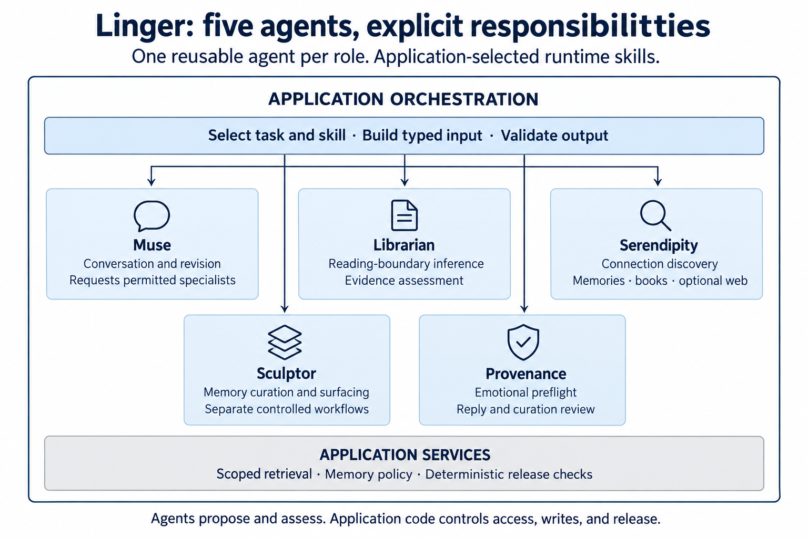
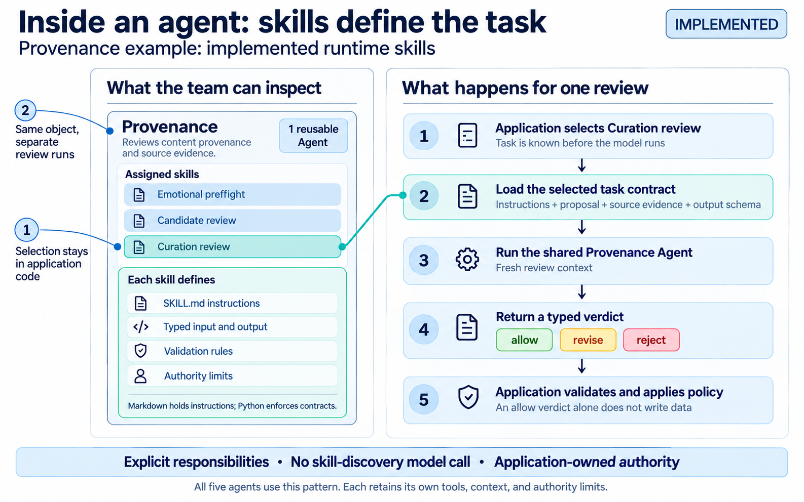

# Linger

For tested images, release approval, and deployment with `compose.release.yaml`,
see the [release guide](docs/releasing.md).

Linger is a multi-agent AI systems project developed for the NUS-ISS Graduate
Certificate in Architecting AI Systems. It investigates how specialised agents
can coordinate reasoning, tool use, and memory with traceable decisions and
explicit security and privacy controls.

The application is a personal reflection and memory companion. It aims to help
people understand why an idea or experience mattered, preserve that meaning,
and rediscover relevant connections over time, starting with conversations and
a small literary corpus.

## Multi-agent architecture



**Muse** conducts the conversation and requests specialist assistance.
**Librarian** assesses reading boundaries and book evidence. **Serendipity**
recalls saved memories and explores connections across memories, books, and
authorised web sources.
**Sculptor** proposes memory curation after a reviewed capture. Its offline
tasks evaluate memory surfacing, propose chapter search cues, analyse retrieval
failures, and research retrieval improvements. **Provenance** reviews emotional
boundaries, reply candidates, and curation proposals.

Each role uses one reusable PydanticAI Agent with application-selected runtime
skills. Typed task contracts keep each invocation's context and permissions
explicit. Application code coordinates the handoffs and controls retrieval,
memory writes, and user-visible output. See the
[agent runtime architecture](docs/agent-skills.md) for the contracts and consumers.

The project explores evidence-backed connection discovery, retrieval constrained
by reading progress, and memory curation that preserves original records.
Human-reviewed synthetic scenarios evaluate coordination, security boundaries,
and decisions to clarify or decline. Automated tests and privacy-conscious
tracing support verification and diagnosis.

<details>
<summary>How runtime skills work</summary>



Provenance illustrates the shared pattern. The application selects a skill and
supplies its instructions, evidence, and output schema before the model runs.
Each review uses fresh context through the same Agent object. An `allow` verdict
still requires application validation before any memory change. Other roles
retain their own tools and context rules, including Muse's session history.

</details>

## Current prototype

The local app places English-language chat, a live agent map, and turn inspection
on one page.
It supports book-grounded reflection, recall from available account memories,
and connections to memories, books, and optional public-web sources. A recall
request can return one matching memory without requiring alternative candidates.
General factual questions do not use private memories as reference material.

After emotional preflight, Muse classifies the current message with its turn-triage skill.
Application code uses that result and the available reading context to expose
only the relevant specialist tools. Reflection instructions include the modules
for those tools, plus revision guidance when a reply needs correction.

Librarian breaks book questions into focused searches and assesses the evidence
against the full request. Reading permission comes from explicit progress or
validated inference from reader statements and eligible memories. Provenance
reviews the complete reply, including quotations, attribution, and claim
support. Bounded repairs check quotation text and retain source mappings for
unchanged accepted claims before the application checks release.
An explicit completed chapter carries across follow-ups about the same book
and part. A correction can lower or retract that permission. The chapter
ceiling lasts only for the running session; it is not a durable reading log.

Interactive memory capture is on by default, and the app exposes no
memory-management actions. Linger also remembers the chapter a reader
declared for each book, so a later conversation about that book does not ask
again. Controlled workflows support reviewed capture,
Sculptor curation, Provenance review, and application of approved derived
changes while preserving original records. Memory surfacing runs only in
offline evaluation.

This is a prototype with username and password accounts. Accounts and
per-account conversation history persist in local SQLite files under `data/`
and survive restarts. Signing in restores saved chats and continues the latest
conversation. **New chat** starts another conversation while keeping earlier
ones in the feed. **Delete** removes a conversation and its saved inspection
details. Chat content is sent to the configured model provider. Optional backend
telemetry records
metadata rather than conversation content. Synthetic evaluations may also
record synthetic inputs and outputs. See the [telemetry contract](docs/telemetry.md).

The stack is Python, FastAPI, Pydantic AI, and React.

## Run locally

### Prerequisites

- [Python](https://www.python.org/) 3.12 or later
- [uv](https://docs.astral.sh/uv/) for Python environments and locked dependencies
- [Node.js](https://nodejs.org/) 20.19+ or 22.12+ and [pnpm](https://pnpm.io/) for the frontend
- An API key for Google, OpenAI, or Anthropic

### Install and configure

From the repository root, create `.env` if you do not already have one:

```bash
cp -f .env.example .env
```

Install the dependencies:

```bash
uv sync --dev
pnpm install --dir apps/frontend
```

Edit `.env` to set `LINGER_MODEL` and the matching API key. The example selects
`openai:gpt-6-luna`, which requires `OPENAI_API_KEY`. Models with the `google:`
prefix use `GOOGLE_API_KEY`; models with `anthropic:` use `ANTHROPIC_API_KEY`.
Only the selected provider's key is needed. The standard OpenAI model uses low
reasoning effort. Turn triage uses the provider's configured small model, as
described in the [app guide](apps/README.md#setup).

Public-web discovery is optional and requires both `EXA_API_KEY` and
`LINGER_WEB_SEARCH_ENABLED=true`. See [app configuration](apps/README.md#setup)
for other settings and [evaluation setup](evals/synthetic_journals/README.md#human-gated-end-to-end-workflow)
for Logfire credentials.

### Start the app

Run these commands in two terminals from the repository root:

```bash
# Terminal 1: API at http://127.0.0.1:8000
uv run uvicorn apps.backend.main:app --reload
```

```bash
# Terminal 2: UI at http://localhost:5173
pnpm --dir apps/frontend dev
```

Open <http://localhost:5173> and create an account or sign in to use live chat.
The synthetic-persona path opens saved evaluations without sign-in or model
calls. Interactive API documentation is available at <http://127.0.0.1:8000/docs>.

### Start with Docker Compose

Create `.env` as described above, then build and run both services:

```bash
docker compose up --build
```

Open <http://localhost:5173>. The frontend proxies `/api` to the backend, which
also remains available directly at <http://localhost:8000>. Account and
transcript databases and account memories are stored in named Docker volumes.
Stop the stack with `docker compose down`; add `--volumes` only when you also
intend to delete that persisted application data.

This two-service stack builds the local checkout. To run an approved, combined
frontend and backend image, follow the [release guide](docs/releasing.md).

## Try a conversation

For a book-grounded reflection, send a message such as:

> I've finished Chapter 2 of Alice's Adventures in Wonderland. Alice's changes
> in size made me think about feeling out of place. Can we explore that?

This gives Linger both a book and a completed reading boundary. Any retrieved
book passages must stay within that boundary. If the book or your progress is
unclear, Linger asks for clarification. Naming a book alone does not establish
reading progress.

The default configuration enables these books:

- *Alice's Adventures in Wonderland*
- *Animal Farm*
- *The Adventures of Pinocchio*
- *Narrative of the Life of Frederick Douglass, an American Slave*
- *The Story of My Life*

The local frontend includes developer tools alongside the conversation:

- The live map follows agent activity. Select a component or completed turn to
  inspect its context, outcomes, findings, release decision, and trace reference.
- **Library** opens the canonical Reader by chapter or named section. Browsing
  a book does not set reading progress for chat.
- The prompt tray offers optional guided conversation paths. Persona replay
  shows recorded synthetic runs, their answer keys, and review assessments in
  the same chat and map UI, without invoking agents.

These diagnostics are for local development and grant no runtime authority.
See the [frontend guide](apps/frontend/README.md) for the controls and the
[evaluation explorer](apps/evaluation-explorer/README.md) for standalone
architecture walkthroughs and snapshot refresh commands.

## Skills

Ask your coding agent to use these project-local skills:

- [Format book corpus](.agents/skills/format-book-corpus/SKILL.md) converts book
  sources into Linger's canonical Markdown format and validates content integrity.
- [Plan synthetic scenarios](.agents/skills/plan-synthetic-scenarios/SKILL.md)
  plans evaluation Objectives and prepares a generator prompt without generating data.
- [Review synthetic Ground truth](.agents/skills/review-synthetic-ground-truth/SKILL.md)
  guides human review and adoption of proposed Ground truth, then runs a supported
  replay after confirmation.
- [Run scenario](.agents/skills/run-scenario/SKILL.md) runs a saved scenario selected
  from a numbered menu after provider and model confirmation and credential checks.
  It returns a Logfire link and saves an analysis report covering every Scene,
  including potentially misleading passes.

## Run checks and evaluations

Run the tests, frontend lint, and production build from the repository root:

```bash
uv run pytest
pnpm --dir apps/frontend test
pnpm --dir apps/frontend lint
pnpm --dir apps/frontend build
```

GitHub Actions runs the backend and frontend unit suites for pull requests and
pushes to `main` and `release-candidate`. Backend tests block model-provider requests; tests marked
`embeddings` use real local embedding and reranker models. Their first run needs
the model files in cache or permission to download them. To exclude those tests,
run `uv run pytest -m "not embeddings"`.

Live release evaluations and automatic publication are disabled in
`.github/release-config.json`. Promote changes to `release-candidate` when they
are ready for release testing. When enabled, the release run builds, scans, and
tests one Linux AMD64 image, then publishes that same image after the configured
approval decision. Auto-publishing remains off until evaluation results justify
a threshold. See the [release guide](docs/releasing.md) for the switches,
required GitHub protections, and manual approval steps, and the
[release flow diagram](docs/release-flow-end-to-end.png) for the full process.

The [synthetic evaluation guide](evals/synthetic_journals/README.md) covers
scenario generation, independent human Ground truth adoption, supported
Objectives, and replay. Supported workflows include combined capture and
curation, bounded curation with cross-source connections, multi-turn continuity,
longitudinal retrieval, and book grounding across the five registered corpora.
Grades distinguish completed retrieval, evidence use, review, and final release.
Use the Skills above to follow those workflows.

List saved scenarios and inspect replay options from the repository root:

```bash
uv run python -m evals.synthetic_journals.run_scenario menu
uv run python -m evals.synthetic_journals.replay --help
```

Individual agent evaluation guides cover [Muse](evals/muse/README.md),
[Librarian](evals/librarian/README.md), [Provenance](evals/provenance/README.md),
[Serendipity](evals/serendipity/README.md), and [Sculptor](evals/sculptor/README.md).
The Provenance guide includes candidate risk-code, curation risk-code, and claim
mapping commands. Live evaluation commands use the configured model provider.

The component and offline guides document these evaluation entry points:

| Task | Command | Guide |
|---|---|---|
| Compare Muse drafts and review outcomes | `uv run python -m evals.muse.baseline_run --help` | [Muse evaluations](evals/muse/README.md) |
| Test one revision against fixed findings | `uv run python -m evals.muse.revision_run --help` | [Muse evaluations](evals/muse/README.md) |
| Judge paired replies with hidden model labels | `uv run python -m evals.muse.blind_review --help` | [Muse evaluations](evals/muse/README.md) |
| Measure chapter-cue retrieval and selected evidence | `uv run python -m evals.librarian.chapter_cue_recall --help` | [Librarian evaluations](evals/librarian/README.md) |
| Run Sculptor's retrieval analysis and research stages | `uv run python -m evals.librarian.research_loop --help` | [Librarian evaluations](evals/librarian/README.md) |
| Compare recall before and after reviewed curation | `uv run python -m evals.synthetic_journals.memory_loop_replay --help` | [Synthetic evaluations](evals/synthetic_journals/README.md) |
| Inspect release evidence checks and suite execution | `uv run python -m evals.release --help` | [Release checks](docs/release-checks.md) |

Sculptor's retrieval experiments use fixed practice and held-back requests.
Owners review each input and approve analyses and specifications before
dependent stages run. Chapter cues and larger
per-part candidate pools are opt-in evaluation settings. The
[experiment design](docs/design/self-improving-memory-loop.md) and
[retrieval research report](docs/evaluation/retrieval-research-experiment-4-2026-10-01.md)
describe the method, recorded results, and limits.

## Documentation

- [Architecture](docs/agent-skills.md): agent roles, runtime skills, typed
  contracts, and application ownership.
- [App guide](apps/README.md): configuration, API, and backend workflow.
- [Book registration](docs/book-registration.md) and
  [corpus formats](docs/corpus/canonical-sections.md): add books, understand
  reading boundaries, and validate canonical sources.
- [Telemetry](docs/telemetry.md): what backend and evaluation runs send to Logfire.
- [Product specification](docs/specification.md): product scope and acceptance
  criteria, including target behavior that is not yet implemented.
- [Contributor instructions](AGENTS.md): repository workflow and Beads task tracking.
