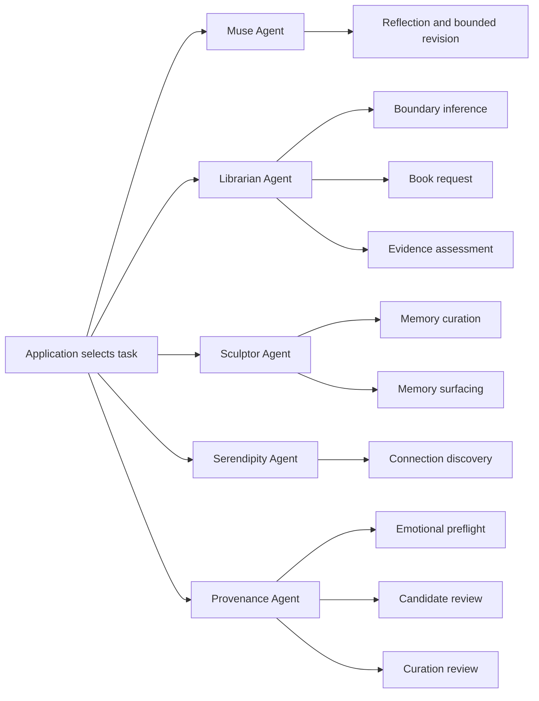
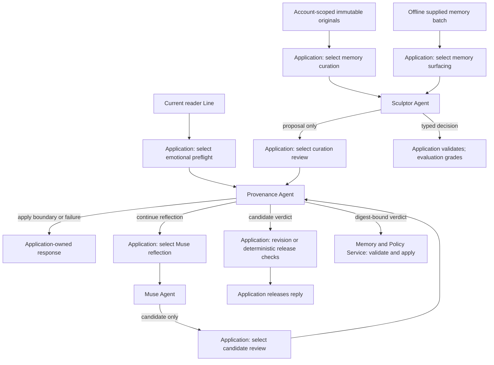

# Agent runtime skills

Linger assigns one reusable PydanticAI `Agent` object to each logical role. The
application selects a skill before each model run. A skill binds trusted
instructions to typed input and output contracts, validation, and permitted
tools. A model run is one invocation of the object and can include tool calls
and validation retries. This organization does not reduce the number of model
calls or transfer application authority to a model.

## Assigned skills and typed entry points

| Role and assignment | Skill instructions | Input and output | Application entry point |
|---|---|---|---|
| [Muse](../src/linger/agents/muse/README.md) · [assignment](../src/linger/agents/muse/skills.py) | [Reflection](../src/linger/agents/muse/skills/reflection/SKILL.md), including revision | `MuseDraftInput` or `MuseRevisionInput` → `MuseCandidate` | `reflection_reply` and its bounded draft, review, and revision calls |
| [Librarian](../src/linger/agents/librarian/README.md) · [assignment](../src/linger/agents/librarian/skills.py) | [Boundary inference](../src/linger/agents/librarian/skills/boundary-inference/SKILL.md) | `LibrarianBoundaryInferenceInput` → `LibrarianBoundaryDecision` | `judge_spoiler_boundary`; deterministic grant validation follows |
| Librarian | [Book request](../src/linger/agents/librarian/skills/book-request/SKILL.md) | `LibrarianBookRequestInput` → `BookRequestPlan` | `plan_book_request` identifies requested book parts before retrieval; exact reader spans are validated |
| Librarian | [Evidence assessment](../src/linger/agents/librarian/skills/evidence-assessment/SKILL.md) | `LibrarianEvidenceStrengthInput` → `BookEvidenceAssessment` | `assess_book_evidence` validates requested-part support and selected IDs, then returns `EvidenceStrengthDecision` |
| [Sculptor](../src/linger/agents/sculptor/README.md) · [assignment](../src/linger/agents/sculptor/skills.py) | [Memory curation](../src/linger/agents/sculptor/skills/memory-curation/SKILL.md) | `AccountScopedMemories` → `CurationProposal` or `NoCurationProposal` | `propose_curation`; account identity is excluded from model input |
| Sculptor | [Memory surfacing](../src/linger/agents/sculptor/skills/memory-surfacing/SKILL.md) | `SurfacingInput` → `SurfaceNow`, `Defer`, or `DoNotSurface` | `propose_surfacing`; account identity is excluded and decision validation follows |
| [Serendipity](../src/linger/agents/serendipity/README.md) · [assignment](../src/linger/agents/serendipity/skills.py) | [Connection discovery](../src/linger/agents/serendipity/skills/connection-discovery/SKILL.md) | `ConnectionDiscoveryInput` → `ConnectionProposal` or `ConnectionDecline` | `discover_connection`; fresh request dependencies collect evidence |
| [Provenance](../src/linger/agents/provenance/README.md) · [assignment](../src/linger/agents/provenance/skills.py) | [Emotional preflight](../src/linger/agents/provenance/skills/emotional-preflight/SKILL.md) | `EmotionalBoundaryInput` → `EmotionalBoundaryAssessment` | `assess_emotional_boundary` before Muse or its tools |
| Provenance | [Candidate review](../src/linger/agents/provenance/skills/candidate-review/SKILL.md) | `ProvenanceInput` → `ProvenanceReview` | `reflection_reply` supplies canonical evidence and, on revision, the original candidate and findings to recheck |
| Provenance | [Curation review](../src/linger/agents/provenance/skills/curation-review/SKILL.md) | `CurationReviewInput` → `CurationProvenanceReview` | `review_curation` binds the verdict to the exact proposal and source snapshot |

The Python models define machine-readable schemas. `SKILL.md` describes the
task, decision criteria, permitted outputs, and authority limits. A skill does
not duplicate schema definitions or turn each helper into another model task.
Librarian's scoped retrieval is deterministic application work. It remains
distinct from Librarian's model tasks.

## Implementation contract

Each role owns `skills.py` and a `skills/<name>/SKILL.md` resource. Shared role
instructions live under `agents.<role>` in the packaged
[`prompts/prompt_catalog.yaml`](../src/linger/prompts/prompt_catalog.yaml).
`RuntimeSkill` is an immutable assignment record. Its `run_options()`
returns fresh per-run instructions, retries, metadata, and, where needed, an
output contract. Typed task entry points project trusted input, select the
constant, invoke the role's Agent, and apply existing domain checks.

Muse and Serendipity retain fixed output schemas and registered output
validators. Librarian, Sculptor, and Provenance select task-specific output
schemas per run. The Provenance candidate-review run also binds its typed input
in a request-scoped context so its skill-selected output validator can retry
finding-location mismatches within the skill's output retries. No run modifies
a shared Agent's configuration. Requests keep their existing dependencies,
bounded context, evidence, and histories.

Instructions load through `importlib.resources`, independently of the working
directory. Only shared policy and the selected skill reach the model. Runtime
skills never load Codex development instructions. Fingerprints cover effective
shared and selected instructions, input and output schemas, tool permissions,
validator identities, and retry limits.

Each fingerprint contains a stable `template_id` and an automatically computed
SHA-256 `digest`. Changes to the covered instructions or configuration change
the digest without a manual version counter.

`prompt.py` and the task-specific prompt modules expose tracing fingerprints
for their existing consumers. `load_prompt("agents", "muse")` loads one role's
shared instructions from the catalogue. Skill instructions remain in their
per-role `SKILL.md` files. The catalogue's separate `evaluation` group contains
`serendipity_review` and `book_spoiler_review`, used only by evaluation runners.
Typed contracts, tools, validators, and retry guidance remain in Python.
Agent builders retain test model injection and use the existing provider
selection in `build_model`; production constructs each role
object once at module import. Tests may construct separate injected instances.

Typed application entry points select a constant such as
`MEMORY_CURATION.run_options()` before `run_agent_traced` invokes the shared
Sculptor object. The options carry selected instructions, output schema,
retry limits, and `linger_skill` metadata. No plugin registration, filesystem
search, model-driven selection, or skill-loading model call occurs.

The [installed PydanticAI run API](https://pydantic.dev/docs/ai/api/agent/)
provides additive per-run instructions, output contracts, retries, dependencies,
and capabilities. This implementation was verified against version 2.26.0.
Each no-tool role has an empty tool set. Muse permits `librarian_route`,
`librarian_search`, and sequential `serendipity_explore`. Serendipity retains
bounded `search_librarian`, scope-gated `search_memories`, and application-granted
Exa capabilities. A skill assignment describes those capabilities; it cannot
grant access to an account, evidence, or the web.

## Authority and run context

Muse receives only application-managed history. Rejected drafts are excluded
from persistent session history. A first review may request one revision,
whose context remains bounded by the original turn's authority. The stable
`MuseCandidate` validator retries invalid evidence IDs, source locations,
quotation copies, and missing visible links for declared public sources before
application review. A revision addresses every reported finding and audits the
complete reply and its mappings for missed defects, within the same evidence
authority. Muse never releases its own reply.

Librarian's chapter-boundary decision begins with one explicit assessment per
supplied memory. Each assessment names canonical passages and explains whether
they establish earlier knowledge, provide no support, or conflict with the
current report. `BoundaryMemoryValidation` checks coverage and source IDs within
the existing single output retry. The decision must agree with its assessments;
the application rechecks them before granting a boundary. This adds no model
invocation and never promotes a memory merely because it exists. Uncertain
current progress still grants nothing. Session-supported passage decisions keep
their separate statement-based contract.

Provenance reuses its Agent across three skills, but every review begins with a
fresh typed input and no message history or tools. Emotional preflight sees
the current Line and policy. Candidate review sees the complete candidate,
canonical evidence, untrusted tool outcomes, and bounded reader context.
When validated routing requires clarification, the application also supplies
the exact question in `context.required_clarification`. Provenance can review
that question's catalog metadata without demanding book passages. This field
does not authorize added plot claims or bypass the rest of the review.
On revision, `previous_response_review` also supplies the original candidate
and its response findings. Provenance returns one `finding_resolutions` entry
per earlier finding. Application validation rejects missing, duplicate, or
unknown indices, and a pass with unresolved findings. Resolution explanations
remain semantic judgments; the reviewer must also inspect the whole revised
candidate for new or previously missed defects. Capture findings are excluded
from this response-repair context and remain a separate decision.
Curation review sees only the proposal digest, proposal, and selected source
snapshots. Candidate output retries remain two; preflight and curation review
retain one. Earlier findings are typed review data, not instructions, additional
evidence authority, or model conversation history.

Serendipity creates fresh dependencies and an evidence collection for each
request. Optional capabilities are passed to that run. Exact public URLs in
the application's grant may be opened without searching for them first;
unrestricted discovery still requires a search lead. Raw and decoded page URLs
must pass privacy checks, and only opened matching pages become evidence.
The privacy gate checks web queries and page URLs against the current cue,
supplied memories, and explicit `prior_reader_statements`. Muse evidence and
session context remain in request-local context variables owned and reset by
the application. No account, history, evidence collection, or capability grant
is written onto a shared Agent or skill binding.

Muse and Serendipity use the same scoped retrieval and Librarian judgment path.
Before private retrieval, `plan_book_request` gives Librarian the
application-supplied reader cue and earlier reader statements. Muse
`librarian_search` and Serendipity `search_librarian` accept no model-written
book query. Planning receives no candidate passages.
Each `BookRequestPart` contains exact `context_spans`, `purpose`, and exact
`reader_spans`, with no rewritten question. Context preserves the book, scene,
or speaker needed to resolve a question's references; it adds no answer
requirements and is empty for a self-contained question. `reference` grounds named book material for reflection or a
comparison. `answer` preserves an explicit book question, claim check, or
quotation request, including one used in reflection. The skill selects the
shortest exact fragments naming the book request,
excluding personal details, other sources, and progress-only statements.
The Agent's `BookRequestSpanValidation` capability checks planning output with
`book_request_span_errors`. Invalid spans receive structured repair feedback
within the skill's existing single output retry. Only `BookRequestPlan` outputs
use this check; other Librarian skills are unaffected. `plan_book_request`
rechecks the result with the same helper before retrieval. Acceptance still
requires nonempty spans copied exactly from the supplied reader text.

Application code joins the frozen plan's context and question spans into the bounded backend
search query. The 2,000-character query limit applies after planning, so a long
reader message can yield a short book query. `assess_book_evidence` then gives
the same plan and permitted canonical passages to a second invocation. Every
selected record must map to an existing requested part and explain its necessary
support. A `sufficient` assessment must cover
all requested parts. Application code validates those mappings, evidence IDs,
and the selection budget, then returns the unchanged `EvidenceStrengthDecision`
contract to the caller. The two skills use the same reusable Librarian Agent
with separate inputs and no shared conversation history. Neither the plan nor
its reader spans grant reading permission. Exact passage grants use the same
planner and assessor over only their fixed records, without a broader search.

The diagram groups repeated uses of one role object. Application code controls
which branch consumes each typed result; sharing an object creates no path
between task contexts. Provenance approval is necessary for a releasable
candidate or stored curation, and deterministic application checks still apply.

## Runtime, evaluation, and targets

Chat currently uses Muse reflection, Librarian boundary inference, book-request
planning, and evidence assessment when needed, optional Serendipity connection discovery, and the two
Provenance conversation skills. The same Serendipity skill also serves plain
personal recall: when Muse asks and the account has active memories, it searches
the curated retrieval view and returns memory evidence for the ordinary
Provenance and release path. Reviewed automatic capture stays under the
existing server-controlled evaluation policy.

`run_curation_loop` implements reviewed curation as a callable application
workflow. The chat handler does not initiate it. Bounded-curation synthetic
replay invokes the proposal task and verifies source preservation; it does
not apply proposals or prove a retrieval benefit. Surfacing has an offline
supplied-batch execution and grading path. It does not retrieve memories,
schedule future contact, or deliver a response. The conversational
capture-to-curation-and-surfacing demonstration and system-playbook proposals
remain product targets. They have no additional implemented runtime skill.

Evaluation registers the five reusable role objects once through
`evaluation_agents()` and lists the assigned skills through `evaluation_skills()`.
Model overrides on one object cover all its tasks. Each invocation still
records its selected skill, role, stage, and fingerprint, so multiple tasks on
the same Agent remain distinguishable. Muse draft and revision fingerprints
include their respective input schema within the same reflection skill.

The full prompt fingerprint set includes all skills, including offline
surfacing and curation review. Objective-specific execution identities retain
their narrower comparison scope. Existing submission PDFs remain historical
evidence; they do not describe this refactor or replace maintained docs.

## Resource distribution and verification

`uv build` creates a wheel and source archive containing `prompts/prompt_catalog.yaml`
and all assigned `SKILL.md` resources. `importlib.resources` resolves the catalogue
from `src.linger.prompts` and skills from each installed role package. Prompt
and skill loading do not depend on a repository checkout or the process working
directory. Corpus data, configuration, and evaluation Scenarios retain their
existing deployment requirements.

The test suite exercises task selection, schema-specific retries, registered
output validators, permitted tools, request isolation, and evaluation model
overrides using the installed PydanticAI implementation. Resource checks also
load skills from a different working directory. Provider-backed evaluation
remains necessary for claims about model decision quality; this structural
refactor does not replace those evaluations.
