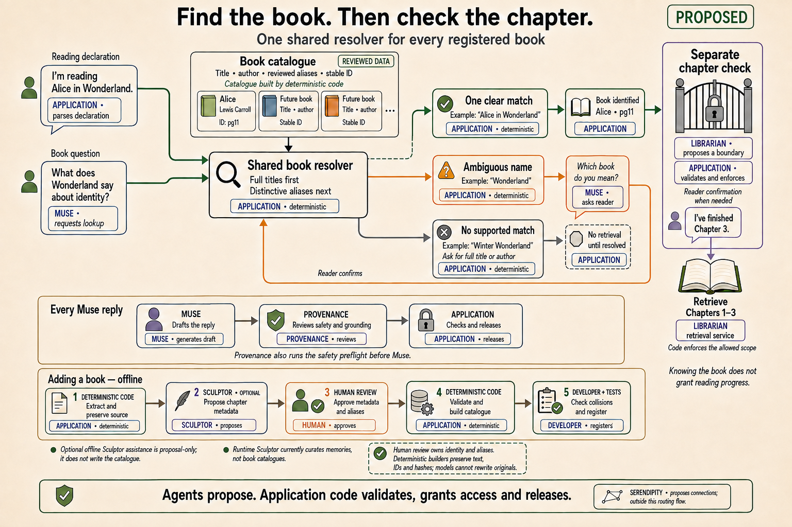

# Registering books and resolving their names

Linger uses one reviewed book registry for explicit reading declarations,
Librarian routing, and identity checks on memories. The registry lives in
[`src/linger/corpus/registry.py`](../src/linger/corpus/registry.py). A book's
stable work ID comes from its registration; chat never manufactures an ID
from an unknown title.

The current library contains Alice. Adding a book requires a validated corpus,
a registration, and an application grant for its exact revision. Registration
does not automatically grant retrieval access.

## Identity and ambiguity

Each `CorpusRegistration` contains a `BookCorpus`, its canonical directory,
and two optional name lists:

| Field | Meaning | Example |
|---|---|---|
| `aliases` | Reviewed, distinctive alternate names that can identify the work | `alice in wonderland` |
| `candidate_aliases` | Broad names that require the reader to identify the book | `wonderland` |

Application code normalizes capitalization, apostrophe variants, whitespace,
and surrounding punctuation. A longer name takes precedence over a shorter
name contained inside it. At the same position, a canonical title or work ID
takes precedence over an alias. Separate explicit book mentions remain
ambiguous; extra character or location cues cannot choose between them.
Books with the same title can be distinguished by their registered authors.

Explicit declarations and title-only answers use exact name matching, with an
optional `by Author` suffix. This also covers a title following a chapter number,
such as "I've finished Chapter 2 of The Orchard Notebook". Free-form Librarian
requests use the same resolver
to find reviewed names within the reader's original message. If there is no
name signal, Librarian can still use its existing catalogue cues. Multiple
qualifying catalogue candidates require clarification, even if their scores
differ. Candidate aliases never become strong memory-identity evidence.

An unresolved book declaration clears the previous selection, chapter
candidate, and pending chapter question. A typed identity clarification from `librarian_route` occurs before
private memory selection or full-work boundary inference. Muse must relay the
exact question without book evidence or other tool calls; application code
checks this even after a Provenance pass. When no supported route is found,
Muse asks for a title and author if the answer requires a book, or continues
personal reflection when it does not.

Naming a book establishes identity only. A later title answer does not confirm
an earlier chapter guess. Retrieval still requires explicit current-turn
completion or a validated memory-supported boundary, and application code
enforces the permitted revision and chapter ceiling.

A reply such as "Chapter 3" establishes completed progress only when answering
a pending chapter question for that available book. Switching books discards
the previous book's pending question. A direct `librarian_search` call without
a boundary also checks identity from the original reader message or validated
session selection before it can leave a pending chapter question; Muse's tool
arguments cannot select the book by themselves.

## Add a book

1. Use the [corpus-formatting workflow](../.agents/skills/format-book-corpus/SKILL.md)
   to preserve the immutable source, create canonical chapters, and review
   semantic chapter metadata. Reuse the shared corpus lifecycle with a
   source-specific adapter.
2. Add its `CorpusRegistration` in `src/linger/corpus/registry.py`. Keep stable
   identity and author information in `BookCorpus`. Classify broad or shared
   names as candidate aliases.
3. Run the registration check:

   ```bash
   uv run python -m src.linger.corpus.registry
   ```

   The check reports invalid keys or revision directories, empty or conflicting
   alias declarations, duplicate authoritative names, and aliases overlapping
   another book's title or candidate alias. Shared titles with distinct authors
   are supported, but require disambiguation at runtime. Shared candidate-only
   aliases are allowed. Resolve reported collisions by correcting metadata or
   making an ambiguous alternate name candidate-only.
4. Run the adapter's corpus check and the cross-book tests:

   ```bash
   uv run python -m src.linger.corpus.book your.adapter.module check
   uv run pytest tests/test_book_registry.py tests/test_librarian.py tests/test_book_context.py tests/test_librarian_route_e2e.py -q
   ```

   Include the new book in cases for shared names, names inside other titles,
   unknown titles, author disambiguation, and multiple books in one request.
   The normal test suite also checks the shipped registry for registration
   errors.
5. Enable its exact revision in `allowed_book_version_ids` when the corpus is
   ready for use. Muse obtains identifiers from validated context and tool
   results; adding a book requires no new book-specific prompt or router branch.

## Responsibility boundaries



This diagram comes from the design discussion; its "Proposed" label predates
the runtime resolver implementation. The offline Sculptor step describes
optional metadata proposals for human review.

| Owner | Responsibility |
|---|---|
| Human reviewer | Approves book identity, aliases, and semantic metadata |
| Deterministic corpus tooling | Preserves source bodies and IDs, validates canonical files, and derives `catalog.json` |
| Sculptor, optional offline assistance | Proposes semantic chapter metadata for review; does not write the catalogue or rewrite source bodies |
| Application code | Resolves identities, validates chapter authority, controls session state, enforces access, and releases replies |
| Muse | Decides when conversation needs a lookup, asks clarifying questions, and drafts replies |
| Librarian | Proposes an inferred boundary when needed and supplies evidence through the bounded retrieval service |
| Provenance | Runs safety preflight and reviews Muse's complete draft; cannot grant access or release a reply itself |
| Serendipity | Proposes connections; does not own catalogue construction or book identity |

The catalogue remains a deterministic projection of canonical chapter metadata.
Reviewed book aliases live in the registry, not in model-generated catalogue
JSON. Runtime Sculptor still handles memory curation; this change does not add
an automatic book-cataloguing agent, fuzzy matching, or arbitrary uploads.
