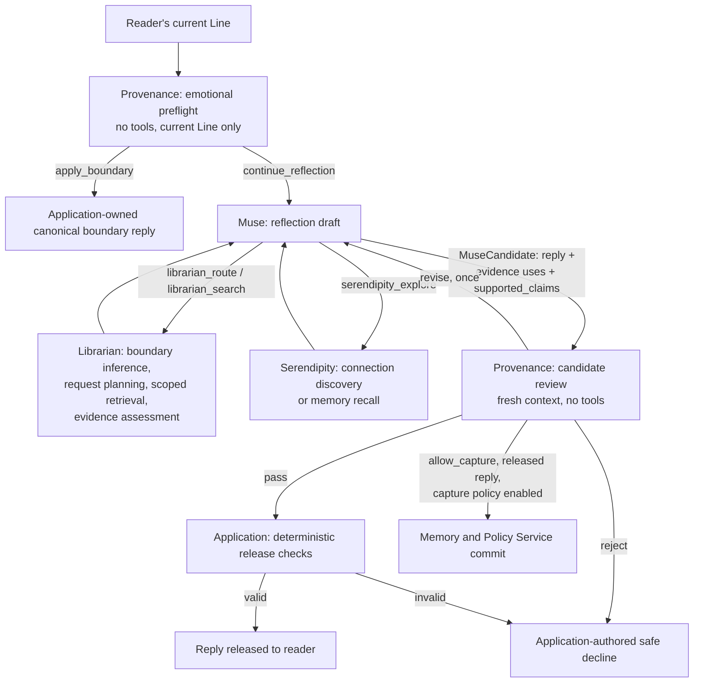
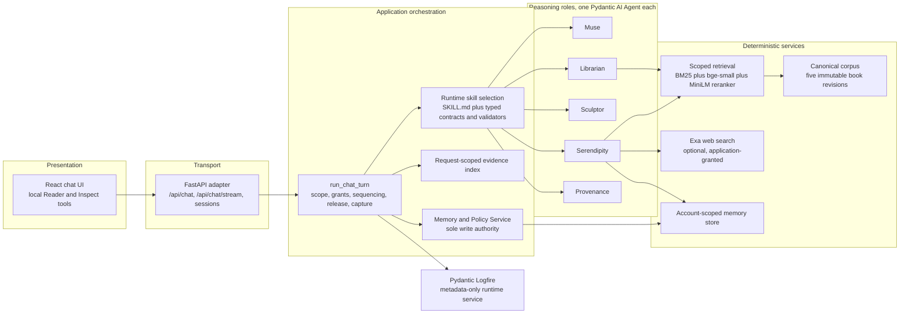
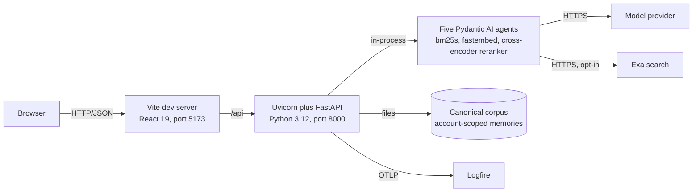
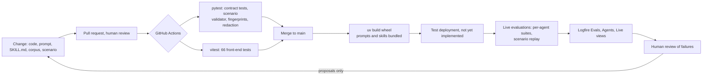

# Linger: A Provenance-First Multi-Agent Reflection Companion

**Group Project Report**

Team 9

Desmond Choy, Kevin Manuel Lee, Kay Mei Leong, Yuen Ying Jodie Loke

*[Confirm member order and per-agent ownership before submission.]*

---

## 1. Executive Summary

### 1.1 Objective and scope

Large language models make it straightforward to build a companion that discusses a person's reading and their life. They make it equally straightforward to build one that misquotes the book, invents what the person said, reveals a chapter the reader has not reached, or quietly stores something that should never have been kept. Linger is an academic prototype that treats these four failure modes as the central design problem rather than as quality issues to be tuned away after the fact.

Linger is a personal reflection and memory companion grounded in five public-domain books: *Alice's Adventures in Wonderland*, *Animal Farm*, *Narrative of the Life of Frederick Douglass*, *The Adventures of Pinocchio*, and Helen Keller's *The Story of My Life*. The question the project sets out to answer is whether a multi-agent system can be structurally prevented from misquoting, spoiling, fabricating, and over-storing, and what that structure costs in usefulness. The emphasis on structural prevention is deliberate. A system that avoids these failures because its prompts discourage them offers no guarantee, whereas a system in which the component capable of the failure cannot reach the data required to commit it does.

### 1.2 Key characteristics of the solution

The system is built as five specialised reasoning agents, named Muse, Librarian, Serendipity, Provenance, and Sculptor, arranged around one deterministic Memory and Policy Service. The governing rule of the architecture is that no model may release its own output or widen its own authority. Every reply is produced as a typed candidate, reviewed by a Provenance agent that has no tools and no conversation history, and then validated by application code against a request-scoped evidence index before any text reaches the reader. Every memory write passes through the same review followed by a deterministic commit.

Three design mechanisms carry most of the weight. The first is a typed hand-off envelope between every pair of components, which means no agent ever receives a full transcript or an unrestricted working context. The second is a runtime-skill mechanism that binds each model run to explicit instructions, schemas, validators, tool allow-lists, and retry budgets, and records a SHA-256 fingerprint of that configuration on every telemetry span, so that prompt drift is visible rather than inferred. The third is a spoiler-safe retrieval pipeline in which the reader's permitted reading position is inferred from their own words on every request and retrieval is bounded to that position before any search runs, so that the model judging the evidence never sees material it should not disclose.

### 1.3 Principal results

On the evidence committed to the repository, the Provenance release gate blocked every unsafe candidate across five risk classes, giving a block recall of 1.00, at the cost of a 14 per cent over-refusal rate on benign candidates. The Librarian retrieval pipeline reached 0.92 evidence recall and 1.00 citation precision with zero spoiler exposure, and an audit of 23 synthetic book-grounded conversations found no disclosure of text beyond the reader's stated position. The automated contract suite comprises 1,967 backend tests and 66 front-end tests, all passing. The consistent cost of the design is over-refusal rather than leakage, which is the trade the architecture was built to make.

### 1.4 Constraints and assumptions

The prototype is single-user and local. It has no end-user authentication and no database, and conversation state lives in the backend process and is lost on restart. Chat content is transmitted to the configured model provider, which is OpenAI by default, with Google and Anthropic also supported. Public-web discovery through Exa is opt-in and disabled unless both a policy flag and credentials are present. Automatic memory capture is disabled in the interactive application and is enabled only as controlled server-side evaluation state.

The project makes no production claims about scale, availability, or regulatory compliance, and it does not claim that its telemetry measurably improved the system. Mental-health assessment, crisis routing, continuous monitoring, and end-user memory management are explicitly out of scope, and no agent is designed, reviewed, or evaluated to perform them. Every committed live result was produced against a single provider model, `openai:gpt-5.6-luna`, so while the architecture is provider-agnostic, the reported numbers are not.

---

## 2. System Overview

### 2.1 How the agents work together

A reader's message, which the project calls a Line, enters the system through a single application-owned boundary function named `run_chat_turn`. That function owns session scope, specialist tool grants, agent sequencing, output release, and capture policy. Agents never call one another. Every hand-off between them is mediated by application code, which selects the skill, projects the input, runs the agent, and validates the result before deciding what happens next.

The order of the sequence carries meaning. An emotional preflight runs before the drafting agent and before any tool is granted, so that a distressing disclosure never triggers retrieval or connection search in the first place. Provenance classifies the current Line with no tools and no history, and a classification of `apply_boundary` diverts the turn to a fixed, application-authored reply that no model wrote. Everything else continues to Muse.

Muse owns the reply and is the only role that writes reader-facing prose or sees conversation history. While drafting, it may call the Librarian tools if the reader's own words carry a book cue, and the Serendipity tool if a connection might deepen the reflection. Both return typed results rather than free text. In the Librarian case, application code inserts the reader's exact message as the routing and retrieval cue, so that the model cannot substitute a paraphrase of its own. Librarian infers the reader's chapter ceiling, plans the retrieval request as exact spans copied from the reader's text, runs bounded hybrid retrieval, and judges whether the permitted passages support the request. Serendipity, when granted, searches whichever permitted sources are relevant to the request, compares two or three candidate interpretations against an anchored rubric, and returns one tentative connection or a typed decline.

Muse then returns a complete candidate containing the reply text, a declaration of every piece of evidence it used with the exact reply spans that evidence supports, and either one exact-span memory nomination or a typed reason for nominating nothing. Provenance reviews that candidate from a fresh typed input with no history, verifying each declaration against the frozen evidence and separately scanning the whole reply for undeclared quotations, factual claims, and sensitive inferences. After a passing review, application code resolves every declaration against the request-scoped evidence index, checks each quotation verbatim against both the source record and the reply, and only then releases the text. Any failure at any stage produces a safe decline, which is a fixed message that reveals nothing from the rejected candidate and writes nothing to storage.

Two workflows run outside the chat turn. Reviewed curation obtains one Sculptor proposal over a bounded set of stored records, obtains an independent Provenance verdict bound to that proposal's content digest, and allows the Memory and Policy Service to apply only an exactly matching approved proposal. Memory surfacing is an offline decision path in which Sculptor judges whether a supplied batch of history could help a later conversation. Its conversational integration remains a product target rather than an implemented feature.

### 2.2 High-level workflow

**Figure 1.** One chat turn. Every arrow represents an application-mediated hand-off carrying a typed envelope. The two paths out of the deterministic checks are the only ways text reaches the reader.

A grounded turn therefore costs at least three model invocations, being the preflight, the draft with its tool calls, and the review, plus the judgments Librarian makes inside the tool calls. A personal reflection that involves no book costs two. In three live turns captured during figure preparation on 19 September 2026, the elapsed time from the reader pressing Send to the reply being released ranged from 82 to 90 seconds, with the Muse draft and its tool calls accounting for most of that interval.

---

## 3. System Architecture

### 3.1 Logical architecture

Figure 2 shows the components and their permitted interactions. The React front end communicates with a thin FastAPI adapter, which performs transport concerns only and holds no orchestration logic. Every request enters `run_chat_turn`. Synthetic evaluation replay calls that same boundary function directly rather than reimplementing the sequence, which means evaluation exercises production code paths rather than a parallel test harness that could drift from them.

**Figure 2.** Logical architecture. The absence of any edge between two agents is the point of the diagram. Application code selects a skill, projects the input, runs the agent, and validates the result.

The request-scoped evidence index deserves particular attention because it is where the provenance guarantee is ultimately enforced. The index accepts only three classes of record: exact records returned by the current direct Librarian result, the selected records of a current Serendipity proposal, and records re-resolved by Librarian from identifiers cited in an earlier successfully released reply within the same session. A quotation that cannot be bound to a record in that index does not reach the reader regardless of how confident the drafting model was or how favourable the review verdict was.

### 3.2 Physical architecture and infrastructure

The current deployment is a local two-process prototype. A Vite development server serves the React 19 front end on port 5173, and a Uvicorn-hosted FastAPI backend runs on port 8000 with all five agents, the retrieval models, and the file stores resident in the backend process. Python 3.12 dependencies are locked with `uv` and front-end dependencies with `pnpm`. Model calls travel over HTTPS to the configured provider, and OpenAI calls use the Responses API so that reasoning can be retained across tool calls within a single draft.

**Figure 3.** Physical architecture of the local prototype.

Persistent state is held as files rather than in a database. The corpus is versioned, content-hashed Markdown under `data/`, and evaluation memories are account-scoped Markdown under `memories/`. For a single-user prototype this is adequate, and the combination of immutability and content hashing proved simpler to reason about than a schema with migrations. The local front end also mounts two developer tools that a product build would omit. Reader is a chapter browser that deliberately grants no reading progress to the conversation, so that browsing cannot be mistaken for having read. Inspect is a read-only per-turn view of the resolved context, each agent's outcome, the review verdict and its finding codes, the deterministic validation results, the release source, and the Logfire trace identifier.

Telemetry is exported to one Logfire project under two service identities. The `linger-backend` identity records metadata only, under a written telemetry contract that a typed projection and an exported-payload test enforce. The `linger-evals` identity, used only by code-owned evaluation runners against synthetic data, is permitted to record content.

### 3.3 Deployment strategy

Continuous integration runs in GitHub Actions on every pull request and every push to the main branch, and the build produces an installable wheel that bundles the prompt catalogue and all skill resources. Bundling the instruction resources into the wheel and loading them through `importlib.resources` means an installed artefact runs identically to a source checkout, which removes a class of environment-dependent behaviour that would otherwise undermine the prompt fingerprinting described in Section 7.

Beyond the wheel build, deployment is designed but not implemented. There is no container image, no deployment job, and no multi-account test environment, and the load test the specification calls for has not been run. This is the most significant infrastructure gap in the project and it is recorded as such in Section 9 rather than presented as future work in a way that obscures its current absence.

### 3.4 Agent communication protocols

There is no free-form messaging between agents. Every hand-off is a strict, discriminated Pydantic envelope carrying only the fields the receiving step requires, and full transcripts and unrestricted working context are never passed. Table 1 lists the envelopes in the order they occur.

| Hand-off | Input to output | Authority note |
|---|---|---|
| Application to Provenance, preflight | `EmotionalBoundaryInput` to `EmotionalBoundaryAssessment` | Current Line and versioned policy only |
| Application to Muse | `MuseDraftInput` or `MuseRevisionInput` to `MuseCandidate` | A revision keeps the original turn's authority, and at most one is permitted |
| Muse to Librarian, via tools | `librarian_route`, `librarian_search` | Thin adapters. The model writes no book query, and the application supplies the reader's exact spans |
| Application to Librarian | `LibrarianBoundaryInferenceInput` to `LibrarianBoundaryDecision`, event identification, `LibrarianBookRequestInput` to `BookRequestPlan`, `LibrarianEvidenceStrengthInput` to `BookEvidenceAssessment` | Decisions are content-free. Spans must be exact reader text and identifiers must resolve |
| Muse to Serendipity, via tool | `serendipity_explore` to `ConnectionProposal`, `MemoryRecall`, or `ConnectionDecline` | Fresh dependencies per request. The intent selects the skill |
| Application to Provenance, review | `ProvenanceInput` to `ProvenanceReview` | Fresh input with no history. A revision review carries `finding_resolutions` |
| Application to Sculptor | `AccountScopedMemories` to `CurationProposal` or `NoCurationProposal`, and `SurfacingInput` to `SurfaceNow`, `Defer`, or `DoNotSurface` | Account identity is excluded from the model input |
| Application to Provenance, curation | `CurationReviewInput` to `CurationProvenanceReview` | The verdict echoes the proposal digest unchanged |
| Application to Memory and Policy Service | Reviewed command carrying a digest | Accepted only when the digest matches an approving verdict and the sources are unchanged |

**Table 1.** Typed hand-off envelopes.

The pattern that recurs across these envelopes is that authority travels in the input rather than being asserted in the output. Serendipity, for instance, receives a scope object stating which sources it may search and at what chapter ceiling, and it returns evidence identifiers that application code then re-resolves. At no point does an agent assert that it was permitted to do something, because such an assertion would be exactly the kind of claim an injected instruction could manufacture.

### 3.5 Justification of architectural style and technology choices

The dominant risk in this system is not that a model produces a poor sentence but that a model widens its own authority, whether through an injected instruction in retrieved content or through ordinary confident error. That judgment drove the choice of an application-orchestrated architecture over an agent-graph framework such as LangGraph, AutoGen, or CrewAI. Sequencing, tool grants, and release decisions are easiest to control, to read, and to unit-test when they are plain Python in a single boundary function. A framework that makes agent-to-agent delegation ergonomic optimises for a property the project specifically did not want.

The decision to build five roles rather than one well-instructed model is likewise a decision about authority rather than about capability. A component that cannot see the memory store cannot leak it, and a reviewer that receives no conversation history cannot be talked round by an argument made earlier in that history. The same underlying provider model plays several of these roles, and the design assumes that it does. What separation buys is not independence of judgment but separation of duties, and the boundaries it creates are enforceable in code and testable without invoking a model at all.

Table 2 records the principal choices and the reasoning behind each.

| Choice | Alternative considered | Reason for the choice |
|---|---|---|
| Five roles under application orchestration | One model that reflects, retrieves, connects, curates, and checks its own work | Authority, not capability. Each boundary is enforceable in code and testable without a model |
| Plain Python orchestration | An agent-graph framework | The dominant risk is authority widening, which is easiest to control and test in one explicit sequence |
| Pydantic AI | A custom tool-dispatch and web-client layer | Typed input and output with validation retries, per-run instructions, a capability and toolset model, provider abstraction, Logfire instrumentation, and a maintained Exa capability |
| One agent per role with per-run skills | One agent per skill | Preserves per-role tool and validator authority while making each task's instructions, schema, and retries explicit and separately fingerprinted |
| Deterministic retrieval with model judgment on either side | Model-driven retrieval | Spoiler safety cannot depend on a model's discretion. Retrieval becomes a scoped, testable service and the model judges only the boundary and the evidence strength |
| Hybrid BM25 and dense retrieval with cross-encoder reranking | Any single retrieval strategy | Selected on measurement. Reranking raised evidence recall to 0.92 and halved evidence volume at a p95 cost of 0.46 seconds on local models |
| Logfire under a written data contract | Ad hoc logging | Traceability without content leakage, enforced by a typed projection and an exported-payload test |
| Content-hashed Markdown file stores | A relational database | Adequate for a single-user prototype, and immutability with content hashing is simpler to reason about than schema migrations |

**Table 2.** Architecture and technology choices.

The retrieval choice is the one decision in the table that was settled by measurement rather than by reasoning about authority. Five configurations were benchmarked on identical inputs across twelve frozen query cases: bounded direct chapter reads as a control, BM25 alone, dense embeddings alone, their reciprocal-rank fusion, and fusion followed by cross-encoder reranking. Two gates had to pass before any quality number was allowed to count, namely zero passages beyond the reading ceiling and exact resolution of every returned identifier to canonical text. Reranked fusion won on evidence recall and on downstream evidence-token volume simultaneously, which is why it carries an additional model into the retrieval path despite the latency cost.

---

## 4. Agent Roles and Design

All five roles run on the configured `LINGER_MODEL`, which was `openai:gpt-5.6-luna` in every committed evaluation. They are presented below in the order in which they act during a chat turn, with Sculptor last because it runs outside the turn. The full design of each role, including its complete decision logic and enforcement layers, is documented in Appendix E of the accompanying technical report.

### 4.1 Muse, the conversation

Muse owns the reply. Its responsibility is to turn one bounded reader turn into one typed candidate suitable for independent review, calling a specialist when that would help and responding to one round of review findings. It is the only role that writes reader-facing prose and the only one that sees conversation history, and it can neither release its own words nor write durable memory.

Its memory access is deliberately narrow. Muse sees released session history only, under application control, so a rejected draft never re-enters its context as though it had been said. Stored memory records reach Muse only as evidence returned by Serendipity, never as a store it can browse. It writes nothing, and its sole influence over storage is the right to nominate at most one exact span of the reader's current message per turn, which Provenance then approves or vetoes independently of the response decision.

Muse holds three tools, `librarian_route`, `librarian_search`, and `serendipity_explore`, all of which are thin adapters that the application grants and executes. The model supplies an intent, and the application supplies the reader's exact wording. Muse first chooses a path, answering a plain reflection from the reader's experience without retelling the book, asking one clarifying question when a book is named but the reading position is unclear, and routing to Librarian only when the reader's own words carry a book cue. A search result arrives on one of four branches, being a clarification to ask, sufficient evidence to answer from, weak evidence to answer within stated limits, or no supporting passage found, and Muse must honour whichever branch it receives. When a review returns a verdict of `revise`, Muse receives one opportunity to repair every finding and then re-audit the entire reply, because the findings are required repairs rather than an exhaustive list of defects.

### 4.2 Librarian, reading boundaries and book evidence

Librarian is responsible for the reading boundary and for book evidence. It determines whether the reader's words and eligible memories locate a chapter ceiling or an exact already-read passage, identifies which spans of the reader's message express a book request, and judges whether the permitted evidence is sufficient, weak, or absent for each part of that request. It decides nothing about what text is disclosed, whether a candidate is answered, or anything concerning memory or release.

Librarian holds no conversational memory and no tools. It is stateless by construction, and the reading boundary is re-resolved from the reader's words on every single request rather than persisted, so that a boundary established in one turn cannot silently authorise disclosure in a later one. Four tool-less skills run on the one agent. Boundary inference returns a memory-supported or Line-supported chapter ceiling, an exact set of already-read paragraphs, or an explicit verdict of uncertain. Event identification independently determines which single occurrence in the book the reader's description of their stopping point refers to, returning unresolved when the wording fits several occurrences. Book request planning returns the exact spans copied from the reader's text that express each book need. Evidence assessment judges whether the permitted records support every requested part.

The architectural significance of Librarian lies in the ordering of its work. Scope is derived and applied before search, so post-boundary catalogue entries and chapter bodies never reach the evidence judge, the drafting model, the bounded index, or the reranker. Only the private first-phase inference may inspect the whole immutable work, and that phase has localisation authority rather than disclosure authority. Its passages never enter the turn's evidence.

### 4.3 Serendipity, connection discovery and memory recall

Serendipity looks for one tentative, evidence-supported connection between the reader's current reflection and a permitted source, which may be a book passage, an earlier memory, or a public web page, and returns either one proposal or one typed decline. Under a separate intent it recalls the reader's own earlier words without interpreting them. Connection-finding is a separate role because it requires search, comparison, and a genuine willingness to say no, and a drafting agent that also hunts for connections has a standing incentive to find one.

Its memory access is granted rather than assumed. Serendipity searches the account-scoped curated retrieval view by lexical token overlap, and only when the application grants memory access, which requires that the view actually contains records. It holds no account identity, cannot widen its own scope, and writes nothing. Its tools are book search through Librarian's judged retrieval path, memory search, and Exa web search with page retrieval, each withheld from the toolset entirely unless granted for that specific request. Run budgets cap it at eight model requests, six tool calls, and five results per source, with at most one expansion to a second source and exactly one run per turn.

The distinctive element of its design is a two-stage decision that separates eligibility from ranking. Candidates are first filtered against three anchored ordinal criteria, being cue fit, reflective value, and safety, together with six explicit disqualifiers, and safety has no usable middle rating because an unresolved risk is not something to weigh against merit. Survivors are then ranked lexically by cue fit, then reflective value, and never by a weighted total, because a total can conceal a poor safety rating behind a strong fit score. A tie between the top two candidates produces a decline rather than an arbitrary selection.

### 4.4 Provenance, independent review

Provenance is the reviewer, and it is the reason the rest of the design can afford to be generous with model initiative elsewhere. It classifies the current Line for the emotional boundary before Muse runs, reviews every complete Muse candidate including drafts that declare no factual claim, decides independently whether a memory nomination may be captured, and reviews every Sculptor curation proposal against its exact sources.

It has no memory and no tools, and this is the most consequential design decision in the role. Every review starts from a fresh typed input, so a prior review cannot influence the next and the draft under review cannot argue with it. The review input is organised by trust level, separating the trusted context of policy and reading scope from the frozen canonical evidence, the verified session lines, and the untrusted tool outcomes of the current run.

Provenance must do two distinct things on every candidate review. It verifies each declaration and quotation against the frozen evidence, and it separately scans the entire reply for undeclared quotations, undeclared factual claims, and sensitive inferences. The second obligation exists because a drafting model that omits a declaration would otherwise pass a review that only checked what was declared. Findings are returned from a closed code set, and a finding of `spoiler` or `prompt_injection` forces outright rejection with no revision offered. A Provenance approval is necessary but never sufficient for release or for a write, and a missing, malformed, stale, or incorrectly bound review fails closed.

### 4.5 Sculptor, memory curation and surfacing

Sculptor proposes bounded curation over stored memory and judges whether stored history should surface in a later conversation. Its curation skill works over a supplied set of records and may propose duplicate links, derived summaries, or topic groups, while preserving every original record without exception. Its surfacing skill judges a supplied batch and returns one of three typed outcomes, being surface now, defer, or do not surface.

Sculptor receives only the bounded record set the application supplies and never the store itself, and account identity is excluded from its model input entirely, so it cannot construct a request that crosses an account boundary even in principle. It holds no tools. Every proposal it makes is bound to the content digest of the records it saw, reviewed independently by Provenance, and applied only by the Memory and Policy Service after the sources have been re-read and re-hashed. Declining to curate is a valid outcome rather than an error, which matters because a curation agent under pressure to produce a proposal would eventually propose a merge that loses information.

### 4.6 The Memory and Policy Service

The Memory and Policy Service is not a reasoning role and uses no model. It is deterministic application code, and it is the only component in the system that writes. Its responsibility is to turn application-owned identity, policy, and reviewed candidates into auditable storage decisions.

It owns the store in full. The store comprises an append-only original layer holding one immutable Markdown record per capture, a curation layer of duplicate links, versioned derived summaries, topic groups, and reversible retrieval tombstones, and an immutable audit log. All of it is account-scoped, and account scope derives from authenticated context rather than from anything an agent supplied.

Automatic capture is a deterministic rule chain rather than a judgment. A write requires trusted account scope, capture policy enabled, a Muse nomination validated as an exact slice of the current message, an independent Provenance capture allowance, an absence of sensitive content, a matching idempotent retry if one exists, and an atomic commit without overwrite. Every safe decline and every emotional-boundary release suppresses writes even when the nomination was independently approved, because a turn that failed to release text should not leave a trace in storage. Any failed rule means no write at all, and the properties of this component are established by contract tests rather than by model evaluation, because there is no model in it to evaluate.

---

## 5. Explainable and Responsible AI Practices

### 5.1 Alignment across the development lifecycle

Responsible AI practice in this project is distributed across the lifecycle rather than concentrated in a review step at the end, and each stage carries a specific commitment.

At framing, the specification excludes mental-health profiling, diagnosis, crisis routing, continuous monitoring, unsolicited resurfacing, and end-user memory management until governance for them exists. These exclusions are load-bearing rather than aspirational, in that no agent is designed, prompted, or evaluated to perform them, and the emotional preflight exists precisely to route a distressing disclosure away from the reflective path rather than to assess it.

At the data stage, only public-domain works are used, each with a recorded source audit and a content hash. Synthetic evaluation data is generated by a model but adopted by a person, and the adoption step records a hash of the approved bytes so that a later replay can prove which expectations it graded against. No real user data is used for evaluation at any point.

At design, authority is separated by component and every input class is labelled by trust level, so that book text, memories, web pages, and model candidates all arrive at a reviewing model marked as data rather than as instruction. During development, prompts are versioned packaged resources with automatically computed digests, prompt changes pass through human review, and the full contract suite runs in continuous integration on every change. At evaluation, the three-layer method described in Section 8 keeps component, coordination, and reader-value claims strictly apart, and any result produced by a secondary model judge is labelled non-independent because that judge may share the model under test. In operation, telemetry is metadata-only under a written contract with a fixed failure taxonomy, and no production configuration flag can enable content capture. For improvement, both specified self-improvement loops produce human-reviewed proposals only and grant no runtime authority.

### 5.2 Explainability and traceability

Every reply is inspectable through the local Inspect tool, which shows the resolved context, each agent's outcome, the Provenance verdict with its finding codes, the deterministic validation results, the release source, and the Logfire trace identifier. Explainability here is a property of the recorded decision path rather than a narrative the model generates about itself, which matters because a model-authored explanation of its own reasoning is another output requiring verification rather than a source of assurance.

Evidence is separated from interpretation within the reply itself. Book quotations are verbatim and carry a location, claims drawn from a web page carry an exact visible citation, and memory evidence is attributed as the reader's own personal context rather than as public fact. Every model span records the role, skill, stage, template identifier, configuration digest, hand-off origin and receiver, verdicts, retry count, tokens, latency, and cost, so any decision can be traced back to the exact configuration that produced it. Declines explain themselves structurally through a fixed enumeration of causes rather than through generated prose, which keeps the reason for a refusal auditable.

### 5.3 Fairness and bias mitigation

The corpus is small and old, and the project acknowledges that it contains dated cultural perspectives. The mitigation is architectural rather than editorial. Linger surfaces book text as quoted evidence attributed to the work and never restates it as the system's own claim, which limits how far the corpus's perspective can be laundered into apparently neutral assistant prose.

Provenance detects sensitive inferences independently of whether Muse declared them, so a sensitive inference that the drafting model did not recognise as one is still caught by a reviewer scanning the whole reply. Content carrying sensitive traits is never captured to memory under any configuration. The emotional-content policy is deliberately constructed as a request-local interaction boundary rather than as a label or a severity score attached to the person, so the system stops probing and points toward human support without characterising the reader.

One limitation is stated plainly because it is material. The project has not run a persona-diversity evaluation of Muse's reflections, which would test whether an equivalent reflection prompt receives comparable treatment across readers presenting different backgrounds. That evaluation is designed as a future Objective but has not been run, and no claim about fairness across reader populations is made on the current evidence.

### 5.4 Governance framework alignment

Against Singapore's Model AI Governance Framework, the project maps to the four framework headings as follows. Internal governance is provided by the written system specification, the telemetry contract, issue tracking, and reviewed prompt changes, which together constitute the record of who decided what and on what basis. The level of human involvement is human-in-the-loop for every irreversible or high-impact decision, specifically ground-truth adoption, prompt changes, capture-policy enablement, and every self-improvement proposal, and human-out-of-the-loop only for bounded, reviewed, and reversible runtime decisions. Operations management covers data provenance through source audits and content hashing, versioning by automatic digest, repeatability through scenario replay, and a fixed failure taxonomy. Stakeholder communication is served by a visible notice accompanying every committed capture and by the consistent separation of the reader's words, the source text, and the system's interpretation within every reply.

The generative-AI extension of the framework places particular emphasis on content provenance, which maps directly onto the role Provenance plays in this architecture. The correspondence is not incidental, since the role was designed against that requirement.

---

## 6. AI Security Risk Register

Fifteen risks were identified from three sources: the OWASP Top 10 for Large Language Model Applications, the safeguard sections of the project specification, and failures actually observed during evaluation. They fall into four groups. The first concerns content that reaches the reader, covering prompt injection, fabricated citations, spoiler leakage, and over-reach on distress. The second concerns content that leaves the system, covering private wording in web queries, cross-account memory exposure, and telemetry leakage. The third concerns the integrity of the pipeline itself, covering output-gate bypass, prompt drift, supply chain, secrets, and test isolation. The fourth concerns usability and cost.

| ID | Risk | Likelihood | Impact | Nearest OWASP category | Principal control | Evidence status |
|---|---|---|---|---|---|---|
| R1 | Indirect prompt injection through retrieved content | High | High | LLM01 Prompt injection | Untrusted labelling, application-owned grants, forced rejection on the `prompt_injection` finding | Verified. Block recall 1.00 |
| R2 | Fabricated or altered quotations and citations | High | High | LLM09 Misinformation | Muse output validator, verbatim quotation checks, request-scoped evidence index | Verified. Citation precision 1.00 |
| R3 | Spoiler leakage across the reading boundary | Medium | High | LLM02 Sensitive information disclosure | Boundary re-resolved per request, scope applied before search, forced rejection on the `spoiler` finding | Verified. Zero exposures across a 23-Scene audit |
| R4 | Private wording leaking into public web queries | Medium | High | LLM02 | Serendipity privacy gate on queries and on raw and decoded URLs | Contract tests only |
| R5 | Cross-account memory exposure | Low | High | LLM02 | Account identity from authenticated context only, authenticated snapshot binding | Contract tests only |
| R6 | Unsafe automatic memory capture | Medium | High | LLM02 | Independent Provenance capture veto, deterministic capture policy, capture disabled by default | Verified. Capture-veto recall 1.00 |
| R7 | Over-reach on distressing disclosures | Medium | High | Not applicable | Tool-less emotional preflight before Muse, canonical application-owned reply | Suite exists, no committed run |
| R8 | Output-gate bypass | Low | High | LLM05 Improper output handling, LLM06 Excessive agency | Single application-owned release path, rejected drafts excluded from history | Contract tests and inspection projection |
| R9 | Over-refusal degrading usefulness | Medium | Medium | Not applicable | One bounded revision before decline, over-refusal reported as a first-class metric | Measured. 0.14 response, 0.17 capture, both above target |
| R10 | Telemetry leaking reader content | Low | High | LLM02 | Written telemetry contract, typed projection, exported-payload test | Contract tests |
| R11 | Prompt drift | Medium | Medium | Not applicable | SHA-256 configuration fingerprint on every span, human-reviewed prompt changes | Contract tests |
| R12 | Supply-chain compromise | Medium | Medium | LLM03 Supply chain | Locked dependency files, maintained library tools preferred to custom clients | No dependency audit in the pipeline |
| R13 | Secrets exposure | Low | High | LLM07 System prompt leakage, LLM02 | Environment file excluded from version control, single provider key required | No secret scanning in the pipeline |
| R14 | Cost and latency abuse | Low | Medium | LLM10 Unbounded consumption | Revision, retry, and exploration budgets fixed per role | Recorded per span, no per-turn aggregate |
| R15 | Developer environment leaking into tests | Medium | Low | Not applicable | Continuous integration generates an offline environment file | Observed. Tests should pin the policy explicitly |

**Table 3.** AI security risk register. Likelihood and impact are the team's qualitative ratings.

Eleven of the fifteen risks carry committed evidence that the control holds, drawn either from the live gate suites or from the contract suite. The distribution of the remaining four is informative. R7, covering over-reach on distressing disclosures, has a designed eight-case suite with no committed run, and since the preflight is the only gate capable of skipping the drafting agent entirely, this is the single most important missing piece of security evidence in the project. R12 and R13 are pipeline omissions rather than design gaps, in that dependency auditing and secret scanning are well-understood additions that have simply not been wired into continuous integration. R4 and R5 carry contract-test evidence only, which establishes that the application enforces the control on whatever the model produces but says nothing about how often a live model attempts to violate it.

R15 deserves a brief note because it was discovered rather than anticipated. Running the test suite with the developer's own environment file, which granted web search, produced five failures in tests asserting that the Serendipity connection tool is not granted. The same tests pass with the variables unset, as they are in continuous integration. This is a test-isolation defect rather than a product defect, since the tests should pin the web-search policy explicitly rather than inherit it from the environment, but it illustrates a general hazard in which a permissive developer environment can mask a policy test.

---

## 7. LLMSecOps Pipeline

The pipeline is best understood as a loop that begins with a change and ends with a reviewed proposal for the next change, rather than as a linear path from commit to deployment. Figure 4 shows the stages, and the subsections that follow trace the same lifecycle.

**Figure 4.** The LLMSecOps loop. Solid stages are implemented. The deployment stage is designed but not built.

### 7.1 Change control

Development was specification-first. A single system specification records the product scope, the authority model, the output release contract, the safeguards, and the acceptance criteria, an architecture document records the runtime-skill contract, and a telemetry contract is the sole authority on what may be logged. Implementation was staged so that a working end-to-end slice existed before each new capability was added, beginning with reflection and review, then book grounding, then connection discovery, then reviewed capture and curation. A prompt change is treated as a code change and passes through the same pull-request review, which is the practical consequence of treating instructions as versioned resources rather than as configuration.

### 7.2 Automated testing

Automated testing runs on every pull request and every push to the main branch. The AI-specific security tests are present rather than deferred, comprising the release-gate and curation risk-code suites, the emotional-boundary suite, the privacy-gate and public-source access tests, and the injected-content scenarios. The live-model suites are run manually and their reports committed to the repository, while only their deterministic graders execute in continuous integration. This split is a deliberate compromise. Running live-model suites on every push would make continuous integration non-deterministic and costly, so the project accepts that live evidence is refreshed by explicit decision and records the date and prompt digest of every committed report so that staleness is visible.

### 7.3 Versioning and tracking

Code is versioned in Git and dependencies are locked in `uv.lock` and `pnpm-lock.yaml`. Corpus revisions are content-hashed, so a passage citation binds to an exact revision of an exact work. Prompts and skills are fingerprinted automatically, with a SHA-256 digest computed over the effective shared and selected instructions, the input and output schemas, the tool and capability permissions, the validator identities, and the retry limits. The digest is never computed over request content. A change to any covered element changes the digest without anyone remembering to increment a version counter, which is the property that makes prompt drift detectable rather than merely discouraged. Evaluation datasets and reports carry dataset digests, run identifiers, and the Git revision they were produced against.

### 7.4 Deployment

Deployment is not implemented beyond the wheel build, as noted in Section 3.3. A container image, a deployment job, and front-end lint and build steps in continuous integration are the obvious next additions, and the specified load test at five concurrent sessions has not been run.

### 7.5 Monitoring and alerting

Logfire provides three views that the project uses differently. The Live view shows the trace hierarchy and per-role model exchanges for an individual run, the Agents view aggregates runs, cost, and average duration by role, and the Evals view holds evaluation datasets with expected and actual labels alongside latency, tokens, and cost. Every failure carries a fixed stage, code, category, retryability flag, and owner, where the owner is one of model, validation, or application. Classifying failures by owner at the point of failure rather than by inspecting error text later is what makes the failure taxonomy usable for triage.

No alert rules are configured. For a local single-user prototype there is no on-call surface for an alert to reach, but this would be a prerequisite for any deployed version.

### 7.6 Logging and auditability

Runtime spans are metadata-only under the telemetry contract, and the contract is enforced by a typed projection plus an exported-payload test that inspects what actually leaves the process rather than what the code intends to send. Every applied curation produces an immutable audit event, so the memory store carries its own history of modification independently of the application logs. The Inspect projection records each turn's decisions for developer review, and design decisions and their rationale are retained in the issue tracker.

### 7.7 Bounded lifecycle automation

Two loops are specified to reduce development effort while keeping humans in control of every change. In failure-to-eval promotion, Provenance rejections, blocked injections, and failed deterministic checks emit permitted metadata signatures only, and those signatures identify candidate regression gaps. Turning a signature into a synthetic scenario remains a human-reviewed workflow that the project has specified but not adopted. In the Sculptor-curated system playbook, a scheduled Sculptor task reads permitted operational records and proposes a pull request that deduplicates, summarises, and prunes a versioned playbook of operational lessons, with continuous integration and human review gating the merge exactly as for any other change. Both loops run outside user conversations, add no runtime authority, and are bounded by the telemetry contract.

---

## 8. Testing and Evaluation Summary

### 8.1 Evaluation method

Evaluation is organised into three layers, each answering a different question, and their results are never pooled. Keeping them apart is a methodological commitment rather than a presentational one, because the most common way to overstate the safety of a system like this one is to report a contract test as though it were evidence about model behaviour.

Layer 1 comprises automated contract tests with mocked models, answering whether the application enforces its contracts given a model output. These tests substitute Pydantic AI's `TestModel` or a fixed function for a provider and run in seconds. They establish authority boundaries, validator behaviour, retry limits, scope enforcement, and telemetry redaction, and they establish nothing whatsoever about decision quality.

Layer 2 comprises component evaluations with a live model and fixed evidence, answering whether each agent makes the correct local decision when the evidence is held constant. Holding retrieval fixed is the key methodological choice, because an agent handed three irrelevant passages and correctly declining is indistinguishable from an agent declining out of timidity if retrieval varies between runs. Grading has two parts. Deterministic hard gates check schema conformance, response kind, cited identifiers, required and forbidden tool operations, word limits, and quotation substrings. A separately reported semantic review is performed by a human or by a secondary model, and a semantic score can never override a failed hard gate.

Layer 3 comprises scenario replay with a live model through the production chat-turn boundary, answering whether the agents hand off correctly and whether the safeguards hold across a whole conversation. Replay uses a controlled vocabulary in which an Objective is one evaluation goal from a catalogue of eleven, a Scenario is the complete design for one synthetic person, a Scene is one graded unit comprising a reader message with its pre-placed memory records and expected outcome, and Ground truth is the set of expected outcomes, which becomes authoritative only after a human reviewer independent of the generator adopts it. Adoption records a hash of the approved bytes.

### 8.2 Contract test results

The backend suite was run on 19 September 2026 in the same offline environment continuous integration uses. Table 4 groups the collected tests by area.

| Area | Tests | Files | What the group establishes |
|---|---:|---:|---|
| Librarian and retrieval | 672 | 62 | Boundary decisions grant nothing without support, retrieval never returns records above the ceiling, every corpus revision hashes and parses identically |
| Provenance review paths | 315 | 20 | Fixed finding codes, forced rejection on spoiler and injection, every prior finding resolved on revision, curation verdicts bound to the digest |
| Muse and chat-turn orchestration | 262 | 17 | Only released turns enter history, every release has a recorded verdict, safe declines suppress capture |
| Synthetic evaluation tooling | 232 | 10 | Ground-truth structures validate deterministically, a component pass cannot become an Objective pass, failure flags survive into analysis |
| Serendipity | 195 | 15 | Copied reader wording never reaches a public query or URL, discovered URLs require a search lead, recall returns only exact records |
| Sculptor and Memory and Policy Service | 162 | 14 | Originals are immutable, tombstones reversible, account scope derives from context only, capture requires nomination and policy and no veto |
| Cross-cutting contracts | 84 | 12 | Supported-claim spans are exact and non-stale, shortlist budgets fail closed |
| Telemetry redaction | 27 | 2 | Exported payloads contain only contract-permitted fields, failures classify by exception type rather than by text |
| Runtime skills and fingerprints | 18 | 4 | Skill selection is explicit, digests change with instructions, schemas, tools, validators, or retries |

**Table 4.** Contract-test coverage by area. The full suite is 1,967 tests across 115 modules, passing in 69.6 seconds, with 678 subtests. The front-end suite passes 66 of 66 tests across 10 files.

What this layer does not establish bears repeating, because the size of the number invites over-reading. Every model call in these tests is a `TestModel` or a fixed function. The suite proves that the application enforces its contracts on whatever the model returns, and says nothing about whether the live model returns good decisions.

### 8.3 Component evaluation results

Table 5 collects the committed live component results across the roles that have them.

| Agent and suite | Date | Principal metrics | Result |
|---|---|---|---|
| Provenance release gate, 24 cases | 12 Sep 2026 | Block recall, code precision, capture-veto recall, decoupling accuracy | 1.00, 1.00, 1.00, 1.00 |
| Provenance release gate, same run | 12 Sep 2026 | Overall accuracy, over-refusal response, over-refusal capture | 0.75, 0.14, 0.17 |
| Provenance curation gate, 12 cases | 15 Sep 2026 | Positive recall, code recall, near-miss precision | 1.00, 1.00, 0.67 |
| Provenance emotional preflight, 8 cases | Not run | Boundary accuracy, boundary-miss count | No committed run |
| Librarian retrieval benchmark, 12 cases | Committed | Evidence recall, citation precision, spoiler exposures | 0.92, 1.00, 0 |
| Serendipity component suite, 10 cases at 5 repeats | 22 Sep 2026 | Run pass rate, cases stable across all repeats | 0.70, 5 of 10 |
| Sculptor curation and surfacing baselines | Not run | Curation precision | No committed run |

**Table 5.** Committed component evaluation results.

Two findings emerge from this table. The first concerns Provenance and is the central quantitative result of the project. Perfect block recall combined with an overall accuracy of 0.75 means that every error the reviewer makes is a false positive. Approximately one benign candidate in seven is sent back for revision or declined outright, and approximately one safe nomination in six is vetoed. Both suites therefore miss their targets on usability rather than on safety, which is the trade the architecture was designed to make but is nonetheless the clearest axis for the next iteration. The decoupling accuracy of 1.00 is a separate and reassuring result, since it establishes that the response decision and the capture decision, which the design requires to be independent, actually are.

The second finding concerns reliability and emerged from work on Serendipity. The component suites had been run once each, and a single green run was being treated as evidence that a component worked. Re-running the Serendipity suite five times per case, with one agent instance reused so that instructions, contracts, tool permissions, and retry budgets were identical across repeats, produced a run-level pass rate of 0.70 with only five of the ten cases passing on every repeat. Four cases passed intermittently and one never passed. A single-run report of the same suite would have shown any of these outcomes depending only on which sample it happened to draw. This result changed how the team reads every other single-run live number in the project, including several in Table 5, and it is the basis of the recommendation in Section 9 that repeats become standard for any claim about live-model behaviour.

### 8.4 Scenario replay results

The most recent committed batch is iteration 18 of a Librarian-focused improvement cycle, run on 18 September 2026 against `openai:gpt-5.6-luna` at medium reasoning effort, with twelve suites across six concurrent workers and 222 source files hash-verified unchanged before and after the run.

| Evaluation | Result |
|---|---|
| Native scenario replay across eight scenarios | 26 of 29 Scenes passed, 28 of 32 judgments, 5 of 8 suites passed strictly |
| Muse and Librarian release suite | 12 of 12 |
| Claim-mapping suite | 4 of 4 |
| Direct notebook helpers | 12 of 12 |
| Outside-essay web smoke test | Passed |
| Boundary audit across 23 book Scenes | No ceiling leak and no support leak, with 5 positive independent event gates and 6 safe ambiguous controls |
| Independent human review of the 29 native Scenes | 17 credible passes, 8 limited, 1 potential false positive, 1 potential false negative, 2 supported failures |

**Table 6.** Scenario replay, iteration 18, 18 September 2026.

The value of this batch lies as much in the character of its failures as in the pass count. The *Douglass* scenario failed safely, in that after a wrong-record repair and then a duplicate-inventory repair both failed, Muse withheld rather than answering. The *Animal Farm* scenario granted the correct chapter ceiling but produced a candidate omitting a mandatory recognition-evidence declaration, which is a mapping defect rather than a leak. One *Roses* Scene was blocked by a review that the human reviewers judged questionable, because it rejected a bounded and accurate statement about the limits of the available evidence. The batch also recorded one potentially misleading pass, in *Pinocchio*, where the expected outcome occurred but a source-dependent interpretation went undeclared, which is precisely the class of result the replay tooling exists to surface rather than to absorb into a pass count.

Taken together with the Provenance component results, the pattern is consistent across layers. The system's failures are failures of over-caution and of bookkeeping. No Scene in the batch released a fabricated quotation or a fact drawn from beyond the reader's stated position.

### 8.5 Threats to validity

Several limitations bound how far these results generalise. Every committed live result uses one provider model, so while the architecture is provider-agnostic the numbers are not. Secondary-model semantic reviews may share the model under test and are labelled non-independent for that reason, though no hard gate depends on them. The case sets are small, with five-case baselines and suites of twelve to twenty-four cases, and they function as regression guards rather than as population estimates. Scenarios are authored and human-adopted rather than collected from real readers, and the corpus is five old public-domain works. Most significantly for the safety claims, the drafting agent and the reviewing agent are the same provider model supplied with different context, so a blind spot shared by both would be caught only by the deterministic checks, which cover what can be verified mechanically and nothing beyond it.

---

## 9. Reflection

### 9.1 What the architecture established

The project's central claim, that a model should never release its own output and that the safeguards should hold structurally rather than behaviourally, is supported by every committed live result. Block recall was perfect across five unsafe classes, capture-veto recall was perfect, spoiler exposures were zero across both the retrieval benchmark and a 23-Scene conversational audit, and no scenario released a fabricated quotation. These are the results the architecture was built to produce, and the mechanism that produced them is identifiable. In each case the guarantee is enforced by application code holding evidence the model cannot reach or by a deterministic check the model cannot influence, rather than by an instruction the model was asked to follow.

Fixing the authority boundaries in application code first, and only then placing agents inside them, made the security story testable from the beginning rather than something to be retrofitted once the conversational behaviour was satisfactory. The 1,967-test contract suite exists because the boundaries were expressed as code contracts, and a design that had located the same boundaries in prompt text would have had nothing comparable to test.

### 9.2 What the results cost

The consistent and measurable cost is over-refusal. Across Provenance's two component suites and the scenario batch, roughly one benign candidate in seven is sent back or declined, and human reviewers identified specific review objections as unnecessary, including objections raised against inner quoted spans already covered by a complete contiguous declaration. This is the expected shape of a fail-closed design and is preferable to the alternative failure mode, but it is a real cost to the product and it is the axis on which the next iteration should work.

The second cost is latency. A grounded turn takes at least three model invocations plus the Librarian judgments made inside the tool calls, and the three live turns captured for documentation ranged from 82 to 90 seconds end to end. The architecture's separation of duties is directly responsible for a substantial part of that figure, and any deployed version would have to address it.

### 9.3 What the evaluation taught the team

The methodological lesson was larger than any individual result. Single live runs proved misleading often enough that repeated runs became the standard, and the Serendipity reliability experiment made the problem concrete. A suite showing a clean pass on one sample showed a 0.70 run-level pass rate with only half its cases stable when each case was run five times against an identical configuration. On a non-deterministic system a passing result is a sample rather than a fact until it has been repeated, and several of the single-run numbers reported in Section 8 should be read with that caveat attached.

A second lesson concerned the maintenance cost of evaluation assets. Scenario schemas changed under the evaluation data more than once during the project, leaving three early scenarios on a historical schema that requires migration before they can be replayed. Stale evaluation data is a genuine cost of a refactor-heavy project and is easy to underestimate when the evaluation suite is new.

### 9.4 Individual reflections

*[To be completed by each team member. Each member should address what they would do differently, and what building this system changed in their understanding of multi-agent LLM systems. Useful prompts: which architectural boundary proved hardest to hold in practice, what surprised you about evaluating a non-deterministic system, and what you would prioritise first given another two weeks.]*

### 9.5 Future work

Five items are listed in priority order. First, report the metrics that are defined but unreported, specifically memory-retrieval Recall@5, Serendipity's weak-evidence decline rate, Sculptor's curation precision, and the emotional preflight, all with repeats rather than single runs. The preflight is first among these because it is the only gate that can skip the drafting agent entirely and it currently has no committed live evidence at all. Second, reduce Provenance over-refusal without lowering block recall, using the specific reviewer notes from the scenario batch as the starting point. Third, implement the conversational capture-to-surfacing loop, which the architecture describes and whose decision component is measured but which is not closed end to end. Fourth, containerise the application, deploy it to a multi-account test environment, and run the specified load test. Fifth, adopt the failure-to-eval loop so that every blocked attack becomes regression coverage without any reader content being copied.

---

## Appendix: Supporting documents

The complete technical account of this system, including the worked-example turn, the full per-agent design detail, the objective catalogue and scenario generation lifecycle, the complete risk-register narrative, the guarantee traceability matrix, and the full reference list, is in [`specification_report.md`](specification_report.md). Figures referenced in this report are in [`images/`](images/).

### References

Ford, D. (2024). *Introducing contextual retrieval*. Anthropic.

Greshake, K., Abdelnabi, S., Mishra, S., Endres, C., Holz, T., and Fritz, M. (2023). Not what you've signed up for: Compromising real-world LLM-integrated applications with indirect prompt injection. *Proceedings of the 16th ACM Workshop on Artificial Intelligence and Security*.

Infocomm Media Development Authority and Personal Data Protection Commission. (2020). *Model artificial intelligence governance framework* (2nd ed.). Singapore.

Infocomm Media Development Authority and AI Verify Foundation. (2024). *Model AI governance framework for generative AI*. Singapore.

Lewis, P., Perez, E., Piktus, A., Petroni, F., Karpukhin, V., Goyal, N., Küttler, H., Lewis, M., Yih, W., Rocktäschel, T., Riedel, S., and Kiela, D. (2020). Retrieval-augmented generation for knowledge-intensive NLP tasks. *Advances in Neural Information Processing Systems, 33*.

Meng, R., Dalvi Mishra, B., Chen, J., Li, C.-L., Goyal, P., Parmar, M., Song, Y., Song, Y., Sinha, R., Ranganathan, P., Gokturk, B., Yoon, J., and Pfister, T. (2026). *ScientistOne: Towards human-level autonomous research via chain-of-evidence*. arXiv:2605.26340.

OWASP Foundation. (2025). *OWASP Top 10 for large language model applications*.

Rajasekaran, P., Dixon, E., Ryan, C., and Hadfield, J. (2025). *Effective context engineering for AI agents*. Anthropic.

Robertson, S., and Zaragoza, H. (2009). The probabilistic relevance framework: BM25 and beyond. *Foundations and Trends in Information Retrieval, 3*(4), 333 to 389.

Weng, L. (2026). *Harness engineering for self-improvement*. Lil'Log.
