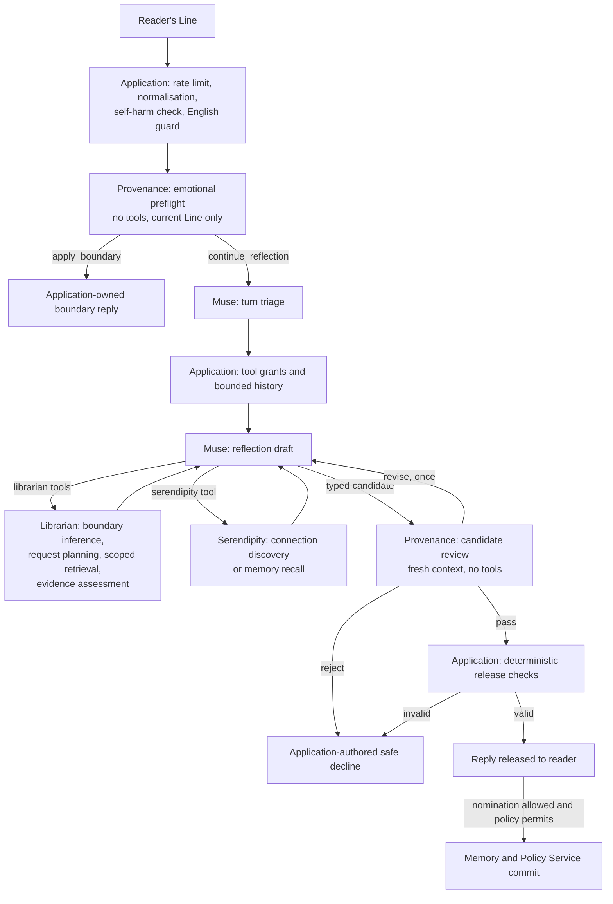
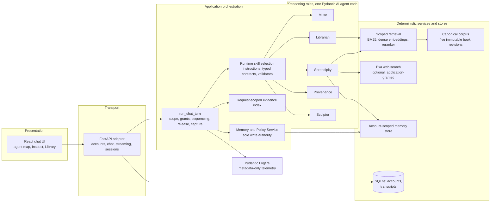
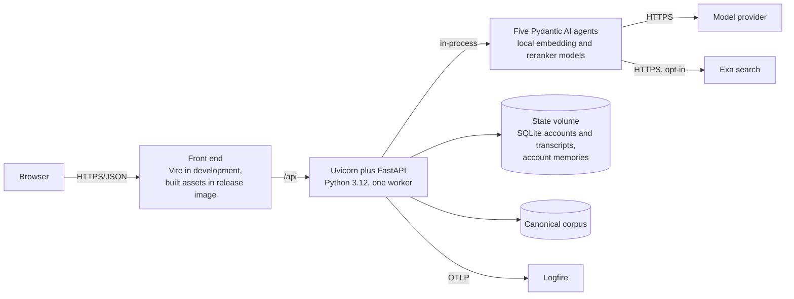
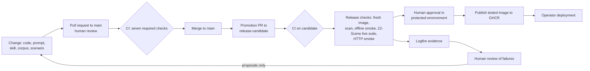
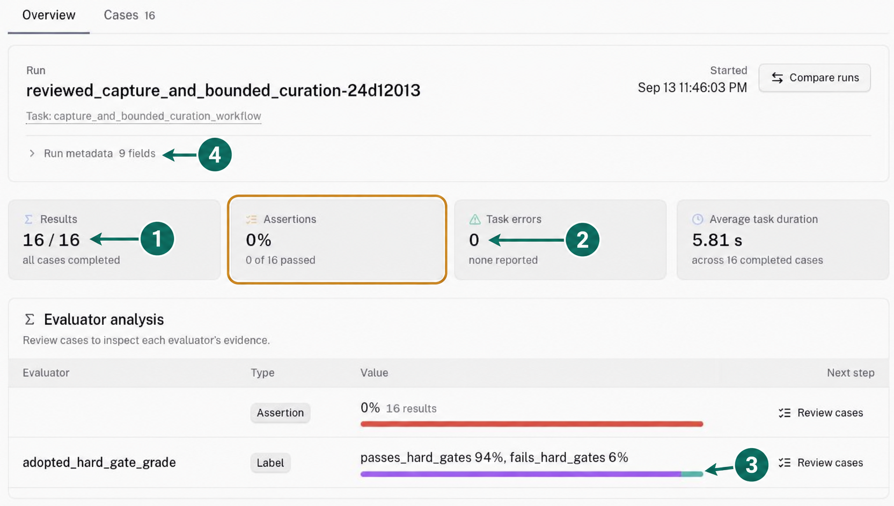
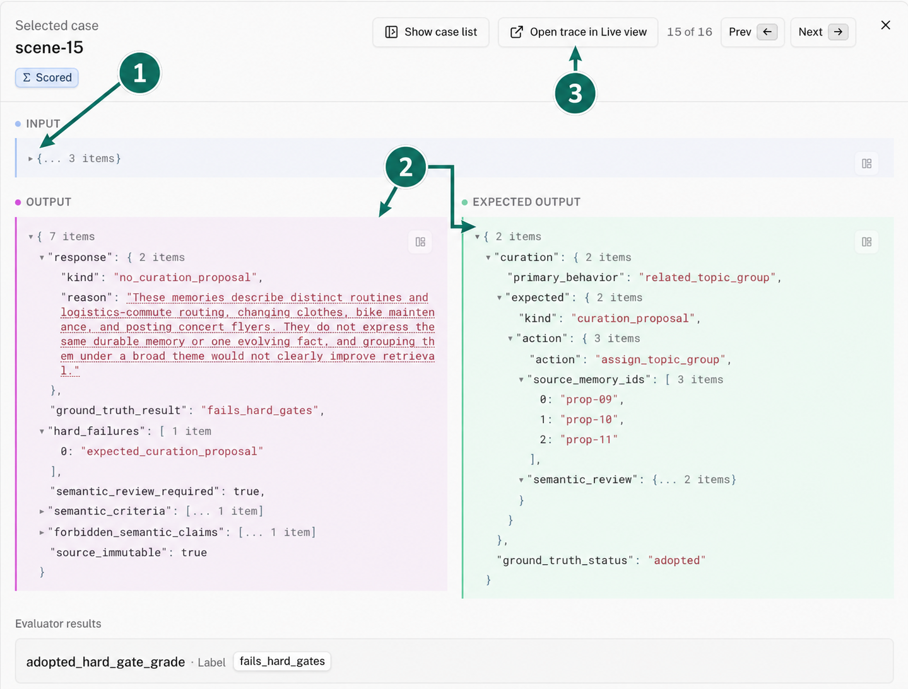

# Linger: A Provenance-First Multi-Agent Reflection Companion

**Group Project Report**

Team 9

Desmond Choy, Kevin Manuel Lee, Kay Mei Leong, Yuen Ying Jodie Loke, Avan *[surname to confirm]*

| Agent | Owner |
|---|---|
| Muse | Avan |
| Librarian | Kevin Manuel Lee |
| Serendipity | Yuen Ying Jodie Loke |
| Provenance | Kay Mei Leong |
| Sculptor | Desmond Choy |

---

## Contents

- [1. Executive Summary](#1-executive-summary)
  - [1.1 Objective and scope](#11-objective-and-scope)
  - [1.2 Key highlights of the solution](#12-key-highlights-of-the-solution)
  - [1.3 Constraints and assumptions](#13-constraints-and-assumptions)
- [2. System Overview](#2-system-overview)
  - [2.1 How the agents work together](#21-how-the-agents-work-together)
  - [2.2 High-level workflow](#22-high-level-workflow)
- [3. System Architecture](#3-system-architecture)
  - [3.1 Logical architecture](#31-logical-architecture)
  - [3.2 Physical architecture and infrastructure](#32-physical-architecture-and-infrastructure)
  - [3.3 Deployment strategy](#33-deployment-strategy)
  - [3.4 Agent communication protocols](#34-agent-communication-protocols)
  - [3.5 Justification of architectural style and technology choices](#35-justification-of-architectural-style-and-technology-choices)
- [4. Agent Roles and Design](#4-agent-roles-and-design)
- [5. Explainable and Responsible AI Practices](#5-explainable-and-responsible-ai-practices)
  - [5.1 Alignment across the development lifecycle](#51-alignment-across-the-development-lifecycle)
  - [5.2 Explainability and traceability](#52-explainability-and-traceability)
  - [5.3 Fairness and bias mitigation](#53-fairness-and-bias-mitigation)
  - [5.4 Governance framework alignment](#54-governance-framework-alignment)
- [6. AI Security Risk Register](#6-ai-security-risk-register)
- [7. LLMSecOps Pipeline](#7-llmsecops-pipeline)
  - [7.1 Change control](#71-change-control)
  - [7.2 Automated testing](#72-automated-testing)
  - [7.3 Versioning and tracking](#73-versioning-and-tracking)
  - [7.4 Deployment](#74-deployment)
  - [7.5 Monitoring and alerting](#75-monitoring-and-alerting)
  - [7.6 Logging and auditability](#76-logging-and-auditability)
  - [7.7 Bounded lifecycle automation](#77-bounded-lifecycle-automation)
- [8. Testing and Evaluation Summary](#8-testing-and-evaluation-summary)
  - [8.1 Evaluation approach](#81-evaluation-approach)
  - [8.2 Types of tests performed](#82-types-of-tests-performed)
  - [8.3 Contract test results](#83-contract-test-results)
  - [8.4 Component evaluation summary](#84-component-evaluation-summary)
  - [8.5 End-to-end scenario results](#85-end-to-end-scenario-results)
  - [8.6 Where the system loses quality](#86-where-the-system-loses-quality)
  - [8.7 Cost and latency](#87-cost-and-latency)
  - [8.8 Limitations and threats to validity](#88-limitations-and-threats-to-validity)
- [9. Reflection](#9-reflection)
  - [9.1 What the architecture established](#91-what-the-architecture-established)
  - [9.2 What the results cost](#92-what-the-results-cost)
  - [9.3 What the evaluation taught the team](#93-what-the-evaluation-taught-the-team)
  - [9.4 Individual reflections](#94-individual-reflections)
  - [9.5 Future work](#95-future-work)
- [Appendix A. Metric definitions](#appendix-a-metric-definitions)
- [Appendix B. Related work](#appendix-b-related-work)
- [References](#references)

---

## 1. Executive Summary

### 1.1 Objective and scope

Large language models make it straightforward to build a companion that discusses a person's reading and their life. They make it equally straightforward to build one that misquotes the book, invents what the person said, reveals a chapter the reader has not reached, or quietly stores something that should never have been kept. Linger is an academic prototype of a personal reflection and memory companion that treats these failures as the central design problem rather than as quality issues to be tuned after the fact.

A reader tells Linger about a book they are reading and about their own life. Linger helps them articulate why a passage or an experience mattered, preserves that reflection, and suggests tentative connections between their reading, their earlier reflections, and public sources. It is grounded in five public-domain works: *Alice's Adventures in Wonderland*, *Animal Farm*, *Narrative of the Life of Frederick Douglass*, *The Adventures of Pinocchio*, and Helen Keller's *The Story of My Life*.

The objective was to build this companion so that its characteristic failures are prevented by structure rather than discouraged by prompts, and to measure what that structure costs. The scope covers book-grounded reflection, connection discovery across books, memories, and the web, reviewed memory capture and curation, a web interface with accounts, and the delivery pipeline and evaluation needed to support it.

### 1.2 Key highlights of the solution

- **Five agents, one deterministic writer.** Muse, Librarian, Serendipity, Provenance, and Sculptor are arranged around one deterministic Memory and Policy Service, which is the only component that writes. No model may release its own output or widen its own authority.
- **Independent review before every release.** Every reply is drafted as a typed candidate, reviewed by a Provenance agent that has no tools and no conversation history, and validated by application code against a request-scoped evidence index before any text reaches the reader. Any failure becomes a fixed, application-authored decline.
- **Spoiler-safe retrieval.** The reader's reading position is resolved from their own words and applied before any search runs, so text beyond it never reaches a model.
- **Typed, application-mediated hand-offs.** Agents never call one another. Every hand-off is a typed envelope carrying only what the next step needs, and every model run carries a fingerprint of its exact configuration.
- **Evaluation and release pipeline.** Contract tests, component evaluations, and replay of synthetic conversations with human-adopted expected outcomes; CI with security scanning; and a release gate that requires live evaluation evidence and human approval.

On the committed evidence, the controls held where application code enforces them: no scenario released a fabricated quotation or text beyond the reader's position, and no memory was written without review. Their main costs are over-refusal of roughly one benign candidate in six to eight, grounded replies that took 82 to 90 seconds in observed turns, and up to 222,000 input tokens per message in the most demanding scenario.

### 1.3 Constraints and assumptions

- **Prototype, not production.** Linger runs as a single backend process. Readers sign up and log in, and released turns are saved per account in SQLite, but there is no password reset, email verification, or multi-process deployment, and no load test has been committed. The project makes no claims about scale, availability, or regulatory compliance.
- **External model provider.** Chat content is sent to the configured provider, OpenAI by default, with Google and Anthropic supported. Every live result was produced with OpenAI models, and the default model changed from `gpt-5.6-luna` to `gpt-6-luna` during the project.
- **Opt-in web access.** Public-web discovery through Exa is disabled unless both a policy flag and credentials are present.
- **Excluded functions.** Mental-health assessment, crisis routing, continuous monitoring, unsolicited resurfacing, and end-user memory management are out of scope, and no agent is designed or evaluated to perform them.
- **Synthetic evaluation data.** All evaluation uses synthetic readers and public-domain books. No real user data was used, and usefulness to real readers was not measured.

---

## 2. System Overview

### 2.1 How the agents work together

A reader's message, which the project calls a Line, enters the system through one application-owned boundary function, `run_chat_turn`. That function owns session scope, tool grants, agent sequencing, output release, and capture policy. Agents never call one another. Every hand-off is mediated by application code, which selects the skill, projects the input, runs the agent, and validates the result before deciding what happens next.

Before any model runs, the application enforces a limit of ten chat requests per rolling minute per account, normalises the message by removing control and invisible characters that could hide instructions, and applies a deterministic self-harm check and an English-language guard. A tool-less Provenance preflight then classifies the Line for the emotional boundary. A classification of `apply_boundary` diverts the turn to a fixed, application-authored reply that no model wrote, so a distressing disclosure never triggers retrieval or connection search.

Every other turn continues to Muse. A turn-triage step classifies the Line, and the application uses that classification and the available reading context to grant Muse only the specialist tools the turn needs. While drafting, Muse may call Librarian for book evidence and Serendipity for a connection or a recalled memory, and both return typed results rather than free text. Muse then returns a complete candidate containing the reply, a declaration of every piece of evidence it used with the exact reply spans that evidence supports, and either one exact-span memory nomination or a typed reason for nominating nothing.

Provenance reviews that candidate from a fresh typed input with no history. It verifies each declaration against the frozen evidence and separately scans the whole reply for undeclared quotations, factual claims, and sensitive inferences. It may pass the candidate, ask for one revision, or reject it. After a pass, application code resolves every declaration against the request-scoped evidence index and checks each quotation verbatim against both the source record and the reply, and only then releases the text. Any failure at any stage produces a safe decline, a fixed message that reveals nothing from the rejected candidate and writes nothing to storage.

### 2.2 High-level workflow

Figure 1 shows the sequence for one chat turn.

**Figure 1.** One chat turn. Every arrow is an application-mediated hand-off carrying a typed envelope. The two paths out of the deterministic checks are the only ways model-written text reaches the reader.

Two workflows run outside the reply path. After a new memory is committed, the application may run reviewed curation: Sculptor proposes one change over a bounded set of stored records, Provenance reviews the proposal against its exact sources, and the Memory and Policy Service applies only an approved proposal whose content digest still matches. Memory surfacing, in which Sculptor judges whether stored history could help a later conversation, runs only in offline evaluation.

---

## 3. System Architecture

### 3.1 Logical architecture

Figure 2 shows the components and their permitted interactions. The React front end communicates with a thin FastAPI adapter that handles transport and authentication only. Synthetic evaluation replay calls the same `run_chat_turn` boundary directly, so evaluation exercises production code paths rather than a parallel harness that could drift from them.

**Figure 2.** Logical architecture. No edge connects two agents.

The request-scoped evidence index is where the provenance guarantee is finally enforced. It accepts only exact records returned by the current Librarian result, the selected records of a current Serendipity proposal, and records re-resolved from identifiers cited in an earlier released reply in the same session. Memory declarations must bind to the authenticated account's active memories, and web declarations must bind to a page actually opened from an application-supplied URL or a permitted search lead. A quotation that cannot be bound to a record in the index does not reach the reader, however confident the drafting model or favourable the review.

### 3.2 Physical architecture and infrastructure

The prototype runs as two processes during development: a Vite server for the React 19 front end and a Uvicorn-hosted FastAPI backend on Python 3.12, with all five agents, the local retrieval models, and the stores resident in the backend process. Accounts and saved transcripts are held in SQLite, the corpus as versioned and content-hashed Markdown, and account memories as Markdown records. Model calls travel over HTTPS to the configured provider.

**Figure 3.** Physical architecture.

### 3.3 Deployment strategy

Deployment is containerised. Docker Compose builds and runs the front end and backend as two services, with account databases, transcripts, and memories kept in named volumes. For release, a single Linux AMD64 image built on Ubuntu 24.04 runs one non-root Uvicorn worker and serves the built front end. The image contains the canonical corpus, the skills and prompts, and the local embedding and reranking models with their file hashes, and it excludes provider keys, account databases, private memories, and raw evaluation reports. Readiness and health endpoints check configuration, storage, corpus, and local models without making a paid model call. An approved image is published to the GitHub Container Registry, and deployment from the registry is a separate operator action. The path does not provide multi-user capacity, distributed session storage, or zero-downtime deployment.

### 3.4 Agent communication protocols

There is no free-form messaging between agents. Every hand-off is a strict, discriminated Pydantic envelope carrying only the fields the receiving step requires, and full transcripts and unrestricted working context are never passed. Table 1 lists the envelopes in the order they occur.

| Hand-off | Input to output | Authority note |
|---|---|---|
| Application to Provenance, preflight | `EmotionalBoundaryInput` to `EmotionalBoundaryAssessment` | Current Line and versioned policy only |
| Application to Muse, triage | Current Line to a typed turn classification | Classification only; the application decides the tool grants |
| Application to Muse, draft | `MuseDraftInput` or `MuseRevisionInput` to `MuseCandidate` | A revision keeps the original turn's authority, and at most one is permitted |
| Muse to Librarian, via tools | `librarian_route`, `librarian_search` | Thin adapters. The model writes no book query; the application supplies the reader's exact spans |
| Application to Librarian | Boundary inference, event identification, book request planning, and evidence assessment inputs to typed decisions | Decisions are content-free. Spans must be exact reader text, and identifiers must resolve |
| Muse to Serendipity, via tool | `serendipity_explore` to `ConnectionProposal`, `MemoryRecall`, or `ConnectionDecline` | Fresh dependencies per request. The intent selects the skill |
| Application to Provenance, review | `ProvenanceInput` to `ProvenanceReview` | Fresh input with no history. A revision review carries finding resolutions |
| Application to Sculptor | `AccountScopedMemories` to `CurationProposal` or `NoCurationProposal` | Account identity excluded from the model input |
| Application to Provenance, curation | `CurationReviewInput` to `CurationProvenanceReview` | The verdict echoes the proposal digest unchanged |
| Application to Memory and Policy Service | Reviewed command carrying a digest | Accepted only when the digest matches an approving verdict and the sources are unchanged |

**Table 1.** Typed hand-off envelopes.

Authority travels in the input rather than being asserted in the output. Serendipity, for instance, receives a scope object stating which sources it may search and at what chapter ceiling, and returns evidence identifiers that application code re-resolves. No agent ever asserts that it was permitted to do something, because such an assertion is exactly what an injected instruction could manufacture.

### 3.5 Justification of architectural style and technology choices

The dominant risk in this system is not that a model writes a poor sentence but that a model widens its own authority, whether through an instruction injected in retrieved content or through ordinary confident error. That judgment drove the choice of application orchestration in plain Python over an agent-graph framework such as LangGraph, AutoGen, or CrewAI. Sequencing, tool grants, and release decisions are easiest to control, read, and unit-test when they live in one explicit boundary function, whereas a framework that makes agent-to-agent delegation ergonomic optimises for a property the project specifically did not want.

Five roles rather than one well-instructed model is likewise a decision about authority. A component that cannot see the memory store cannot leak it, and a reviewer with no conversation history cannot be talked round by an argument made earlier in that history. The same provider model may play several roles. What separation buys is not independence of judgment but separation of duties, with boundaries that are enforceable in code and testable without a model.

| Choice | Alternative considered | Reason |
|---|---|---|
| Five roles under application orchestration | One model that reflects, retrieves, connects, curates, and checks its own work | Authority, not capability. Each boundary is enforceable in code and testable without a model |
| Plain Python orchestration | An agent-graph framework | The dominant risk is authority widening, which is easiest to control and test in one explicit sequence |
| Pydantic AI | Custom tool dispatch and web clients | Typed input and output with validation retries, per-run instructions, a capability model, provider abstraction, Logfire instrumentation, and a maintained Exa capability |
| One agent per role with per-run skills | One agent per skill | Keeps per-role tool and validator authority while making each task's instructions, schema, and retries explicit and separately fingerprinted |
| Deterministic retrieval with model judgment on either side | Model-driven retrieval | Spoiler safety cannot depend on a model's discretion. The model judges only the boundary and the evidence strength |
| Hybrid BM25 and dense retrieval with cross-encoder reranking | A single retrieval strategy | Chosen by measurement (Section 8.4): highest evidence recall with the least evidence volume, at a retrieval p95 of 0.46 seconds |
| Logfire under a written data contract | Ad hoc logging | Traceability without content leakage, enforced by a typed projection and an exported-payload test |
| SQLite for accounts and transcripts; content-hashed Markdown for corpus and memories | A database server | Adequate for a single-process prototype; immutable, hashed records are simple to reason about and audit |

**Table 2.** Architecture and technology choices.

---

## 4. Agent Roles and Design

All five agents use the configured model, `LINGER_MODEL`, which defaults to OpenAI's `gpt-6-luna` at low reasoning effort; earlier evaluations used `gpt-5.6-luna`. Table 3 summarises each role. Each agent's internal design is described only to the depth needed to understand the system.

| Agent | Purpose and responsibilities | Model | Memory | Tools |
|---|---|---|---|---|
| Muse | Owns the conversation. Triages each Line, drafts the only reader-facing prose, nominates at most one exact span for capture, and repairs one round of review findings | Configured model; turn triage uses `gpt-6-luna` with OpenAI or `gemini-2.5-flash` with Google | Released session history only: at most eight recent turns and 16,000 characters. Stored memories arrive only as evidence returned by Serendipity | `librarian_route`, `librarian_search`, `serendipity_explore`, each granted by the application per turn |
| Librarian | Resolves the reader's reading boundary, plans book requests as exact spans of the reader's text, and judges whether permitted passages support each part of a request | Configured model, plus local embedding and reranker models in application-owned retrieval | Stateless per request, apart from a chapter the reader explicitly declared, which is held for the session and saved per account and work | None. Retrieval is application code |
| Serendipity | Looks for one tentative, evidence-supported connection between a reflection and a permitted book passage, memory, or web page, or returns a typed decline; under a separate intent, recalls the reader's earlier words | Configured model | None. Holds no account identity | Book search through Librarian's path, account memory search, and Exa web search with page retrieval, each granted per request |
| Provenance | Classifies each Line for the emotional boundary, reviews every complete Muse candidate and memory nomination, and reviews every Sculptor curation proposal against its exact sources | Configured model | None. Every review starts from a fresh typed input | None |
| Sculptor | Proposes bounded curation over supplied memory records while preserving originals; judges memory surfacing offline; runs offline retrieval-improvement experiments | Configured model | None. Receives only a bounded record set, with account identity excluded | None, except web search and page retrieval in offline research tasks |
| Memory and Policy Service | Deterministic application code, not an agent. The only component that writes | None | Owns the account-scoped store: immutable originals, curation layer, audit log | Not applicable |

**Table 3.** Agent roles.

Muse is the only role that writes reader-facing prose or sees conversation history, and it can neither release its own words nor write durable memory. Its tools are thin adapters that the application grants and executes: the model supplies an intent, and the application supplies the reader's exact wording, so Muse cannot substitute a paraphrase of its own as a search query.

Librarian's significance lies in the order of its work. The reading boundary is derived from the reader's words and applied before any search runs, so passages beyond the boundary never reach the evidence judge, the drafting model, or the reranker. Only an explicitly declared chapter persists; inferred boundaries are resolved afresh on every request, so a boundary established in one turn cannot silently authorise disclosure in a later one.

Serendipity is a separate role because finding connections requires search, comparison, and a genuine willingness to say no, and a drafting agent that also hunts for connections has a standing incentive to find one. It filters candidates for eligibility before ranking them, and a tie between the top two candidates produces a decline rather than an arbitrary choice. Its runs are capped at eight model requests and six tool calls.

Provenance is the reason the rest of the design can afford model initiative elsewhere. Its review input is organised by trust level, separating policy and reading scope from frozen evidence and from untrusted tool outcomes. A finding of `spoiler` or `prompt_injection` forces outright rejection with no revision. A Provenance approval is necessary but never sufficient for release or for a write.

Sculptor's proposals are bound to the content digest of the records it saw, reviewed independently by Provenance, and applied only by the Memory and Policy Service after the sources have been re-read and re-hashed. Declining to curate is a valid outcome, because a curator under pressure to produce a proposal would eventually propose a merge that loses information.

The Memory and Policy Service turns identity, policy, and reviewed candidates into auditable storage decisions. A capture requires trusted account scope, capture policy enabled, a nomination validated as an exact slice of the current message, an independent Provenance allowance, no sensitive content, and an atomic commit without overwrite. A turn that ends in a safe decline or the emotional boundary writes nothing, even if the nomination was approved.

---

## 5. Explainable and Responsible AI Practices

### 5.1 Alignment across the development lifecycle

Responsible AI practice is distributed across the lifecycle rather than concentrated in a final review.

- **Framing.** The specification excludes mental-health profiling, diagnosis, crisis routing, continuous monitoring, and unsolicited resurfacing. The emotional preflight exists to route a distressing disclosure away from the reflective path, not to assess the person.
- **Data.** Only public-domain works are used, each with a recorded source audit and content hash. Evaluation data is synthetic, generated by a model but adopted by a person, and no real user data is used for evaluation.
- **Design.** Authority is separated by component, and every input class is labelled by trust level, so book text, memories, web pages, and model candidates reach a reviewing model marked as data rather than instruction.
- **Development.** Prompts are versioned, packaged resources with automatically computed digests, and prompt changes pass human review.
- **Evaluation.** The three evaluation layers keep contract, component, and conversation claims apart, and any result from a model judge is labelled non-independent because the judge may share the model under test.
- **Operation.** Telemetry is metadata-only under a written contract, and no production configuration can enable content capture in telemetry.
- **Improvement.** Self-improvement loops produce human-reviewed proposals only and grant no runtime authority.

### 5.2 Explainability and traceability

Every turn is inspectable in the local application. The Inspect view and live agent map show the resolved context, each agent's outcome, the Provenance verdict and finding codes, the deterministic validation results, the release source, and the Logfire trace identifier. Explainability is a property of the recorded decision path rather than a narrative the model writes about itself, because a model's account of its own reasoning is another output that would need verification.

Evidence is separated from interpretation within the reply. Book quotations are verbatim and located, claims drawn from a web page carry an exact visible citation, and memory evidence is attributed as the reader's own words rather than as public fact. Every model span records the role, skill, configuration digest, hand-off origin and receiver, verdicts, retries, tokens, latency, and cost. Declines explain themselves through a fixed enumeration of causes rather than generated prose, which keeps the reason for a refusal auditable.

### 5.3 Fairness and bias mitigation

The corpus is small and old and contains dated cultural perspectives. The mitigation is architectural: Linger surfaces book text as quoted evidence attributed to the work and never restates it as the system's own claim, which limits how far the corpus's perspective can be laundered into apparently neutral prose. Provenance detects sensitive inferences whether or not Muse declared them, and content about sensitive traits is never captured. The emotional-content policy is a request-local interaction boundary rather than a label or score attached to the person.

The project has not run a persona-diversity evaluation testing whether equivalent reflections receive comparable treatment across readers of different backgrounds, and it makes no claim about fairness across reader populations.

### 5.4 Governance framework alignment

| Model AI Governance Framework heading | Linger practice |
|---|---|
| Internal governance structures | Written system specification and telemetry contract, issue tracking of decisions, human review of every prompt change, protected release environment with a required human reviewer |
| Level of human involvement | Human-in-the-loop for Ground truth adoption, prompt changes, capture-policy changes, self-improvement proposals, and release approval; human-out-of-the-loop only for bounded, reviewed, reversible runtime decisions |
| Operations management | Source audits and content hashing, automatic configuration digests, repeatable scenario replay, a fixed failure taxonomy, and release evidence bound to a commit and image identity |
| Stakeholder interaction and communication | A visible notice for every committed capture, and consistent separation of the reader's words, source text, and the system's interpretation in every reply |

**Table 4.** Alignment with the Model AI Governance Framework.

The framework's generative-AI extension emphasises content provenance, which corresponds directly to the role of the Provenance agent and the evidence index.

---

## 6. AI Security Risk Register

Sixteen risks were identified from the OWASP Top 10 for LLM Applications, the safeguards in the system specification, and failures observed during evaluation. They fall into four groups: content that reaches the reader (R1 to R3, R7), content that leaves the system or crosses accounts (R4 to R6, R10, R16), the integrity of the pipeline (R8, R11 to R13, R15), and usability and cost (R9, R14).

| ID | Risk | Likelihood | Impact | OWASP category | Principal control | Evidence status |
|---|---|---|---|---|---|---|
| R1 | Indirect prompt injection through retrieved content or the Line | High | High | LLM01 | Message normalisation, untrusted labelling, application-owned grants, forced rejection on `prompt_injection` | Injection class blocked in both gate runs; triage flagged every override attempt in its completed runs; release-suite attack datasets adopted, live runs deferred |
| R2 | Fabricated or altered quotations and citations | High | High | LLM09 | Muse output validator, verbatim quotation checks, request-scoped evidence index | Citation precision 1.00; one uncited web claim passed review in the latest gate run |
| R3 | Spoiler leakage beyond the reading boundary | Medium | High | LLM02 | Boundary resolved per request, scope applied before search, forced rejection on `spoiler` | Zero exposures in the retrieval benchmark and a 23-Scene audit |
| R4 | Private wording leaking into web queries | Medium | High | LLM02 | Serendipity privacy gate on queries and URLs | Contract tests only |
| R5 | Cross-account memory exposure | Low | High | LLM02 | Account scope from the authenticated token only | Contract and API authorisation tests |
| R6 | Unsafe automatic memory capture | Medium | High | LLM02 | Independent capture veto, deterministic policy, sensitive content never captured | Capture-veto recall 1.00 in both gate runs |
| R7 | Over-reach on distressing disclosures | Medium | High | Not applicable | Deterministic self-harm check, tool-less preflight, fixed boundary reply | 8 of 8 preflight cases correct, single run |
| R8 | Output-gate bypass | Low | High | LLM05, LLM06 | Single application-owned release path; rejected drafts excluded from history | Contract tests and turn inspection |
| R9 | Over-refusal degrading usefulness | Medium | Medium | Not applicable | One bounded revision before decline; over-refusal reported as a first-class metric | Measured: 0.12 to 0.18 on responses, 0.11 to 0.33 on captures |
| R10 | Telemetry leaking reader content | Low | High | LLM02 | Telemetry contract, typed projection, exported-payload test | Contract tests |
| R11 | Prompt drift | Medium | Medium | Not applicable | SHA-256 configuration fingerprint on every span; reviewed prompt changes | Contract tests |
| R12 | Supply-chain and code vulnerabilities | Medium | Medium | LLM03 | Locked dependencies; Trivy and CodeQL gates in CI; actions pinned to reviewed commits | Enforced on every pull request |
| R13 | Secrets exposure | Low | High | LLM02, LLM07 | Environment file excluded from version control and the image; release keys held in protected environments | No dedicated secret scanning |
| R14 | Cost and latency abuse | Low | Medium | LLM10 | Ten requests per minute per account; per-role request and tool budgets | Contract tests; counters are per process |
| R15 | Developer environment leaking into tests | Medium | Low | Not applicable | CI generates its own offline environment file | Observed once; tests should pin policy explicitly |
| R16 | Account compromise | Low | High | LLM02 | Salted scrypt password hashes; bearer tokens; account derived from the token on every route | API tests; no password reset or verification |

**Table 5.** AI security risk register. Likelihood and impact are the team's qualitative ratings. Evidence comes from Section 8.

Every risk except R13 has some committed evidence, but its strength varies. R1 to R3, R6, R7, and R9 have live-model evidence. R4, R5, R10, R11, R14, and R16 carry contract-test evidence only, which shows the application enforces the control on whatever a model produces but not how often a live model attempts to violate it. R12 is enforced by CI on every change. R13 has no dedicated secret scanning. R2 now has a live counter-example: in the latest release-gate run the reviewer passed an uncited web claim that it should have sent back, which is the class of error Section 9.1 discusses. R15 was discovered rather than anticipated: running the tests with a developer's environment file, which granted web search, produced failures in tests that assert the connection tool is not granted, because the tests inherited policy from the environment instead of pinning it.

---

## 7. LLMSecOps Pipeline

The pipeline is a loop that begins with a change and ends with an approved, tested image or a reviewed proposal for the next change. Figure 4 shows it.

**Figure 4.** The LLMSecOps loop. The release checks are built but currently switched off in the release configuration, so release runs skip the image build, live evaluation, and publication.

### 7.1 Change control

All changes reach `main` through pull requests with human review and required CI checks. Batches of changes are promoted from `main` to a protected `release-candidate` branch by a further pull request, and the resulting commit is the candidate's identity. Prompt and skill changes follow exactly the same path as code. Development was specification-first: a single system specification records the product scope, the authority model, the output release contract, the safeguards, and the acceptance criteria, and a separate telemetry contract is the sole authority on what may be logged. The system was grown in layers, so that a working end-to-end slice existed before each capability was added: reflection with independent review first, then book grounding, then connection discovery, then reviewed capture and curation, and finally accounts, persistence, and the release pipeline.

### 7.2 Automated testing

Continuous integration runs seven required checks on every pull request and push to either branch, without paid model calls or provider secrets.

| Check | Evidence |
|---|---|
| Backend tests | Contract tests, including API authorisation, privacy boundaries, source preservation, evaluation contracts, and release rejection cases |
| Backend tests (embeddings) | Retrieval regressions against the real local embedding and reranker models |
| Frontend tests | Front-end and Ground-truth reviewer tests, lint, and production build |
| CodeQL (Python) and CodeQL (JavaScript/TypeScript) | Static security analysis; findings of severity 7 or above block the build |
| Dependency security | Trivy scan of dependency locks; HIGH or CRITICAL findings block |
| Image (amd64) | Container build, offline startup and persistence smoke test, image vulnerability scan |

**Table 6.** Required CI checks.

The AI-specific security tests are part of the contract suite: release-gate and curation risk-code grading, the emotional-boundary and privacy-gate tests, and injected-content cases. Live-model evaluations are not run on every push, because that would make CI non-deterministic and costly. They run in the release checks, and component evaluations are run manually with their reports committed alongside the date, model, and prompt digest, so staleness is visible.

### 7.3 Versioning and tracking

Code is versioned in Git, and dependencies are locked in `uv.lock` and `pnpm-lock.yaml`. Corpus revisions are content-hashed, so a citation binds to an exact revision of an exact work. Every prompt and skill configuration carries a SHA-256 digest computed over its instructions, input and output schemas, tool permissions, validators, and retry limits, so any change to these alters the digest without anyone remembering to bump a version. Evaluation reports record the dataset digest, run identifier, model, and Git revision, adopted Ground truth records a hash of the approved bytes, and release evidence records the candidate commit and Docker image identity.

### 7.4 Deployment

When live evaluations are enabled, a successful candidate CI run triggers a release run that builds a fresh image at the candidate commit, scans it, proves offline startup and persistence, runs the 22-Scene behavioural suite against a live model, and makes two live HTTP turns against the image. Security failures, invalid adoption, missing observations, and missing evidence block publication outright, and only listed behavioural shortfalls can proceed to human review. With automatic publication off, every eligible candidate waits for a human reviewer, who publishes the same tested image to the registry without rebuilding it. Live evaluations and publication are currently disabled in the release configuration until the team is ready to pay for them.

### 7.5 Monitoring and alerting

Logfire provides three views. The Live view shows the trace hierarchy and per-role exchanges of a run, the Agents view aggregates runs, cost, and duration by role, and the Evals view holds evaluation datasets with expected and actual labels. Every failure carries a fixed stage, code, category, retryability flag, and owner, where the owner is the model, validation, or the application, so failures can be triaged without reading error text. No alert rules are configured; a deployed version would need them.

### 7.6 Logging and auditability

Runtime spans are metadata-only, and an exported-payload test inspects what actually leaves the process rather than what the code intends to send. A separate evaluation identity may record synthetic content only. Every applied curation produces an immutable audit event, so the memory store carries its own modification history. Release approvals record the publication route, registry digest, tested image, and CI run.

### 7.7 Bounded lifecycle automation

Two loops are specified to reduce development effort while keeping humans in control. In failure-to-eval promotion, rejections, blocked injections, and failed checks emit permitted metadata signatures that identify candidate regression gaps; turning a signature into a synthetic scenario remains a human-reviewed step. In the Sculptor-curated playbook, Sculptor proposes pull requests that deduplicate and prune a versioned playbook of operational lessons, gated by CI and human review like any other change. Both loops run outside conversations and add no runtime authority.

---

## 8. Testing and Evaluation Summary

This section summarises how the system as a whole was tested and evaluated. Each agent's own design-level tests and quality evaluation are reported with that agent rather than here; Section 8.4 gives only a summary of their headline results.

### 8.1 Evaluation approach

Improvement proceeded in measured cycles. Early cycles re-ran the full scenario set after each prompt or code change; the batch reported in Section 8.5 is the eighteenth iteration of one such cycle, focused on Librarian. Error analysis of those cycles showed that many fixes had been judged from one or two runs on a system whose behaviour varies from run to run, and the protocol in Section 8.1.4 was adopted as a result.

#### 8.1.1 Three layers of evidence

Evaluation is organised in three layers that answer different questions, and their results are never pooled. Keeping them apart is a methodological commitment, because the commonest way to overstate the safety of a system like this is to report a contract test as though it were evidence about model behaviour.

**Layer 1: contract tests with mocked models.** Given a model output, does the application enforce its contracts? These tests replace the provider with Pydantic AI's `TestModel` or a fixed function. They establish authority boundaries, validator behaviour, retry limits, scope enforcement, and telemetry redaction, and they establish nothing about decision quality.

**Layer 2: component evaluation with a live model and fixed evidence.** Does each agent make the right local decision when its evidence is held constant? Retrieval dependencies return fixed evidence, so a failure localises to the agent's own judgment rather than to retrieval variance; an agent handed irrelevant passages that correctly declines is otherwise indistinguishable from one that declines out of timidity. Grading has two parts. Deterministic hard gates check schema, response kind, cited identifiers, required and forbidden tool calls, word limits, and quotation substrings. A separate semantic review is performed by a person or a model judge, and a semantic score can never override a failed hard gate.

**Layer 3: scenario replay with a live model through the production chat-turn boundary.** Do the agents hand off correctly, and do the safeguards hold across a whole conversation? Replay runs synthetic conversations through `run_chat_turn` exactly as a reader's messages would run.

#### 8.1.2 Evaluation data and Ground truth

Scenario replay uses a controlled vocabulary.

| Term | Meaning |
|---|---|
| Objective | One system-level evaluation goal from a catalogue, with its hard gates and measures |
| Scenario | The complete evaluation design for one synthetic person and account |
| Backstory | That person's situation and reading history |
| Prop | A memory record placed in the store before a Scene runs |
| Line | One reader message |
| Scene | One graded unit: a Line, its Props, and the expected outcome |
| Ground truth | The expected outcome of each Scene, authoritative only after a human reviewer adopts it |

**Table 7.** Scenario-replay vocabulary.

Scenarios are generated by a model and adopted by people, in four stages that keep generation, adoption, and replay separate. A person selects Objectives and approves a generation design; an authorised model writes the Backstory, Props, Lines, and a proposed Ground truth, which are validated without any provider call; a reviewer independent of the generator adopts or flags every expected outcome in a local review application, and adoption records a hash of the approved bytes; and replay runs the Scenario through the production boundary and writes an analysis report for every run, including all-pass runs. Ground truth never enters the system under evaluation, so the agents cannot see the answer key.

The saved Scenarios cover book grounding and clarification in all five works, cross-source connections, reviewed capture and curation, session continuity and longitudinal memory retrieval, sensitive inference with capture veto, memory injection, and direct attacks in the reader's message. A combined Scenario exercises all five agents across nine Scenes.

#### 8.1.3 Metrics

For safety gates, the primary pair is recall on the unsafe class, the fraction of unsafe inputs blocked, and the over-refusal rate, the fraction of benign inputs blocked or sent back. For evidence, the primary pair is evidence recall, the fraction of required passages present in the released evidence, and citation precision, the fraction of released citations that are relevant. Latency, tokens, and model requests are reported as costs. Because live runs are non-deterministic, a case is reported under pass^k where repeats exist, meaning it passes only if all k repeats pass. Appendix A defines every metric.

Reader value, whether a released reply was worth reading, is a human judgment. The project records it as such and reports no proxy score for it.

#### 8.1.4 Repetition and experiment protocol

Early component suites and scenario batches were run once each, and a single passing run was taken as evidence that a component worked. Re-running suites with repeats showed that this was unsafe (Section 9.3), and the protocol for later work became:

- **Locked baseline.** Measurements compare against a named commit, model, and adopted Ground truth, so a change in result can be attributed to a change in the system.
- **Repeats.** At least three, and usually five, repetitions per case on one frozen variant, reported as a rate or under pass^k.
- **Pre-registration.** The pass mark, the stop rule, and each Scene's expected direction of change are written down before the run, so the result cannot be read selectively afterwards.
- **Held-back data.** Improvement loops see a practice set; a sealed set is run once at the end.
- **Isolation.** When an end-to-end measurement varied for too many reasons at once, the question was re-asked in isolation, for example measuring memory search directly instead of through whole replies. An ablation run in isolation, such as curation applied without its review step, is labelled as such and never read as production behaviour.
- **Human approval.** A person approved each model prompt before it ran and each proposal before it was applied.

#### 8.1.5 Human review

Hard gates check that the right sources were cited, not what the reply says about them, so automated passes overstate quality. Scenario runs are therefore followed by a human semantic review; in the batch reported in Section 8.5, it classified each Scene as a credible pass, a limited pass, a potential false positive or negative, or a supported failure. The replay tooling writes an analysis report for every run and flags potentially misleading passes, where the expected outcome occurred for the wrong reason. Where a model judge is used instead of a person, it is labelled non-independent, since it may share the model under test, and no hard gate depends on it.

### 8.2 Types of tests performed

| Type | What it covers | Where it runs | Section |
|---|---|---|---|
| Unit and contract tests | Authority boundaries, validators, retry limits, retrieval scope, capture policy, account authorisation, telemetry redaction, with mocked models | CI, every pull request | 8.3 |
| Retrieval regression tests | Retrieval with the real local embedding and reranker models | CI, every pull request | 8.3 |
| Front-end tests | Front-end behaviour, lint, and production build; the Ground-truth review application | CI, every pull request | 7.2 |
| AI security tests | Release-gate and curation risk codes, injection and policy-override classes, emotional boundary, privacy gate, instruction-leak and self-harm detectors | CI (mocked) and live component suites | 8.3, 8.4 |
| Static and dependency security analysis | CodeQL for Python and TypeScript; Trivy for dependency locks and the container image | CI, every pull request | 7.2 |
| Container and deployment tests | Image build, offline startup and persistence, readiness checks, live HTTP and streaming turns | CI and release checks | 7.4 |
| Component evaluations | Each agent's decisions with a live model and fixed evidence | Manual, reports committed | 8.4 |
| End-to-end scenario replay | Whole conversations through the production chat-turn boundary against human-adopted Ground truth | Manual and release checks | 8.5 |
| Release behavioural suite | 22 Scenes covering grounding, memory retrieval, connections, sensitive inference, memory injection, and direct attacks | Release checks, currently switched off | 7.4 |

**Table 8.** Types of tests performed.

### 8.3 Contract test results

The backend suite on the current `main` commit (`48f9524`, 6 October 2026) collects 3,172 tests. Continuous integration runs them on every pull request, split into an ordinary job and a job that loads the real local embedding and reranker models, alongside the front-end and Ground-truth reviewer tests. Table 9 groups the backend tests by area.

| Area | Tests | What the group establishes |
|---|---:|---|
| Librarian, retrieval, and corpus | 681 | Boundary decisions grant nothing without support; retrieval never returns records above the ceiling; every corpus revision hashes and parses identically |
| Synthetic evaluation and release tooling | 523 | Ground-truth structures validate deterministically; a component pass cannot become an Objective pass; release blockers cannot be overridden |
| Accounts, API, and chat-turn orchestration | 425 | Only released turns enter history; every release has a recorded verdict; account scope comes from the login token; rate limits and message guards run before any agent |
| Provenance review paths | 400 | Fixed finding codes; forced rejection on spoiler and injection; every prior finding resolved on revision; curation verdicts bound to the digest |
| Cross-cutting contracts, safety detectors, and deployment | 373 | Supported-claim spans are exact; evidence budgets fail closed; self-harm and instruction-leak detectors; usage limits; deployment readiness and security-gate parsing |
| Serendipity and web access | 334 | Copied reader wording never reaches a public query or URL; discovered URLs require a search lead; recall returns only exact records |
| Sculptor and Memory and Policy Service | 332 | Originals are immutable; tombstones are reversible; capture requires nomination, policy, and no veto |
| Runtime skills and fingerprints | 72 | Skill selection is explicit; digests change with instructions, schemas, tools, validators, or retries |
| Telemetry redaction | 32 | Exported payloads contain only contract-permitted fields; failures classify by exception type, not text |

**Table 9.** Backend contract tests by area, grouped by test-module name.

What this layer does not establish bears repeating, because the size of the number invites over-reading. Every model call in these tests is a `TestModel` or a fixed function. The suite proves that the application enforces its contracts on whatever the model returns, and says nothing about whether the live model returns good decisions.

### 8.4 Component evaluation summary

Table 10 summarises the most recent committed component result for each agent. These results locate the cause of system-level outcomes; they are not evidence about the whole system on their own.

| Agent | Suite, date, model | Headline result |
|---|---|---|
| Provenance | Release gate, 52 cases, 27 Sep, `gpt-6-luna` | Block recall 0.94 (one uncited web claim passed); over-refusal 0.12; capture-veto recall 1.00 |
| Provenance | Release gate, 52 cases, 22 Sep, `gpt-5.6-luna` | Block recall 1.00; over-refusal 0.18; capture-veto recall 1.00 |
| Provenance | Curation gate (12 cases), emotional preflight (8), claim mapping (4), 22 Sep | All targets met |
| Librarian | Retrieval benchmark, 12 queries, no language model | Reranked hybrid: evidence recall 0.92, citation precision 0.83; zero spoiler exposures in all five configurations |
| Librarian | Live run, 12 cases, 17 Aug, `gpt-5.6-luna` | Evidence recall 0.92, citation precision 1.00, zero spoiler exposures |
| Serendipity | Component suite, 46 cases × 5, 24 Sep, `gpt-5.6-luna` | Run pass rate 0.91; 38 of 46 cases pass all five repeats |
| Muse | Reflection, 51 cases × 3, 30 Sep, `gpt-6-luna` | Hard-gate pass rate 0.94; no leaks |
| Muse | Turn triage, 92 cases × 3, 26 Sep, `gpt-6-luna` | Acceptable classification 0.99 to 1.00 |
| Sculptor | No committed component suite | Evaluated through the Scenarios in Section 8.5 |

**Table 10.** Component evaluation summary. Most results are single runs; the Librarian live run predates two of its current skills.

### 8.5 End-to-end scenario results

**Book grounding and connections.** The most recent committed batch across the book-grounding and connection Scenarios is iteration 18 of the Librarian-focused improvement cycle, run on 18 September with `gpt-5.6-luna` at medium reasoning effort. Twelve suites ran with six concurrent workers, and 222 source files were hash-verified unchanged before and after the run.

| Evaluation | Result |
|---|---|
| Native scenario replay across eight Scenarios | 26 of 29 Scenes passed; 28 of 32 judgments; 5 of 8 Scenarios passed strictly |
| Muse and Librarian release suite | 12 of 12 |
| Claim-mapping suite | 4 of 4 |
| Outside-essay web smoke test | Passed |
| Boundary audit across 23 book Scenes | No ceiling leak and no support leak; 5 positive independent event gates and 6 safe ambiguous controls |
| Human review of the 29 native Scenes | 17 credible passes, 8 limited, 1 potential false positive, 1 potential false negative, 2 supported failures |

**Table 11.** Scenario replay, iteration 18, 18 September 2026.

The character of the failures matters as much as the pass count. In *Douglass*, after a wrong-record repair and a duplicate-inventory repair both failed, Muse withheld rather than answering. In *Animal Farm*, Librarian granted the correct chapter ceiling but the candidate omitted a mandatory evidence declaration, a bookkeeping defect rather than a leak. One *Roses* Scene was blocked by a review that the human reviewers judged questionable, because it rejected an accurate statement about the limits of the evidence. And one *Pinocchio* pass was potentially misleading: the expected outcome occurred, but a source-dependent interpretation went undeclared. No Scene released a fabricated quotation or a fact from beyond the reader's position.

**The five-agent Scenario.** One Scenario exercises all five agents across nine Scenes: five curation Scenes and four Scenes that require a connection across a memory, two books, and a public web page. It was run fifteen times between 19 and 26 September while the system changed, and no run passed all nine Scenes.

| Scene | Passes in 14 working runs | Passes in runs 11 to 15 |
|---|---|---|
| 01 to 05: curation | 14 of 14 each | 5 of 5 each |
| 06: requested comparison | 4 of 14 | 4 of 5 |
| 07: challenge the stronger claim | 3 of 14 | 3 of 5 |
| 08: discovery without named titles | 1 of 14 | 0 of 5 |
| 09: resist the excuse | 1 of 14, a false pass | 1 of 5, a false pass |

**Table 12.** Five-agent Scenario, runs 1 to 15. Run 9 is excluded because every Scene failed on a provider error.

The best runs passed seven of nine Scenes. Curation was solved; the connection Scenes limited the score. At the observed per-Scene rates, the chance of all four connection Scenes passing in one run was effectively zero. The hard gates also overstated quality: all three connection passes in runs 14 and 15 had semantic defects, including a wrong speaker attribution that the reviewer itself had requested during revision. Runs 4 to 15 covered seven different system variants with at most three runs on any one, which is why the protocol in Section 8.1.4 was adopted. Under that protocol, five repetitions of Scene 07 on a locked baseline with `gpt-6-luna` at low reasoning passed three times, each failure traceable to one agent.

**Reviewed capture and curation.** Figure 5 shows a run of the reviewed-capture-and-curation Scenario in Logfire's Evals view. All sixteen Scenes completed without task errors and fifteen passed their adopted hard gates. In the one failure, shown in Figure 6, Sculptor declined to curate where the Ground truth expected a topic group over three records; the source records were unchanged.

**Figure 5.** Evals overview for a sixteen-Scene reviewed-capture and curation run. The generic "Assertions 0 %" tile is a Logfire default that the project's label-based grading does not use.

**Figure 6.** The failing Scene. A hard-gate failure is recorded as such and never silently upgraded.

**Curation and later recall.** A follow-up experiment tested whether curation helps later recall. Three repetitions sent five recall questions through production chat before and after one, two, and three rounds of reviewed curation, 60 recall turns in all. Every summary Sculptor wrote was accurate, but the result was null: no change in recall could be attributed to curation. Search variation, Muse's wording, and the reviewer's strictness each added more variation than curation removed, so the question was re-asked in isolation by measuring memory search directly.

### 8.6 Where the system loses quality

The five-agent Scenario's saved runs allow required book evidence to be followed through the pipeline. For each required passage in Scenes 06 to 08, Table 13 records whether it was retrieved into the candidate pool, kept by Librarian's evidence assessment, passed on to the drafting stage, and finally cited in the released reply.

| Scene | Retrieved | Assessed | Passed on | Cited | Items |
|---|---|---|---|---|---|
| 06 | 1.00 | 0.94 | 0.94 | 0.78 | 36 |
| 07 | 1.00 | 0.83 | 0.83 | 0.44 | 18 |
| 08 | 0.89 | 0.67 | 0.67 | 0.11 | 18 |
| 06 to 08 | 0.97 | 0.85 | 0.85 | 0.53 | 72 |

**Table 13.** Stage-by-stage survival of required book evidence, runs 6 to 15 excluding run 9.

Retrieval is not the bottleneck. Almost every required passage is retrieved, about twelve points are lost in Librarian's assessment, and about thirty-two more are lost across selection, drafting, and review. The losses happen where one agent's judgment hands evidence to the next, which is the pattern Cemri et al. (2025) describe as inter-agent misalignment. Table 14 classifies the failures observed across the evaluation using their three categories.

| Category | Observed failures in Linger |
|---|---|
| Specification and system design | Answer keys stricter than the requirement they encoded, later loosened and re-adopted; reviewer strictness about inferences such as "used to", which caused more recall failures than curation changed; instruction-only fixes that did not change model behaviour |
| Inter-agent misalignment | Required evidence dropped between retrieval and citation (Table 13); Serendipity choosing an identity comparison over the passages the question needed; a Muse revision dropping sources the first review had accepted; a candidate omitting a mandatory evidence declaration |
| Task verification | A second review objecting to text the first review passed, with no revision left; the reviewer accepting a wrong speaker attribution; an uncited web claim passing review; hard-gate passes with semantic defects |

**Table 14.** Observed failures classified by the categories of Cemri et al. (2025).

Two corrections show the remedy that worked. When Librarian's assessor received sixty interleaved candidates and miscopied long corpus identifiers, giving it per-part candidate pools and short record labels, mapped back to identifiers in code, shrank the pool from sixty passages to fourteen while every required passage still reached assessment. When Muse revisions dropped accepted sources, a deterministic check that reports a dropped source back into Muse's own retry budget flagged every such case in the saved revisions and none of the others. Instruction-only changes to model judgment, by contrast, did not hold. Serendipity ignored an instruction that a winning connection must cover each named source, and a clarification of the reviewer's permissions was reverted after its controls moved the wrong way.

### 8.7 Cost and latency

| Measure | Value | Source |
|---|---|---|
| Model calls per grounded turn | At least four: preflight, triage, draft, and review, plus Librarian's judgments inside tool calls | Turn structure |
| Model requests per Line, connection Scene | 11 to 15 | Five-agent Scenario, Scene 07, five repetitions, `gpt-6-luna` |
| Input tokens per Line, connection Scene | 104,000 to 222,000; mean by stage: Muse draft 55,000, Provenance review 54,000, Muse revision 30,000, Librarian assessment 10,000 | As above |
| End-to-end latency, grounded turn | 82 to 90 s in three observed turns | Live turns, 19 Sep, `gpt-5.6-luna` |
| Librarian live case latency | Mean 13.7 s, p95 27.9 s | Librarian live run |
| Retrieval-only latency | p95 0.46 s on local models, zero token cost | Retrieval benchmark |
| Turn triage latency | Median 1.45 s, p90 3.0 s | Triage suite |
| Muse reflection instructions | About 6,900 words; Provenance candidate review about 5,700 words | Skill sizes |

**Table 15.** Cost and latency.

The cost is dominated by the two roles that read the most: Muse's draft and revision and Provenance's review together account for most of a Line's input tokens, against about 10,000 for Librarian's assessment. Their instructions are long partly because they restate rules that application code already enforces, which is the subject of a planned cost reduction. Latency is dominated by model calls rather than retrieval, and the separation of duties is directly responsible for a substantial part of it. No per-turn aggregate of cost or latency across a representative sample, and no load test, has been committed.

### 8.8 Limitations and threats to validity

Three limits of the evaluation design are stated here so the results can be read against them. Reader value is not measured. No single-agent or ablated version of the full architecture was built, so the evaluation shows how the structure behaves but does not compare it against an unstructured alternative. And no persona-diversity or load evaluation has been committed.

Several further threats bound how far the results generalise.

| Threat | Effect on the results |
|---|---|
| One provider, two models | All live results use OpenAI models, and the default changed from `gpt-5.6-luna` to `gpt-6-luna` during the project. Results from different dates are not directly comparable, and the reviewer's trade-off moved with the model |
| Correlated failure | Drafter and reviewer may be the same model with different context. A blind spot shared by both is caught only by the deterministic checks, which cover only what can be checked mechanically |
| Non-independent judges | Model judges may share the model family under test; they are labelled as such, and no hard gate depends on them |
| Small case sets | Suites of 4 to 52 cases are regression guards, not population estimates |
| Synthetic data | Scenarios are authored by a model and adopted by people, not collected from readers, and the corpus is five old public-domain works |
| Moving answer keys | Some Ground truth was loosened and re-adopted during the project. Each adoption is hashed and identified, so results state which answer key they used, but a loosened key can make a later result look like an improvement |
| No comparison condition | No single-agent or ablated architecture was evaluated, so the results show how the structure behaves, not how much better it is than an unstructured alternative |
| Stale evaluation assets | Scenario schemas changed more than once, leaving three early Scenarios on a historical schema that needs migration before replay |

**Table 16.** Threats to validity.

---

## 9. Reflection

### 9.1 What the architecture established

The project's central principle, that no model releases its own output or widens its own authority, held wherever the guarantee is enforced by application code. Spoiler exposures were zero across every measurement, no Scenario released a fabricated quotation, capture vetoes were perfect, and injected instructions were blocked wherever they were tested. In each case the mechanism is identifiable: evidence the model cannot reach, or a deterministic check the model cannot influence. Fixing the authority boundaries in code first, and placing agents inside them afterwards, made the security story testable from the start, and the contract suite exists because the boundaries were expressed as code rather than prompt text.

Where a guarantee depends on semantic judgment, it is weaker. The verification failures in Table 14, a wrong speaker accepted, an uncited web claim passed, a second review contradicting the first, are all failures of a model judging meaning. Separation of duties gives the reviewer a clean context and no tools, but not independent judgment: when the drafter and reviewer share a model, they may share a blind spot. The design accepts this explicitly, which is why approval by the reviewer is necessary but never sufficient, and why the residual risk sits in exactly the claims that cannot be checked mechanically.

### 9.2 What the results cost

The costs are real. Over-refusal of roughly one benign candidate in six to eight is the expected shape of a fail-closed design and preferable to leakage, but it is a cost to the reader. The structure multiplies model calls and context: a connection turn can consume over 200,000 input tokens and a grounded turn has taken well over a minute. And most required evidence that is lost is lost between agents, not in search, which means the seams the architecture creates for safety are also where quality leaks out. That is the axis on which the next iteration should work.

### 9.3 What the evaluation taught the team

The most consequential lesson concerned reliance on single runs. For most of the project, a component suite or scenario batch was run once and its result taken at face value, and fixes were judged from one or two runs across a system that was itself changing. The Serendipity repeats and the five-agent error analysis showed that this could not separate improvement from variance. The tightened protocol of Section 8.1.4 came late, so several results in Section 8 remain single runs and should be read as samples rather than facts.

The Serendipity suite made the problem concrete. It had been run once per case, and a single green run was treated as evidence that the component worked. Re-running ten cases five times each, with identical instructions, contracts, tools, and budgets, gave a run-level pass rate of 0.70, with only five of the ten cases passing every repeat. A single-run report of the same suite could have shown anything from failure to a clean pass, depending only on which sample it drew.

A further lesson concerned what to measure end to end. The first curation-and-recall experiment varied in turn triage, search wording, drafting, and review all at once, and produced a null result that said little about curation itself. Re-asking the question in isolation was more informative. End-to-end measurement is necessary for coordination claims, but it is a poor instrument for any single component's effect.

The clearest lesson for building multi-agent systems is in how improvements held. Changes that altered the shape of a task, or added a deterministic check whose error flowed back into the model's own bounded retry, held across repetitions. Changes that only reworded instructions to a model's judgment mostly did not. This matches Cemri et al.'s (2025) finding that multi-agent failures are predominantly failures of specification and coordination, and it suggests that the leverage in such systems lies in structure rather than in prompting.

### 9.4 Individual reflections

*[To be completed by each team member. Each member should address what they would do differently, and what building this system changed in their understanding of multi-agent LLM systems. Useful prompts: which architectural boundary proved hardest to hold in practice, what surprised you about evaluating a non-deterministic system, and what you would prioritise first given another two weeks.]*

### 9.5 Future work

Six items are listed in priority order.

1. **Run the release suite live.** The memory-injection and direct-attack Scenarios have adopted Ground truth but no live run, and they are the strongest available test of the system's resistance to malicious input.
2. **Repeat the single-run results.** Re-run the Provenance gates, the emotional preflight, and the Librarian live suite with repeats on the current model, and report them under pass^k.
3. **Reduce evidence loss between agents.** Target Librarian's under-selection and the drafting stage's citation choices, the two places Table 13 shows evidence is lost, without loosening the reading boundary.
4. **Reduce over-refusal and cost together.** Move rules that code already enforces out of the Muse and Provenance instructions, accepting the change only if the repeated measurements do not regress.
5. **Add a comparison condition.** Evaluate an ablated configuration, such as drafting without independent review, on the same Scenarios, so that the contribution of the structure can be measured rather than inferred.
6. **Deploy and load-test.** Publish an approved image to a multi-account test environment, run the specified five-session load test, and configure alerting.

---

## Appendix A. Metric definitions

| Metric | Definition |
|---|---|
| Block recall | Unsafe candidates blocked ÷ unsafe candidates |
| Over-refusal rate | Benign candidates blocked or sent back ÷ benign candidates |
| Code precision | Blocked candidates with the correct finding code ÷ blocked candidates |
| Capture-veto recall | Unsafe nominations vetoed ÷ unsafe nominations |
| Capture over-refusal rate | Safe nominations vetoed ÷ safe nominations |
| Decoupling accuracy | Cases where the response and capture decisions were each correct independently ÷ cases |
| Evidence recall | Required passages covered by released evidence ÷ required passages |
| Citation precision | Released citations that are relevant ÷ released citations |
| Evidence-strength accuracy | Cases where the sufficient, weak, or none judgment matches the expected label ÷ cases |
| Spoiler exposure count | Released records or reply facts beyond the permitted boundary |
| Run pass rate | Passing runs ÷ total runs across all cases and repeats |
| pass^k | A case passes only if all k repeated runs pass |
| Stage survival | Required evidence items present at a pipeline stage ÷ required evidence items |
| Recall@5 | Mean, over relevant records, of the chance that a top-five search result stands for that record, averaged over tie orders |

## Appendix B. Related work

Linger draws on four areas of prior work.

**Retrieval-augmented generation.** Grounding model output in passages retrieved at request time (Lewis et al., 2020) is the standard defence against fabricated facts. Linger combines lexical BM25 retrieval (Robertson and Zaragoza, 2009) with dense retrieval and cross-encoder reranking, a combination Anthropic's contextual-retrieval study reports substantially reduces retrieval failures (Ford, 2024). Retrieval alone does not make an answer faithful, and ordinary retrieval does not respect a reader's position in a book; Linger bounds retrieval before search and treats retrieved passages as evidence to verify rather than context to prompt with.

**Verification and provenance.** ScientistOne (Meng et al., 2026) requires every claim in a generated research paper to trace through recorded supporting claims to a grounding source, built into generation rather than audited afterwards. Linger applies the same idea to conversation: every evidence declaration names the reply spans it supports, and the reviewer checks both the mapping and the unmapped remainder. Linger adds a chain of authority to the chain of evidence, because evidence must also be permitted for this reader and request.

**Multi-agent failures and harness design.** Cemri et al. (2025) analysed over 1,600 traces from seven multi-agent frameworks and found that most failures arise from specification and coordination rather than model limits, in three categories: specification issues, inter-agent misalignment, and task verification. Anthropic's guidance on context engineering argues for minimal, curated context per model call (Rajasekaran et al., 2025), and Weng (2026) locates near-term improvement in the harness of typed contracts and gates around a model. These shaped Linger's typed hand-offs, per-agent context projections, and human-reviewed improvement loops.

**Security and evaluation of LLM agents.** Greshake et al. (2023) showed that instructions planted in retrieved content can redirect an LLM application, and the OWASP Top 10 for LLM Applications (OWASP, 2025) supplies the vocabulary of the risk register. Yehudai et al. (2025) survey agent evaluation and identify cost, safety, and robustness as its least developed areas, and Xia et al. (2024) argue for evaluation as a continuous governing function across development and operation, the model Linger's evaluation layers and release gate follow.

## References

Cemri, M., Pan, M. Z., Yang, S., et al. (2025). Why do multi-agent LLM systems fail? *Advances in Neural Information Processing Systems 38, Datasets and Benchmarks Track*. arXiv:2503.13657.

Ford, D. (2024). *Introducing contextual retrieval*. Anthropic.

Greshake, K., Abdelnabi, S., Mishra, S., Endres, C., Holz, T., and Fritz, M. (2023). Not what you've signed up for: Compromising real-world LLM-integrated applications with indirect prompt injection. *Proceedings of the 16th ACM Workshop on Artificial Intelligence and Security*.

Infocomm Media Development Authority and Personal Data Protection Commission. (2020). *Model artificial intelligence governance framework* (2nd ed.). Singapore.

Infocomm Media Development Authority and AI Verify Foundation. (2024). *Model AI governance framework for generative AI*. Singapore.

Lewis, P., Perez, E., Piktus, A., Petroni, F., Karpukhin, V., Goyal, N., Küttler, H., Lewis, M., Yih, W., Rocktäschel, T., Riedel, S., and Kiela, D. (2020). Retrieval-augmented generation for knowledge-intensive NLP tasks. *Advances in Neural Information Processing Systems, 33*.

Meng, R., Dalvi Mishra, B., Chen, J., Li, C.-L., Goyal, P., Parmar, M., Song, Y., Song, Y., Sinha, R., Ranganathan, P., Gokturk, B., Yoon, J., and Pfister, T. (2026). *ScientistOne: Towards human-level autonomous research via chain-of-evidence*. arXiv:2605.26340.

OWASP Foundation. (2025). *OWASP Top 10 for large language model applications*.

Rajasekaran, P., Dixon, E., Ryan, C., and Hadfield, J. (2025). *Effective context engineering for AI agents*. Anthropic.

Robertson, S., and Zaragoza, H. (2009). The probabilistic relevance framework: BM25 and beyond. *Foundations and Trends in Information Retrieval, 3*(4), 333 to 389.

Weng, L. (2026). *Harness engineering for self-improvement*. Lil'Log.

Xia, B., Lu, Q., Zhu, L., Xing, Z., Zhao, D., and Zhang, H. (2024). *Evaluation-driven development and operations of LLM agents: A process model and reference architecture*. arXiv:2411.13768.

Yehudai, A., Eden, L., Li, A., Uziel, G., Zhao, Y., Bar-Haim, R., Cohan, A., and Shmueli-Scheuer, M. (2025). *Survey on evaluation of LLM-based agents*. arXiv:2503.16416.
