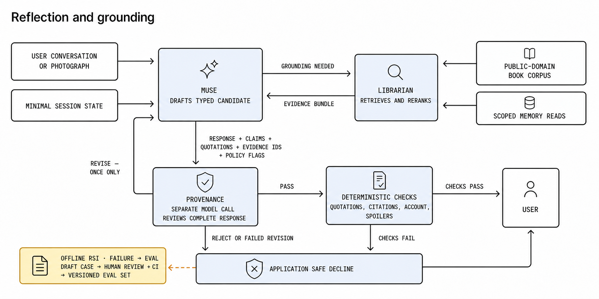
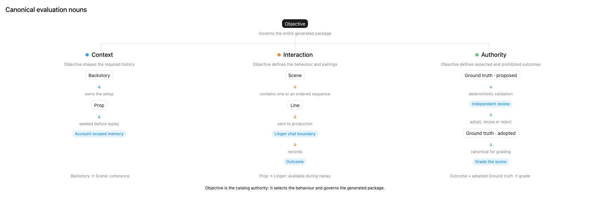

# Linger: System Specification

Status: **Draft implementation specification**

This document is the canonical source for product scope, architecture, implementation rules, and acceptance criteria. The submitted project proposal remains available as an immutable PDF under `docs/submissions/`.

Academic, frontier-lab, and expert sources for the final project report are maintained in [Sources for the Final Project Report](report-sources.md).

The architecture and acceptance criteria below describe the target prototype.
Delivery is staged: the current output-release slice uses a typed Muse candidate
containing the complete reply, declared book-corpus evidence uses, and
`MemoryCandidate | NoMemoryCandidate`. Provenance reviews both response and
nomination; application code binds a nomination to an exact source-turn span,
validates book evidence against one request-scoped index, and lets the
deterministic Memory & Policy Service enforce automatic capture. That index may
contain direct Librarian results, the selected records from a book-only
Serendipity proposal, or exact records re-resolved from evidence identifiers
cited by an earlier released reply in the same session. Stored-memory, web, and
image evidence are not citation authorities in this slice and therefore fail
closed. Declared claims, richer sensitive-inference flags, and account-scoped
memory retrieval remain later slices.

## 1. Purpose and positioning

Linger is an academic prototype of a personal reflection and memory companion, grounded initially in a small literary corpus. It helps a user articulate why an idea or experience mattered, preserve it as a structured memory, and later explore grounded, tentative connections across conversations, books, photographs, and evidence found through general web search.

General-purpose AI agents already offer memory, image understanding, web search, and delegated tasks. Linger is not trying to be another general personal agent. It is a purpose-built reflection and memory application: a **provenance-first reflection companion** that keeps the user's words, source evidence, and generated interpretation distinct. Before any Muse-generated response reaches the user, Provenance — a separate model call — reviews the complete draft for quotations, factual claims, sensitive inferences, attribution, privacy, spoiler, and prompt-injection risks. Application code then performs deterministic checks where applicable. A non-factual reflection may pass without retrieval, but never without review.

[Project Gutenberg](https://www.gutenberg.org/) supplies the literary corpus. Implementation begins with a one-book corpus containing Lewis Carroll's *Alice's Adventures in Wonderland* (Project Gutenberg ebook 11). Once ingestion, retrieval, spoiler filtering, citation validation, and evaluation work end to end for that book, the corpus expands to the planned total of 3–5 deliberately selected public-domain books. The prototype records source metadata and discloses that this small, older corpus may contain dated cultural perspectives.

## 2. Product hypothesis and journey

Linger tests whether a reflection companion becomes more useful and trustworthy when it can:

1. help the user articulate why a fragment mattered;
2. preserve that reflection with inspectable provenance;
3. retrieve exact supporting passages without crossing a spoiler boundary; and
4. reconnect the reflection to later experiences without inventing meaning or becoming intrusive.

The core journey is:

| Stage | Required behaviour |
|---|---|
| **Reflect** | Muse drafts responses to text or a photograph and asks a small number of useful follow-up questions. Provenance reviews every complete draft before display, including drafts with no declared factual claims. |
| **Ground** | Librarian retrieves authorised book passages and memories. Muse drafts a response separating quotations, user statements, and generated interpretation; Provenance checks the complete draft and its claimed support. |
| **Preserve** | During controlled evaluation, Muse may nominate a useful reflection for automatic capture. Provenance may veto an unsafe candidate, and the deterministic Memory & Policy Service alone validates and commits approved captures. The interactive POC exposes no memory-management drawer or explicit save, correction, or deletion actions. Sculptor may later curate existing memories for retrieval. |
| **Reconnect** | Muse may ask Serendipity to explore a cue across memories, books, photographs, and general web evidence. Muse drafts the tentative connection, and Provenance reviews the whole reply and its evidence before release. |

Automatic capture is disabled by default in the interactive POC. Controlled
evaluation may enable it as server-side workflow state; every capture still
requires a Muse nomination, no Provenance veto, and deterministic policy
approval. Content about sensitive traits is never captured.

## 3. Prototype scope

### 3.1 In scope

- ongoing Muse conversations using text and user-supplied photographs, with semantic Provenance review of every candidate response;
- cited retrieval across the initial *Alice's Adventures in Wonderland* corpus and structured memories, followed by expansion to a total of 3–5 Project Gutenberg books;
- keyword, semantic, hybrid, fusion, and reranked retrieval strategies;
- request-specific spoiler filtering and deterministic quotation validation;
- reviewed automatic memory capture as a controlled evaluation capability, with a visible notice for any committed capture;
- original memories, generated summaries, duplicate links, topic groups, and progressive disclosure;
- conversation- or photograph-triggered connections using internal evidence and optional general web search;
- a mandatory, context-restricted output gate, deterministic post-checks, at most one revision, and an application-authored safe decline;
- a simple web interface, multiple test accounts, CI/CD, and reproducible test deployment;
- adversarial, output-gate, reflection, retrieval, memory-quality, connection-quality, cost, and latency evaluation;
- two bounded recursive self-improvement loops — failure-to-eval promotion and a Sculptor-curated system playbook (Section 9).

### 3.2 Stretch

- voice-note transcription, including audio-borne prompt-injection tests;
- cross-book, memory-to-memory, and song-to-memory connections;
- comparison of a revisited pairing with an earlier reflection; and
- a synthetic exercise of an opt-in feedback pipeline.

### 3.3 Out of scope

- persistent reading-progress tracking;
- live music, photo-library, messaging, or social integrations;
- the full Project Gutenberg catalogue;
- copyrighted books, lyrics, or copyrighted-audio analysis without permission;
- general shell, browser-control, or external-action capabilities;
- continuous monitoring or unsolicited resurfacing;
- end-user memory-management settings and explicit save, review, correction, or deletion controls;
- mental-health profiling, diagnosis, or crisis-resource routing;
- autonomous prompt or skill self-modification — the self-improvement loops in Section 9 produce human-reviewed proposals only and never apply changes themselves;
- production scale, availability, compliance, or regulatory claims; and
- any claim that prototype telemetry measurably improved the system.

## 4. Architecture and authority

The system contains five reasoning agents and one deterministic service:

| Component | Responsibility | Write authority |
|---|---|---|
| **Muse** | Maintains the reflection conversation, handles photographs and spoiler clarification, routes work, and produces candidate responses that cannot be sent directly to the user. Its typed output may also nominate one `MemoryCandidate` for automatic capture or return `NoMemoryCandidate`. | None |
| **Librarian** | Infers request-scoped reading boundaries by cross-referencing authorised memories with the complete corpus, then plans, executes, fuses, and reranks evidence retrieval within the inferred ceiling. | None |
| **Sculptor** | Curates bounded sets of existing memories for retrieval by proposing derived summary or formatting updates, duplicate links, and topic groups while preserving originals. A scheduled Sculptor task, run outside user conversations, also curates the system playbook of operational lessons (Section 9.2). | May propose curation changes and playbook pull requests; no direct writes |
| **Serendipity** | Searches internal and optional web evidence and proposes or declines tentative connections. | None |
| **Provenance** | Runs a no-tool emotional-boundary preflight on the current Line before Muse, then semantically reviews every complete Muse candidate. Candidate review passes, requests one revision, or rejects based on evidence, attribution, privacy, spoiler, emotional-policy, sensitive-inference, and injection checks. In the same review call, it may independently veto an unsafe automatic `MemoryCandidate`. | None |
| **Memory & Policy Service** | Authenticates account scope and deterministically enforces automatic-capture policy, access, storage, idempotency, and review. It accepts automatic candidates only after the required review. | Commits validated writes |

The Memory & Policy Service derives account identity from authenticated request
context and never accepts it from model output; agents cannot choose or widen
account scope. The product-facing web application exposes Muse conversation and
session reset. It exposes no diagnostic Reader or Inspect surface, Serendipity
proposal, search or evidence payloads, memory-management UI, or public memory
CRUD API. The local development frontend may mount Reader and a read-only
per-turn Inspect projection so developers can exercise the corpus and debug the
response workflow, released direct Librarian results, fixed Serendipity
outcomes, and trace correlation.

**Tool implementation policy.** Pydantic AI's maintained tools, capabilities, and toolsets are the default implementation, not examples to recreate locally. The implementation must first use an [official Pydantic AI tool or capability](https://pydantic.dev/docs/ai/tools-toolsets/common-tools/), a provider-native tool supported by Pydantic AI, or a supported external toolset such as MCP. A custom Pydantic AI function tool is permitted only for Linger-specific domain operations for which no maintained implementation exists, such as enforcing account-scoped memory retrieval or the book spoiler boundary. Such tools must be thin adapters over application services; they must not reimplement generic search clients, page fetching, tool schema generation, dispatch, or retries already supplied by Pydantic AI.

The allowed tool surface is deliberately smaller than each agent's responsibility:

| Agent | Allowed tools or capabilities | Implementation source |
|---|---|---|
| **Muse** | No general-purpose tools. Photographs use Pydantic AI's model input support. Muse may select only the Linger-specific Librarian and Serendipity function tools permitted by the request; the application owns their grants, scope, execution, validation, inspection, and release. Memory nomination remains part of Muse's typed output. | Pydantic AI multimodal input, typed outputs, and thin Linger function-tool adapters over application services |
| **Librarian** | Search the complete public-domain work and authorised memories for boundary inference; search only the inferred scope for evidence retrieval; resolve selected evidence records. | Thin Linger function-tool adapters over the retrieval and Memory & Policy services; Pydantic AI generates and validates their tool schemas |
| **Sculptor** | No retrieval or write tools. It receives a bounded input set and returns a typed `CurationProposal` or `NoCurationProposal`. | Pydantic AI typed input and output contracts |
| **Serendipity** | Search internal evidence through the same bounded Librarian adapters; search and retrieve public web evidence with Exa. | Internal Linger adapters plus the maintained [`pydantic_ai_harness.exa.ExaSearch`](https://pydantic.dev/docs/ai/tools-toolsets/common-tools/#exa-search-tool) capability |
| **Provenance** | No tools. Its preflight receives only the current Line and emotional-content policy. Its candidate gate receives the typed candidate, canonical evidence, untrusted tool outcomes, current Line, and policy constraints. | Pydantic AI typed input and output contracts |

Exa is the sole general web-search integration for the prototype. Install the `pydantic-ai-harness[exa]` extra and register `ExaSearch()` in Serendipity's `capabilities`; do not implement an Exa client or web-search tool locally. The older `exa_search_tool`, related Exa common tools, and `ExaToolset` are deprecated and must not be introduced. Exa results remain untrusted evidence and are still subject to Sections 6.4 and 6.5. This allocation does not authorise browser control, arbitrary URL fetching, shell access, or any external action excluded by Section 3.

Agents are logical roles, not necessarily separate models or processes. Muse handles ordinary interaction; Librarian, Sculptor, and Serendipity are invoked only when their specialised work is needed. Provenance runs the request-local emotional-boundary preflight for every Line and the release review for every Muse candidate.

The five roles separate conversation and optional memory nomination, retrieval, post-capture memory curation, connection generation, and independent verification. Each agent is handed only the task in front of it, never the whole conversation; deterministic application code enforces access, capture, writes, and output release.

Each hand-off uses a strict, discriminated envelope and carries only the fields required by the next step. Muse receives either a draft envelope or one revision envelope that preserves the same turn and context authority. Full transcripts and unrestricted working context are not passed between agents.

Provenance shares no model working context with the other agents and has no tools. The preflight receives only the current Line and the application-owned emotional-content policy. The later release gate receives one typed envelope containing trusted context, canonical book evidence, untrusted current-run tool outcomes, Muse's candidate declarations, and the current Line for emotional review and exact capture binding. It independently detects quotations, factual claims, and sensitive inferences instead of trusting Muse's declarations. This provides separation of duties, not model independence, because the same underlying model may be used.

### 4.1 Output release contract

Before Muse or any Muse-accessible tool runs, Provenance classifies the current
Line against the versioned emotional-content policy. `continue_reflection`
enters the ordinary Muse flow. `apply_boundary` skips Muse, Librarian,
Serendipity, ordinary candidate review, and memory nomination; application code
releases the canonical response from Section 6.6 and records
`application_emotional_boundary`. A preflight failure fails closed to the
application safe decline before Muse runs. This narrow application-owned path
does not create a Muse candidate; every candidate that Muse does produce still
requires the ordinary Provenance gate.

At target completion, every Muse invocation returns a typed candidate containing the complete response text plus its declared claims, quotations, evidence identifiers, sensitive-inference flags, and `MemoryCandidate | NoMemoryCandidate`. Those fields assist review but do not authorise release or capture: Provenance examines the entire draft and any proposed memory and may identify items Muse omitted or misclassified. Regular expressions and structural checks may provide defence in depth, but they are not the semantic security boundary.

The current book-corpus slice implements the smallest release contract needed by
its active consumer: the complete response text plus declared evidence
identifiers, exact quotations, and source locations. After each passing original
or revised Provenance verdict, application code resolves every declaration
against one application-owned, request-scoped evidence index. The index accepts
only exact book records from the current direct Librarian result, the selected
records from a current book-only Serendipity proposal, or records that Librarian
re-resolved from identifiers cited by an earlier successfully released reply in
the same session. New retrieval and Serendipity records must match the current
trusted work, book version, and chapter ceiling. A re-resolved session record
authorises only that exact previously released passage; it does not establish
current reading progress or grant neighbouring text. Application code also
validates source lines, source location, and any exact quotation before release.
Unsupported, ambiguous, web-backed, or otherwise unverifiable evidence fails
closed to the application-authored safe decline. This staged contract does not
remove the remaining target fields above.

Provenance returns `pass`, `revise`, or `reject` for the user-facing response and, when a `MemoryCandidate` is present, an independent `allow_capture` or `reject_capture` decision. Rejecting capture does not suppress an otherwise safe response. The two semantic decisions remain independent, but deterministic storage eligibility also requires a released Muse candidate. Every `application_safe_decline` suppresses an otherwise eligible automatic write, including when Provenance independently returned `allow_capture`; inspection retains that decision, records `safe_decline_capture_suppressed`, and produces no save notice. Every emotional-boundary release records `emotional_boundary_capture_suppressed`. The preflight branch has no Muse nomination. A candidate-review fallback may retain the candidate's content-free nomination and independent capture decision for inspection, but it always suppresses storage. After a semantic pass, application code validates exact quotations, citation locations, account scope, and spoiler constraints where applicable. Only approved output is displayed. A first `revise` verdict gives Muse one discriminated revision envelope, the draft run's tool messages, and the same request-scoped evidence index, then returns through the same review path; a rejection or failed revision produces an application-authored safe decline.

### 4.2 End-to-end flows

#### 4.2.1 Reflection and grounding

After the emotional-boundary preflight returns `continue_reflection`, Muse asks Librarian for evidence only when grounding is needed, and every Muse path produces a candidate response for Provenance review. There is no Muse-to-user bypass. The no-Muse branches are the fixed application-owned boundary and the generic application safe decline when preflight fails, as described in Sections 4.1 and 6.6.

The following diagram begins at the ordinary `continue_reflection` branch; the
preflight and its application-owned boundary branch precede it.

#### 4.2.2 Reviewed automatic memory capture

During controlled evaluation, Muse may nominate one typed `MemoryCandidate`;
Provenance may veto it for privacy, sensitive inference, unsupported provenance,
or injection risk. The Memory & Policy Service derives account scope, checks the
server-side evaluation policy and idempotency, validates the request, and owns
every write. The application reports a committed capture but offers no
memory-management action.

Sculptor is not part of capture. It later receives a bounded, account-scoped set of existing memories and may return a `CurationProposal | NoCurationProposal`; the Memory & Policy Service validates and applies permitted derived changes without modifying originals.

#### 4.2.3 Connection discovery and verification

Serendipity supplies a proposed connection and evidence identifiers to Muse. Muse drafts the user-facing reply, which uses the same mandatory Provenance gate and deterministic checks as an ordinary reflection.

The implemented discovery slice keeps a narrow release boundary. Serendipity may
search only application-granted book-corpus or Exa web sources and returns a
typed proposal or decline with request-local evidence for deterministic
validation. The application, not Muse, supplies the exact current reader message
as the cue. Each run is limited to eight model requests and six total tool calls.
Muse may relay a typed decline. When every record cited by the selected candidate
is book-corpus evidence, application code validates those exact selected records,
adds them to the shared request-scoped evidence index, and allows Muse to draft a
tentative connection for the ordinary Provenance and deterministic release path.
Losing-candidate evidence is discarded. A selected candidate containing web
evidence remains internal and fails closed; its content-bearing diagnostics are
not returned by the application API. Stored-memory and image evidence also remain
non-authoritative, and authorised-memory retrieval is not a current Serendipity
grant.

#### 4.2.4 Developer corpus and inspection tools

Reader and Inspect are development and debugging tools, not product frontend
surfaces. The local development frontend mounts them for convenience while
developers interact with the corpus and trace backend behavior. A user-facing
frontend does not expose either tool or depend on either tool's state.

Reader is a developer corpus browser for *Alice's Adventures in Wonderland*. It
opens the public Project Gutenberg HTML at the selected chapter. Opening the
book, selecting a chapter, or revealing a chapter summary changes local
diagnostic state only. Chapter summaries remain hidden behind an explicit
spoiler warning, and neither chapter navigation nor summary reveal establishes
reading progress, session evidence, or a chat retrieval boundary. Chat uses only
the request-scoped context resolution and confirmed ceiling described in Section
6.1.

Inspect is a developer-only, read-only projection of each completed chat turn.
It exposes the reader message, `MuseTurn` policy contract, context resolution,
assembled Muse dynamic input, application-recorded agent statuses, direct
Librarian grounding calls, fixed Serendipity decline metadata, the released
response, the actual Provenance verdict path, release source, failure stage,
capture outcome, and server-generated trace ID. This diagnostic detail exists
to debug request-scoped contracts and hand-offs; it is not end-user content. It
does not expose Serendipity proposals, searches, web or private evidence
payloads, rejected draft text, Provenance critiques, or memory content. Inspect
metadata cannot authorize retrieval, release, capture, or storage, and its trace
link follows the metadata-only backend telemetry contract in Section 8.1.

## 5. Core records

### 5.1 Session state

Working context contains only:

- server-supplied `account_id`;
- `memory_capture_enabled`;
- the request-scoped `spoiler_boundary` inferred by Librarian from authorised
  memories, the current message, and the complete immutable work, or established
  through clarification;
- exact book records re-resolved from identifiers cited by earlier released
  replies in this session, when present;
- the active topic; and
- a compact conversation summary.

The complete memory archive is never injected into every prompt. Reading
progress is not stored as durable user state; Librarian resolves a temporary
spoiler boundary anew for each book-related request.

For evidence continuity, the session keeps one content-free record per turn:
the turn identifier, release source, cited evidence identifiers, and review
finding codes. This record never stores passage text or reading progress.
Only a turn released as a Muse candidate enters the conversational message
history itself; an emotional-boundary or safe-decline turn keeps only its
content-free record. Only identifiers from successfully released Muse replies
may be re-resolved on a later turn, and session reset removes these handles
with the conversation.

### 5.2 Memory record

An active memory belongs to the requesting account and was captured through the
reviewed automatic-capture path.

Each active memory contains:

- stable `memory_id` and server-supplied `account_id`;
- the user's original words;
- cited source-evidence identifiers, when applicable;
- a generated summary stored separately from the original;
- provenance linking the originating conversation or photograph;
- links to related, duplicate, or parent memories;
- an idempotency key derived from account, source event, and capture type;
- derivation metadata for generated records; and
- created and updated timestamps.

Original captured records are immutable. Sculptor may add or replace versioned
derived summaries and links but cannot modify an original. The interactive POC
does not expose correction or deletion.

For the prototype, the Memory & Policy Service stores each immutable capture as
a Markdown file with JSON front matter under a Git-ignored
`memories/<hashed-account-id>/` directory. Controlled evaluation may set capture
policy server-side; the interactive UI cannot change it. No embedding,
search-index, telemetry-memory, or vector-database layer is created until
retrieval requires one.

### 5.3 Evidence record

Every retrieved item carries:

- stable evidence identifier;
- source type and source location;
- owner or account scope where applicable;
- trust level and verification state;
- spoiler position for book evidence; and
- the minimum excerpt required for the current task.

During one request, exact book records live in a read-only map keyed by evidence
identifier. Direct Librarian retrieval, selected book-only Serendipity evidence,
and exact re-resolution of identifiers from earlier released replies all feed
this same map. Conflicting records for one identifier fail closed. The map is
discarded after the request; session state retains only the released handles,
never the passage text.

### 5.4 Muse candidate response

At target completion, every candidate response contains:

- the complete proposed user-facing text;
- declared claims and quotations;
- cited evidence identifiers;
- sensitive-inference and policy flags; and
- `MemoryCandidate | NoMemoryCandidate`; and
- revision metadata, when applicable.

Muse's declarations and memory nomination are untrusted review hints. They do not narrow what Provenance must inspect or what application code must validate.

### 5.5 Memory candidate

An automatic `MemoryCandidate` contains only:

- the user's original words proposed for capture;
- the source turn and evidence identifiers, when applicable;
- a concise nomination reason; and
- sensitive-inference and policy flags.

`NoMemoryCandidate` contains a machine-checkable reason code. Neither type
contains account scope or write authority. The POC has no separate explicit-save
path.

### 5.6 Connection proposal

The current `ConnectionProposal` is Serendipity's pre-review decision. It
contains:

- a ranked shortlist of two or three eligible candidates;
- for each candidate, a tentative claim, cited evidence identifiers, shared
  structure, meaningful difference, interpretation, comparison note, and the
  three-field `cue_fit`, `reflective_value`, and `safety` rubric;
- the selected rank-one candidate identifier;
- qualitative uncertainty and the unchanged presentation policy;
- a suggested follow-up for Muse; and
- a closed policy flag indicating whether the winner cites web evidence.

The proposal contains no Provenance verdict or critique. Muse receives it as
untrusted internal material; Provenance reviews the later complete Muse draft.

## 6. Safeguards

### 6.1 Spoilers

For each book-related request, Librarian first performs boundary inference. The
complete immutable work is its search scope: Librarian cross-references all
chapters against relevant, account-scoped memories and the current Line to
localize the latest event the person appears to know. This inference phase
returns a typed candidate boundary, confidence, and supporting locations for
the trace; it must not return
post-boundary story content to Muse. If the evidence is ambiguous or confidence
is insufficient, Muse asks a focused clarification before book evidence is
retrieved.

After inference, application code validates the work and version and propagates
the candidate as a request-scoped ceiling. Librarian then performs a separate
retrieval bounded to that ceiling, and application code rejects evidence outside
it before Muse can use it. Linger stores memories of what the person discussed,
not a durable chapter-progress field; the boundary is derived anew for each
request. This separation lets evaluation compare Librarian's inferred ceiling
with event-derived Ground truth while preventing full-work inference access from
becoming full-work disclosure authority.

The current implementation has both phases for the Alice corpus. Metadata-only
routing first identifies the work. Librarian then receives the current Line and
at most eight account-scoped memories that independently route to that work,
searches the complete immutable revision, and returns a typed candidate ceiling,
confidence, and content-free supporting locations. Full-work candidate passage
text remains private to this phase and is never copied into Muse, Inspect, the
turn evidence ledger, or the release scope.

Application code validates the returned work, version, evidence identifiers,
and candidate chapter. Confidence below `0.75`, conflicting context, missing
support, unreadable memory storage, retrieval failure, or an invalid model
decision produces one fixed clarification and no evidence search. A validated
candidate creates only a request-scoped ceiling; it is not persisted as reading
progress. Muse may then request the second search, which the application clamps
to that ceiling before any passage becomes releasable evidence. Explicit reader
confirmation remains authoritative and skips inference for that request.

### 6.2 Citations and attribution

Whenever an exact quotation is displayed or stored, application code verifies
its text, source, and location against the canonical book record in the shared
request-scoped index. Muse separates evidence from interpretation; Provenance
reviews every complete draft for undeclared or mislabelled quotations and
factual claims and checks their semantic support. Web, stored-memory, and image
records never enter this book-citation authority and therefore fail closed.

### 6.3 Memory and media control

- Automatic capture is disabled by default in the interactive POC and may be enabled only as controlled server-side evaluation state.
- Every committed capture produces a visible notice without exposing a management action.
- Before a long capture-enabled evaluation conversation is compacted or closed, Muse may make one final memory nomination through the same Provenance review and deterministic capture path.
- The interactive application exposes no explicit save, review, correction, or deletion controls.
- Raw photographs remain transient.
- Derived memories from photographs may be captured only while controlled capture policy is enabled.
- Sensitive-trait content is never captured automatically.
- An application-authored safe decline never commits automatic memory or produces a save notice, even when the proposed memory was independently approved.
- The preflight emotional boundary creates no nomination. Every emotional-boundary release suppresses writes and save notices.
- Logs and telemetry follow the canonical [telemetry data contract](telemetry.md).

### 6.4 Untrusted content and privacy

Book text, web results, photographs, media descriptions, and candidate model responses are untrusted input. Web-search queries use general concepts: maintained detectors reject shaped personal data and secrets, and a deterministic overlap guard rejects every multi-character term copied verbatim from the application-owned current cue. Private memory text is never copied into a web-search query. Evidence supplied to each agent is minimised, account-scoped where applicable, and labelled by trust level; application code owns its verification state. Prompt instructions contained in evidence never gain tool authority.

### 6.5 Verification

Every Muse candidate requires a recorded approving Provenance verdict before release. Provenance may pass, reject, or request one revision. A candidate is not released when:

- cited evidence is missing or unresolved;
- attribution is incorrect;
- the spoiler boundary is unclear;
- evidence crosses account boundaries;
- a factual web claim lacks a retrievable citation;
- the candidate contains an unsupported claim or sensitive inference;
- the candidate violates the emotional-content policy; or
- retrieved content attempts to redirect agent behaviour.

Rejected and superseded drafts are never displayed. Deterministic validation runs after semantic approval and fails closed to the application-authored safe decline.

### 6.6 Emotional content

Linger is a reflection companion, not a wellbeing tool. It never diagnoses or
labels a person's mental state. A distressing disclosure is a current,
first-person Line that communicates intense distress or inability to cope such
that continued reflective questioning would be inappropriate. Ordinary
disappointment, frustration, uncertainty, literary discussion, or concern about
someone else does not trigger this boundary by itself. This is a request-local
interaction boundary, not a diagnosis, severity score, or crisis assessment.

Before Muse runs, the no-tool Provenance preflight evaluates only the current
Line and the versioned emotional-content policy. For a distressing disclosure,
the application stops the ordinary reflection path and returns exactly:

> That sounds deeply distressing. I don’t want to keep probing, and I’m not able
> to assess your wellbeing. Please consider reaching out to someone you trust or
> a qualified professional for support.

On this path Muse, Librarian, and Serendipity do not run. No candidate, evidence
declaration, or memory nomination exists. Inspection records
`application_emotional_boundary` and suppressed capture; no write or save notice
occurs. A preflight failure returns the generic application safe decline and
also skips Muse and its tools. The ordinary Muse prompt and candidate Provenance
gate remain defence in depth: Muse must not diagnose or continue probing, and a
missed current-Line boundary is reported through the explicit
`emotional_boundary_decision=required` disposition and a current-Line
`emotional_policy_violation`, so the application can substitute the canonical
response without a revision. Inspection records whether the boundary originated
in the preflight or the candidate review and never claims that Muse was skipped
on the fallback path. A candidate-response-only diagnosis follows the normal
revise-or-reject path.
Crisis assessment and resource routing remain out of scope.

## 7. Evaluation and acceptance

### 7.1 Product evaluation requirements

Evaluation must test the product behaviour and authority boundaries in Sections 4–6. Retrieval and memory quality evaluation covers the following requirements:

- Compare keyword, semantic, hybrid, and reranked book and memory retrieval using measures such as Recall@5 and nDCG@5.
- Test whether Librarian's strategy selection improves relevance or latency over the strongest fixed strategy.
- Measure Sculptor's linking and grouping quality without allowing it to modify or delete an original memory.
- Verify that every derived record resolves to its originals.

The suggested measures in the [synthetic journal evaluation-objective catalog](../synthetic-journal-evaluation/evaluation-objectives.yaml) identify relevant signals. They are not adopted thresholds, aggregate scores, or release gates. Every factual web claim must include a retrievable citation, every evidence identifier must resolve, and any LLM-as-judge result is secondary and labelled non-independent.

### 7.2 Scenario-first synthetic journal evaluation

#### 7.2.1 Canonical vocabulary

Synthetic journal evaluation uses the following six terms. Documentation, skills, and future designs must use these terms instead of ad hoc synonyms such as *artifact*, *world*, *case*, *action*, or *fixture*. The repository defines the vocabulary, Backstory and Ground truth structures, deterministic package validator, and Ground truth authority lifecycle below. Interactive independent adoption, capture replay, and bounded-curation replay are implemented; a session-continuity runner is implemented and registered as a supported replay path; reusable generation, dataset freezing, and replay for other Objectives remain downstream decisions.

The Objective governs the generated package. The diagram follows its Props and
Lines through production replay and the Ground truth lifecycle used for grading.

| Term | Definition |
|---|---|
| **Objective** | One of the ten catalog entries in [`evaluation-objectives.yaml`](../synthetic-journal-evaluation/evaluation-objectives.yaml). An objective specifies the behavior that a group of scenes must demonstrate. |
| **Backstory** | The generated history for one person, plus reading history only when relevant, that makes scenes coherent. One backstory represents one person and one evaluation account. The backstory informs generation only; the running system never receives it. |
| **Prop** | A generated memory record pre-positioned in Linger's storage and available to the evaluation before a scene runs. Each prop belongs to the backstory's person and evaluation account. When lines are fed to Muse, a prop may be used or remain untouched; Ground truth records the expected use or non-use for that scene. |
| **Scene** | One bounded test of one primary behavior, tied to an objective. A scene runs in a fresh session with its designated props and is graded as a unit. Objectives typically require paired scenes, such as a grounded scene and a non-grounded comparison scene. |
| **Line** | One generated user input sent to Linger's production chat boundary within a scene. Most scenes contain one line; some contain an ordered sequence of lines. A policy preflight may stop a line before Muse. |
| **Ground truth** | The answer-key data for a scene: intended relationships, expected outcomes, permitted evidence identifiers, exact spans, and failure conditions. The generator writes **proposed Ground truth** to `ground-truth.json` while creating `backstory.json`. Deterministic validation checks objective facts, then an independent reviewer adopts, revises, or rejects the proposal. Only **adopted Ground truth** is canonical for grading. Neither state is exposed to the running system. |

The vocabulary encodes these boundaries:

- One backstory represents one person and one evaluation account. Every prop, scene, and line belongs to that backstory.
- The backstory never enters the running system, and no backstory content becomes a prop by copying. A prop whose use or non-use is under evaluation must be generated as separate source text.
- Props are placed before a scene runs. Memory records that the system creates while a scene runs are recorded outcomes, not props, and are never hand-authored.
- Lines are conversational input only. Session reset and evaluation-controlled capture policy are workflow state, not Lines.
- The generator writes `backstory.json` and `ground-truth.json` together. The Ground truth file records exact spans, intended relationships, Scene pairings, and expected or prohibited outcomes needed to preserve the generator's intent.
- Deterministic validation checks facts that can be resolved without judging Linger, such as identifiers, references, span boundaries, pairwise differences, and schema constraints. It does not adopt behavioral judgments.
- An independent reviewer adopts, revises, or rejects the proposed Ground truth. The system under evaluation receives neither the Ground truth file nor adopted Ground truth.

Synthetic authoring is intentionally evaluation-aware. The generator receives the selected, resolved Objective requirements and writes both the Backstory package and proposed Ground truth so that intended contrasts and exact source spans are preserved. This is authoring, not grading: the generator does not observe Linger's recorded output and cannot adopt its own labels. Raw developer metadata and judge rubrics remain outside the generator prompt, and an independent reviewer still owns adoption.

[`evals/synthetic_journals/models.py`](../evals/synthetic_journals/models.py) defines `SyntheticBackstory`, `ProposedGroundTruth`, and `GroundTruthAdoption`. [`evals/synthetic_journals/validate_package.py`](../evals/synthetic_journals/validate_package.py) checks the exact `backstory.json` hash, identifiers, references, ordering, spans, evidence, declared Scene differences, and resolved run-configuration counts. [`evals/synthetic_journals/adoption.py`](../evals/synthetic_journals/adoption.py) separately binds a complete human decision to the exact proposed file bytes. One validated package contains one Backstory, person, and evaluation account. A full dataset may combine multiple separately validated packages with different Backstories.

Each authoring attempt has one timestamped directory under
`synthetic-journal-evaluation/packages/`. It starts with
`pre-generation-report.md`; after separate human approval, the generator writes
the sibling `backstory.json` and `ground-truth.json`. Independent confirmation
adds `ground-truth-adoption.json` without modifying either generated file.
Executed replay output is not part of this authoring package.

A Backstory may be memory-only or corpus-backed. In a corpus-backed spoiler scene, a
Prop and Line may refer naturally to events the person has already discussed;
the corresponding corpus position becomes Ground truth for grading Librarian's
boundary inference. Memory-only Backstories do not inspect or depend on the book corpus.

Everything after a Line enters the production chat boundary — preflight, routing, agent hand-offs, telemetry — uses the architecture vocabulary in Sections 4–6 and the [telemetry data contract](telemetry.md), not this vocabulary.

#### 7.2.2 Objective selection and downstream boundary

The [`evaluation-objectives.yaml`](../synthetic-journal-evaluation/evaluation-objectives.yaml) catalog is the authority for the ten synthetic journal evaluation objectives, scenario descriptions, composition constraints, generation briefs, prompt boundaries, and selection rules.

The [`generate-synthetic-journals`](../.agents/skills/generate-synthetic-journals/SKILL.md) skill lets a developer select objectives, review the applicable scenarios and composition constraints, and confirm the selection. It then inspects the current repository and academic briefing, creates one timestamped package directory, and writes `pre-generation-report.md` there for human review. The report assesses current execution readiness per Scene, describes the complete target evaluation design, uses the defined Backstory and Ground truth structures, and identifies the required implementation work. A current implementation gap does not weaken a confirmed Objective: the report instead includes a target-state generator prompt with explicit non-runnable preconditions. The prompt instructs a future generator to create sibling `backstory.json` and `ground-truth.json` files containing Backstories, Props, Scenes, Lines or offline inputs, and proposed Ground truth together. The deterministic package validator checks objective facts before an independent reviewer can adopt Ground truth. The system under evaluation receives neither proposed nor adopted Ground truth. A future generator receives read-only repository paths, including `data/corpus/` only when book material is useful, and discovers current corpus data there instead of receiving a hardcoded book. The report is never passed to a generator and creates no synthetic evaluation data.

After a generator produces the two validated JSON files, the
[`review-synthetic-ground-truth`](../.agents/skills/review-synthetic-ground-truth/SKILL.md)
skill opens a desktop-only loopback React app. Each review row places the
Scene's complete inputs beside its complete proposed Ground truth. The reviewer
may request changes at any time, but confirmation remains unavailable until
every row is explicitly approved. A change request returns control to the
agent without writing adoption or invoking runtime. Confirmation creates the
separate hash-bound adoption, then returns control to the agent. The browser
does not select or invoke a runner.

The reviewed automatic-capture package replays without changing these authority
boundaries. Its runner validates the Backstory, Ground truth, and optional
adoption, creates a temporary store and unique evaluation account,
enables capture through the server-owned Memory & Policy Service, and sends
exactly one Line in a fresh session for each Scene. Pydantic Evals creates one
code-defined dataset, one experiment per replay, and one ordered native case
per Scene. Proposal mode emits `proposal_comparison` with
`matches_proposal` or `differs_from_proposal`. A hash-valid adoption switches
the authority to `adopted`, uses the adopted Ground truth identity as the
dataset version, and emits `adopted_hard_gate_grade` with
`passes_hard_gates` or `fails_hard_gates`.

The bounded-curation runner supplies only the isolated Scene's active,
same-account Props to production `propose_curation`. It preserves and hashes
the immutable sources, records the typed response, and grades deterministic
hard gates. Semantic criteria remain visible and separately reviewable; an
adopted hard-gate pass does not claim semantic quality. Its `full_deployment`
identity covers the configured model and every deployed prompt fingerprint for
lineage, while `objective_execution` covers the configured model, Sculptor
prompt, and active curation contracts for behavioral comparison.

A session-continuity runner replays `session_scoped_conversation_continuity`
packages through the same production chat boundary. It accepts Lines only,
runs each Scene in one persisted session so the Scene's ordered Lines build
real conversation history, and leaves automatic capture disabled throughout.
Scene roles come from the pairing topology: the multi-Line continuity Scene and
the single-Line fresh comparison Scene that repeats its final Line. The
Ground-truth grade binds only to the proposal-backed session boundary — the
comparison Scene's session began clean — and a continuity Scene reports
`not_applicable` rather than any grade, because the adopted key contains no
typed continuity claim. Session-contract deviations are reported separately as
structural findings and never change that grade. Whether a reply adopted the
reader's correction, and whether a comparison reply leaked prior-session
content, remain review judgments. This runner is registered in the Objective
catalog as a supported replay path.

The replay also records a durable JSON transcript containing each synthetic
Line, the exact model-visible agent inputs and messages, typed outputs, tool
calls and results, usage, release and capture decisions, and correlated
Logfire trace and span IDs. It never gives Muse the Backstory or proposed
Ground truth. Provider thinking is intentionally omitted from the durable
artifact; the evaluation-only Logfire path may display a thinking part only
when the provider returned one.

The project still has not defined reusable workflow for:

- backstory generation;
- prop generation;
- scene composition;
- line generation;
- full-dataset assembly and layout;
- freezing; or
- replay of Props outside bounded curation, offline inputs, continued-session
  Scenes, mixed Objective packages, or other Objectives.

The generation briefs and prompt boundaries describe requirements that a future design must preserve. A pre-generation report may propose a target-state stage sequence or unresolved workflow decision, but it must use the defined package models and validator rather than inventing another schema. Every remaining proposal must be labelled as proposed, compared with current repository facts, and approved by a human before use. The earlier inventory of 40 proposed scenes, category allocation, numeric thresholds, and frozen-baseline policy remain unadopted and do not constrain a new proposal.

Resolved run configurations keep each imbalance tied to the entity and Objective it tests. [`reviewed-automatic-memory-capture-10-to-1.json`](../synthetic-journal-evaluation/run-configurations/reviewed-automatic-memory-capture-10-to-1.json) applies a 1:10 capture-candidate/no-candidate **Scene** mix to one `reviewed_automatic_memory_capture` package. [`longitudinal-memory-retrieval-10-to-1.json`](../synthetic-journal-evaluation/run-configurations/longitudinal-memory-retrieval-10-to-1.json) applies a 1:10 relevant/distractor **Prop** mix to the target Scene for `longitudinal_memory_retrieval`; its paired comparison Scene uses the same 11 active Props with none relevant. Neither configuration is a universal Objective minimum. A full dataset repeats these patterns across multiple Backstories because one positive example cannot support stable recall measurement.

### 7.3 Deployment checks

The test deployment supports multiple accounts and up to five concurrent sessions. A basic load test reports success rate, p95 latency, and per-session model cost.

## 8. Operations and change control

The implementation stack is Python 3.12 with Pydantic AI for the five reasoning agents and FastAPI for the application API and deterministic orchestration. Agent-to-agent transitions that affect access, writes, validation, revision, or output release are programmatic hand-offs controlled by application code; no model controls its own authority or release path. OpenAI model calls use the Responses API so reasoning can be retained across tool calls and long-running conversations can be compacted. Agent contexts remain separate and bounded; API conversation state is working context, not durable product memory. Pydantic Logfire is the selected OpenTelemetry-compatible telemetry backend; its data and storage rules are defined exclusively by the [telemetry data contract](telemetry.md). The remaining stack is a lightweight web UI, Docker, and GitHub Actions.

Prompt templates, corpus builds, policies, tool contracts, schemas, evaluation scenes, and the system playbook are versioned. Every model invocation records its template-specific version and a SHA-256 digest of the canonical static instructions and input/output contract identities; the digest excludes runtime content. Synthetic replay records the runtime prompt-fingerprint set without adding it to generated content or proposed Ground truth. Fast mocked contract tests run in CI, while live-model evaluations separately measure output-gate recall, quality, cost, and latency. Prompt changes remain human-reviewed and must pass CI gates. Proposals produced by the self-improvement loops in Section 9 enter through this same review-and-CI path; they have no other route into the repository or the running system. The running test deployment, not only unit tests, is used to exercise rejected-draft suppression, output-gate bypass, account isolation, session reset, spoiler filters, forbidden memory requests, and prompt-injection defences.

Failure ownership is explicit. Exceptions from an agent invocation are model failures. Deterministic envelope, candidate-output, review-output, finding-location, and release checks are non-retryable validation failures. Instrumentation projection defects are non-retryable application failures. All failure paths record fixed metadata without exception text.

### 8.1 Agent telemetry and debugging

The canonical [telemetry data contract](telemetry.md) defines the minimal
captured fields, prohibited content, evaluation boundary, and verification
requirements. Telemetry is diagnostic only: it never authorises output
release, chooses account scope, commits memory writes, or becomes product
memory.

The implementation uses one Logfire project with two explicit service
identities. `linger-backend` remains metadata-only for human runtime traffic.
The synthetic replay process reconfigures telemetry as `linger-evals` in the
`synthetic-evaluation` environment, marks the content as synthetic, and enables
content-bearing instrumentation only for the five fixed named Pydantic AI
agents. This separation is code-owned; there is no production environment flag
that can enable synthetic transcript capture.

Logfire's Evals view shows the replay as a dataset, experiment, and ordered
cases with expected and actual outputs, evaluator labels, latency, tokens, and
cost. Its Agents and LLM views show only roles that were actually invoked in
the selected period, with ordered system, user, assistant, tool, and
provider-returned thinking parts. The Live view retains the complete
application-owned trace hierarchy and fixed hand-off metadata. Logfire renders
native `invoke_agent Muse` and `invoke_agent Provenance` spans as **Muse run**
and **Provenance run**; their surrounding `muse.draft`,
`provenance.emotional_boundary`, and `provenance.review` spans carry the fixed
origin, receiver, and contract attributes.

For the ordinary reviewed-capture Scene, the trace sequence is application to
Provenance emotional preflight, application to Muse draft, application to
Provenance candidate review, deterministic Memory & Policy processing, and
release. An `apply_boundary` preflight terminates before Muse exactly as
specified in Section 4.1. These are application-mediated transitions, not
agent-selected delegation.

## 9. Recursive self-improvement

Linger considers a deliberately bounded form of **recursive self-improvement (RSI)**: the system may help improve its regression coverage and operational guidance while humans retain approval authority over every change. This follows current frontier practice, which frames near-term RSI not as a model modifying its own weights or prompts autonomously, but as agents improving the scaffolding around the model through feedback loops that end in reviewed, gated changes. Any adopted loop must preserve that boundary and cannot grant an agent new runtime authority.

Two loops are in scope.

### 9.1 Failure-to-eval promotion

**Pain point.** Observed failures, including blocked prompt-injection attempts, Provenance rejections, and failed deterministic post-checks, can reveal gaps in regression coverage.

**Boundary.** A live-user failure produces only the metadata signature permitted by the [telemetry data contract](telemetry.md): trace ID, component and prompt versions, fixed verdicts, validation outcomes, and failure codes. Runtime telemetry never reconstructs or copies the user's input. Section 7.2 defines the synthetic Backstory and Ground truth structures, and the package validator checks them. The project has not adopted a mechanism for turning a live failure into a synthetic Backstory, a review and adoption process for that Backstory, or a promotion workflow.

**Agents involved.** Provenance and the deterministic post-check layer act only as detectors. They cannot create, write, freeze, or promote evaluation data.

**Adoption criteria.** Any future failure-to-eval workflow must use synthetic or sanitised content, require human approval before repository integration, and grant no detector write or release authority.

### 9.2 Sculptor-curated system playbook

**Pain point.** Every agent system accumulates operational lessons — recurring Provenance critique patterns, evaluation-failure clusters, retrieval quirks, prompt gotchas — and they evaporate because nothing owns them. Current harness-engineering practice keeps these lessons in a versioned playbook that developers — and, where useful, prompts — draw on at the moment they are relevant. Maintaining such a playbook is curation work: deduplicate, summarise, link, and prune — which is precisely Sculptor's existing skill set, pointed at a second corpus.

**Mechanism.** A scheduled Sculptor task, run outside user conversations, reads only operational records permitted by the [telemetry data contract](telemetry.md), evaluation results, and developer notes, then proposes playbook edits: merge duplicate lessons, summarise clusters, retire stale entries, and link related ones. The playbook is a versioned repository file, not a record in the user memory store; the Memory & Policy Service is not involved. Sculptor's output is a proposed pull request; humans review and CI gates the merge, identical to any other change under Section 8.

**Relationship to Sculptor's product role.** The curation contract is unchanged — propose, never commit; preserve originals; work within a bounded context. Only the corpus differs: one curation agent, two memory stores — user memories and the system's memory of itself — under the same safeguards. The playbook task never receives raw personal memories, full transcripts, photographs, or sensitive-inference content, consistent with Sections 6.3 and 8.1.

**Relationship to failure-to-eval promotion.** If the project adopts the workflow in Section 9.1, failure-to-eval promotion will produce regression coverage, while Section 9.2 will continue to curate operational guidance. The two concerns remain separate.

**Success measures.** Playbook deduplication precision on seeded duplicate lessons; human acceptance rate of proposed edits; recurrence of repeated Provenance rejection classes tracked across releases. These are reported as evidence that the loop operates as designed; consistent with Section 3.3, the prototype makes no claim that telemetry measurably improved the system.

### 9.3 Boundaries

- Every adopted RSI output is a proposal. Humans review and CI gates every merge; no loop applies changes to prompts, policies, code, or evaluation scenes itself.
- Both loops run on a schedule, not during user conversations, and add no latency or authority to any user-facing flow.
- No agent gains write authority. Playbook changes, and any future evaluation data, must enter through repository review rather than the Memory & Policy Service. Sculptor's product-side curation path remains proposal-only.
- Loops consume only the operational metadata permitted by the [telemetry data contract](telemetry.md).
- Autonomous prompt or skill self-modification remains out of scope (Section 3.3); metric trends are reported without claiming measured product uplift.

### 9.4 Practice-module alignment

These loops are the specification's explicit answer to the practice-module briefing (`docs/submissions/aas-practice-module-briefing.pdf`), which asks which parts of the AI system lifecycle can be automated to reduce development effort and improve system quality attributes, and which grades the project on concrete artifacts:

- **MLSecOps/LLMSecOps pipeline design.** Section 9.1 defines the authority and privacy boundary for a possible future path from security detections to regression coverage. The downstream workflow remains unadopted.
- **AI security risk register.** Detection metadata can identify candidate regression gaps for prompt injection, unsupported claims, and sensitive-inference leakage without copying live-user content.
- **Testing data.** The evaluation-objective catalog defines the intended security coverage. A future downstream design must define the test data, harness, review process, and lifecycle.
- **Agent design documentation.** The system playbook demonstrates Sculptor's curation contract generalising across two memory stores under identical safeguards — an agent-design argument, not an added subsystem.
- **Responsible-AI governance.** Both loops are bounded, human-in-the-loop, and auditable: every change they produce is versioned, reviewed, and traceable, aligning the self-improvement story with the module's governance and accountability requirements.
