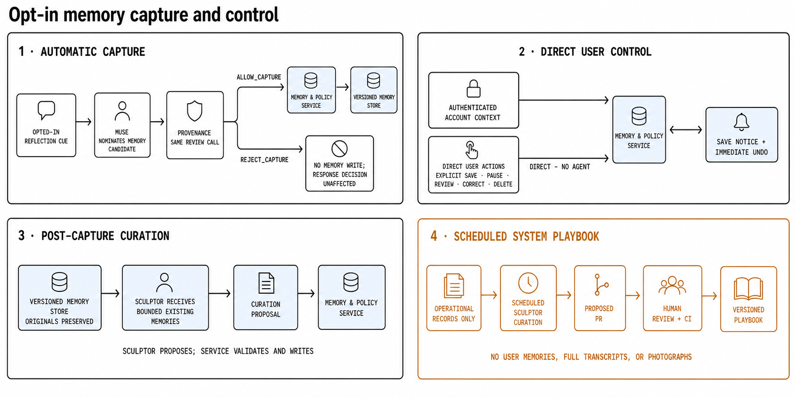
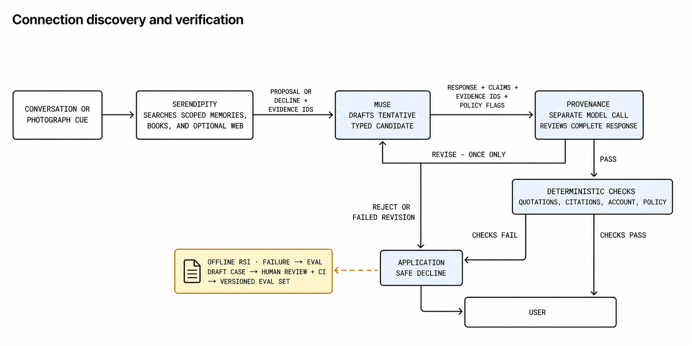

# Linger: System Specification

Status: **Draft implementation specification**

This document is the canonical source for product scope, architecture, implementation rules, and acceptance criteria. The submitted project proposal remains available as an immutable PDF under `docs/submissions/`.

Academic, frontier-lab, and expert sources for the final project report are maintained in [Sources for the Final Project Report](report-sources.md).

The architecture and acceptance criteria below describe the target prototype.
Delivery is staged: the current output-release slice uses a typed Muse candidate
containing the complete reply, declared book-corpus evidence uses, and
`MemoryCandidate | NoMemoryCandidate`. Provenance reviews both response and
nomination; application code binds a nomination to an exact source-turn span,
validates book evidence against trusted Librarian results, and lets the
deterministic Memory & Policy Service enforce automatic capture. Serendipity-
only, stored-memory, web, and image evidence are not citation authorities in
this slice and therefore fail closed. Declared claims, richer sensitive-
inference flags, and account-scoped memory retrieval remain later slices.

## 1. Purpose and positioning

Linger is an academic prototype of a personal reflection and memory companion, grounded initially in a small literary corpus. It helps a user articulate why an idea or experience mattered, preserve it as a structured memory, and later explore grounded, tentative connections across conversations, books, photographs, and evidence found through general web search.

General-purpose AI agents already offer memory, image understanding, web search, and delegated tasks. Linger is not trying to be another general personal agent. It is a purpose-built reflection and memory application: a **provenance-first reflection companion** that keeps the user's words, source evidence, and generated interpretation distinct. Before any Muse-generated response reaches the user, Provenance — a separate model call — reviews the complete draft for quotations, factual claims, sensitive inferences, attribution, privacy, spoiler, and prompt-injection risks. Application code then performs deterministic checks where applicable. A non-factual reflection may pass without retrieval, but never without review.

[Project Gutenberg](https://www.gutenberg.org/) supplies the literary corpus. Implementation begins with a one-book corpus containing Lewis Carroll's *Alice's Adventures in Wonderland* (Project Gutenberg ebook 11). Once ingestion, retrieval, spoiler filtering, citation validation, and evaluation work end to end for that book, the corpus expands to the planned total of 3–5 deliberately selected public-domain books. The prototype records source metadata and discloses that this small, older corpus may contain dated cultural perspectives.

## 2. Product hypothesis and journey

Linger tests whether a reflection companion becomes more useful and trustworthy when it can:

1. help the user articulate why a fragment mattered;
2. preserve that reflection with inspectable provenance;
3. retrieve exact supporting passages without crossing a spoiler boundary; and
4. reconnect the reflection to later experiences without inventing meaning or becoming intrusive.

The core journey is:

| Stage | Required behaviour |
|---|---|
| **Reflect** | Muse drafts responses to text or a photograph and asks a small number of useful follow-up questions. Provenance reviews every complete draft before display, including drafts with no declared factual claims. |
| **Ground** | Librarian retrieves authorised book passages and memories. Muse drafts a response separating quotations, user statements, and generated interpretation; Provenance checks the complete draft and its claimed support. |
| **Preserve** | The user may save a memory explicitly, or, after explicit onboarding opt-in, Muse may nominate a useful reflection for automatic capture. Provenance may veto an unsafe automatic candidate, and the deterministic Memory & Policy Service alone validates and commits every save. Each save is disclosed with immediate undo; the user may pause, review, correct, or delete memories. Sculptor later curates existing memories for retrieval. |
| **Reconnect** | Muse may ask Serendipity to explore a cue across memories, books, photographs, and general web evidence. Muse drafts the tentative connection, and Provenance reviews the whole reply and its evidence before release. |

Automatic capture does not require per-memory approval once enabled, but it does require a Muse nomination, no Provenance veto, and deterministic policy approval. Content about sensitive traits is excluded from automatic capture and may be saved only through an explicit user action.

## 3. Prototype scope

### 3.1 In scope

- ongoing Muse conversations using text and user-supplied photographs, with semantic Provenance review of every candidate response;
- cited retrieval across the initial *Alice's Adventures in Wonderland* corpus and structured memories, followed by expansion to a total of 3–5 Project Gutenberg books;
- keyword, semantic, hybrid, fusion, and reranked retrieval strategies;
- request-specific spoiler filtering and deterministic quotation validation;
- opt-in automatic memory capture with notice, undo, pause, review, correction, and cascading deletion;
- original memories, generated summaries, duplicate links, topic groups, and progressive disclosure;
- conversation- or photograph-triggered connections using internal evidence and optional general web search;
- a mandatory, context-restricted output gate, deterministic post-checks, at most one revision, and an application-authored safe decline;
- a simple web interface, multiple test accounts, CI/CD, and reproducible test deployment;
- adversarial, output-gate, reflection, retrieval, memory-quality, connection-quality, cost, and latency evaluation;
- two bounded recursive self-improvement loops — failure-to-eval promotion and a Sculptor-curated system playbook (Section 9).

### 3.2 Stretch

- voice-note transcription, including audio-borne prompt-injection tests;
- cross-book, memory-to-memory, and song-to-memory connections;
- comparison of a revisited pairing with an earlier reflection; and
- a synthetic exercise of an opt-in feedback pipeline.

### 3.3 Out of scope

- persistent reading-progress tracking;
- live music, photo-library, messaging, or social integrations;
- the full Project Gutenberg catalogue;
- copyrighted books, lyrics, or copyrighted-audio analysis without permission;
- general shell, browser-control, or external-action capabilities;
- continuous monitoring or unsolicited resurfacing;
- mental-health profiling, diagnosis, or crisis-resource routing;
- autonomous prompt or skill self-modification — the self-improvement loops in Section 9 produce human-reviewed proposals only and never apply changes themselves;
- production scale, availability, compliance, or regulatory claims; and
- any claim that prototype telemetry measurably improved the system.

## 4. Architecture and authority

The system contains five reasoning agents and one deterministic service:

| Component | Responsibility | Write authority |
|---|---|---|
| **Muse** | Maintains the reflection conversation, handles photographs and spoiler uncertainty, routes work, and produces candidate responses that cannot be sent directly to the user. Its typed output may also nominate one `MemoryCandidate` for automatic capture or return `NoMemoryCandidate`. | None |
| **Librarian** | Plans, executes, fuses, and reranks retrieval across the corpus and authorised memories. | None |
| **Sculptor** | Curates bounded sets of existing memories for retrieval by proposing derived summary or formatting updates, duplicate links, and topic groups while preserving originals. A scheduled Sculptor task, run outside user conversations, also curates the system playbook of operational lessons (Section 9.2). | May propose curation changes and playbook pull requests; no direct writes |
| **Serendipity** | Searches internal and optional web evidence and proposes or declines tentative connections. | None |
| **Provenance** | Semantically reviews every complete Muse candidate response and passes, requests one revision, or rejects it based on evidence, attribution, privacy, spoiler, sensitive-inference, and injection checks. In the same review call, it may independently veto an unsafe automatic `MemoryCandidate`. | None |
| **Memory & Policy Service** | Authenticates account scope and deterministically enforces capture opt-in, access, storage, idempotency, versioning, review, and cascading deletion. It accepts explicit user saves directly and automatic candidates only after the required review. | Commits validated writes |

The Memory & Policy Service derives account identity from authenticated request context and never accepts it from model output; agents cannot choose or widen account scope. Explicit saves, review, correction, and deletion actions go directly from the web interface to the service and are not mediated by a model.

**Tool implementation policy.** Pydantic AI's maintained tools, capabilities, and toolsets are the default implementation, not examples to recreate locally. The implementation must first use an [official Pydantic AI tool or capability](https://pydantic.dev/docs/ai/tools-toolsets/common-tools/), a provider-native tool supported by Pydantic AI, or a supported external toolset such as MCP. A custom Pydantic AI function tool is permitted only for Linger-specific domain operations for which no maintained implementation exists, such as enforcing account-scoped memory retrieval or the book spoiler boundary. Such tools must be thin adapters over application services; they must not reimplement generic search clients, page fetching, tool schema generation, dispatch, or retries already supplied by Pydantic AI.

The allowed tool surface is deliberately smaller than each agent's responsibility:

| Agent | Allowed tools or capabilities | Implementation source |
|---|---|---|
| **Muse** | No general-purpose tools. Photographs use Pydantic AI's model input support; specialist calls and memory nomination are typed, application-controlled hand-offs rather than model-controlled tools. | Pydantic AI multimodal input and typed outputs; Linger orchestration |
| **Librarian** | Search the public-domain corpus, search authorised memories, and resolve selected evidence records. | Thin Linger function-tool adapters over the retrieval and Memory & Policy services; Pydantic AI generates and validates their tool schemas |
| **Sculptor** | No retrieval or write tools. It receives a bounded input set and returns a typed `CurationProposal` or `NoCurationProposal`. | Pydantic AI typed input and output contracts |
| **Serendipity** | Search internal evidence through the same bounded Librarian adapters; search and retrieve public web evidence with Exa. | Internal Linger adapters plus the maintained [`pydantic_ai_harness.exa.ExaSearch`](https://pydantic.dev/docs/ai/tools-toolsets/common-tools/#exa-search-tool) capability |
| **Provenance** | No tools. It reviews only the complete candidate, supplied evidence, and policy constraints. | Pydantic AI typed input and output contracts |

Exa is the sole general web-search integration for the prototype. Install the `pydantic-ai-harness[exa]` extra and register `ExaSearch()` in Serendipity's `capabilities`; do not implement an Exa client or web-search tool locally. The older `exa_search_tool`, related Exa common tools, and `ExaToolset` are deprecated and must not be introduced. Exa results remain untrusted evidence and are still subject to Sections 6.4 and 6.5. This allocation does not authorise browser control, arbitrary URL fetching, shell access, or any external action excluded by Section 3.

Agents are logical roles, not necessarily separate models or processes. Muse handles the main interaction; Librarian, Sculptor, and Serendipity are invoked only when their specialised work is needed; Provenance runs for every Muse candidate response.

The five roles separate conversation and optional memory nomination, retrieval, post-capture memory curation, connection generation, and independent verification. Each agent is handed only the task in front of it, never the whole conversation; deterministic application code enforces access, capture, writes, and output release.

Each hand-off carries only the candidate response, optional memory candidate, claims, evidence identifiers, confidence, and policy flags required by the next step. Full transcripts and unrestricted working context are not passed between agents.

Provenance is a separate model call that shares no working context with the other agents. It receives the complete candidate response, any optional `MemoryCandidate`, the cited evidence, and the applicable policy constraints — nothing else, and no write tools. It independently detects quotations, factual claims, and sensitive inferences instead of trusting Muse's declarations. This provides separation of duties, not model independence, because the same underlying model may be used.

### 4.1 Output release contract

At target completion, every Muse invocation returns a typed candidate containing the complete response text plus its declared claims, quotations, evidence identifiers, sensitive-inference flags, and `MemoryCandidate | NoMemoryCandidate`. Those fields assist review but do not authorise release or capture: Provenance examines the entire draft and any proposed memory and may identify items Muse omitted or misclassified. Regular expressions and structural checks may provide defence in depth, but they are not the semantic security boundary.

The current book-corpus slice implements the smallest release contract needed by its active consumer: the complete response text plus declared evidence identifiers, exact quotations, and source locations. After each passing original or revised Provenance verdict, application code resolves every declaration against Librarian results from the current Muse invocation and validates the trusted work, book version, chapter ceiling, source lines, and exact quotation before release. Unsupported or unverifiable evidence fails closed to the application-authored safe decline. This staged contract does not remove the remaining target fields above.

Provenance returns `pass`, `revise`, or `reject` for the user-facing response and, when a `MemoryCandidate` is present, an independent `allow_capture` or `reject_capture` decision. Rejecting capture does not suppress an otherwise safe response. After a semantic pass, application code validates exact quotations, citation locations, account scope, and spoiler constraints where applicable. Only approved output is displayed. A first `revise` verdict gives Muse one revision, which returns through the same review path; a rejection or failed revision produces an application-authored safe decline.

### 4.2 End-to-end flows

#### 4.2.1 Reflection and grounding

Muse asks Librarian for evidence only when grounding is needed, but every path produces a candidate response for Provenance review. There is no Muse-to-user bypass.

#### 4.2.2 Opt-in memory capture and control

Explicit user saves go directly from the web interface to the Memory & Policy Service without an agent. For automatic capture, Muse may nominate one typed `MemoryCandidate`; Provenance may veto it for privacy, sensitive inference, unsupported provenance, or injection risk. The Memory & Policy Service then derives account scope, checks opt-in and idempotency, validates the request, and owns every write. The application-generated save notice reports only a committed operation and provides immediate undo.

Sculptor is not part of capture. It later receives a bounded, account-scoped set of existing memories and may return a `CurationProposal | NoCurationProposal`; the Memory & Policy Service validates and applies permitted derived changes without modifying originals.

#### 4.2.3 Connection discovery and verification

Serendipity supplies a proposed connection and evidence identifiers to Muse. Muse drafts the user-facing reply, which uses the same mandatory Provenance gate and deterministic checks as an ordinary reflection.

## 5. Core records

### 5.1 Session state

Working context contains only:

- server-supplied `account_id`;
- `memory_capture_enabled`;
- the request-scoped `spoiler_boundary` inferred by Muse from the user's current
  message and transient conversation context, or established through
  clarification;
- the active topic; and
- a compact conversation summary.

The complete memory archive is never injected into every prompt. Reading
progress is not stored as durable user state; Muse resolves a temporary spoiler
boundary anew for each book-related request.

### 5.2 Memory record

An active memory belongs to the requesting account and has not been deleted. It may have been captured automatically while memory capture was enabled or saved explicitly by the user.

Each active memory contains:

- stable `memory_id` and server-supplied `account_id`;
- the user's original words;
- cited source-evidence identifiers, when applicable;
- a generated summary stored separately from the original;
- provenance linking the originating conversation or photograph;
- links to related, duplicate, or parent memories;
- an idempotency key derived from account, source event, and capture type;
- version and derivation metadata for generated records;
- created and updated timestamps; and
- active or deleted status.

Original user records are immutable. A user correction creates a linked active version while preserving the prior record for provenance. Sculptor may add or replace versioned derived summaries and links but cannot delete an original. User deletion cascades through all versions and any derived storage that Linger actually controls.

For the prototype, the Memory & Policy Service stores each immutable version as a Markdown file with JSON front matter under a Git-ignored `memories/<hashed-account-id>/` directory. Account capture preference lives beside those files in `policy.json`. No embedding, search-index, telemetry-memory, or vector-database layer is created until retrieval requires one; deletion covers only storage that actually exists.

### 5.3 Evidence record

Every retrieved item carries:

- stable evidence identifier;
- source type and source location;
- owner or account scope where applicable;
- trust level and verification state;
- spoiler position for book evidence; and
- the minimum excerpt required for the current task.

### 5.4 Muse candidate response

At target completion, every candidate response contains:

- the complete proposed user-facing text;
- declared claims and quotations;
- cited evidence identifiers;
- sensitive-inference and policy flags; and
- `MemoryCandidate | NoMemoryCandidate`; and
- revision metadata, when applicable.

Muse's declarations and memory nomination are untrusted review hints. They do not narrow what Provenance must inspect or what application code must validate.

### 5.5 Memory candidate

An automatic `MemoryCandidate` contains only:

- the user's original words proposed for capture;
- the source turn and evidence identifiers, when applicable;
- a concise nomination reason; and
- sensitive-inference and policy flags.

`NoMemoryCandidate` contains a machine-checkable reason code. Neither type contains account scope or write authority. Explicit user saves bypass this agent contract and go directly to the Memory & Policy Service.

### 5.6 Connection proposal

A connection proposal contains:

- a tentative claim;
- cited evidence identifiers;
- an explanation that distinguishes evidence from interpretation;
- uncertainty and policy flags; and
- Provenance's decision and structured critique, if any.

## 6. Safeguards

### 6.1 Spoilers

For each book-related request, Muse infers a temporary reading boundary from
what the user has said in the current message and transient conversation
context. If Muse cannot determine the boundary reliably, it asks where the user
stopped before Librarian retrieves book evidence. Muse returns the boundary as
a typed request-scoped constraint, such as the last completed chapter and an
optional position within the current chapter; Librarian retrieves only within
that declared scope. Application code validates and propagates the constraint
but does not choose it. Linger does not persist reading progress.

### 6.2 Citations and attribution

Whenever an exact quotation is displayed or stored, application code verifies its text, source, and location against the corpus. Muse separates evidence from interpretation; Provenance reviews every complete draft for undeclared or mislabelled quotations and factual claims and checks their semantic support.

### 6.3 Memory and media control

- Automatic capture requires explicit onboarding opt-in.
- Every capture produces a visible notice and immediate undo.
- Before a long opted-in conversation is compacted or closed, Muse may make one final memory nomination through the same Provenance review and deterministic capture path.
- Explicit saves go directly to the Memory & Policy Service; no agent mediates user control actions.
- Raw photographs remain transient unless the user explicitly saves them.
- Derived memories from photographs may be captured only while opt-in remains active.
- Sensitive-trait content is never captured automatically.
- Logs and telemetry follow the canonical [telemetry data contract](telemetry.md).

### 6.4 Untrusted content and privacy

Book text, web results, photographs, media descriptions, and candidate model responses are untrusted input. Private memory text is never copied verbatim into a web-search query. Evidence supplied to each agent is minimised, account-scoped, and labelled by trust level. Prompt instructions contained in evidence never gain tool authority.

### 6.5 Verification

Every Muse candidate requires a recorded approving Provenance verdict before release. Provenance may pass, reject, or request one revision. A candidate is not released when:

- cited evidence is missing or unresolved;
- attribution is incorrect;
- the spoiler boundary is unclear;
- evidence crosses account or deletion boundaries;
- a factual web claim lacks a retrievable citation;
- the candidate contains an unsupported claim or sensitive inference;
- retrieved content attempts to redirect agent behaviour.

Rejected and superseded drafts are never displayed. Deterministic validation runs after semantic approval and fails closed to the application-authored safe decline.

### 6.6 Emotional content

Muse is a reflection companion, not a wellbeing tool. It does not diagnose or label mental state and stops reflective probing after a distressing disclosure. It uses a fixed boundary response encouraging appropriate human support; crisis assessment and resource routing remain out of scope.

## 7. Evaluation and acceptance

### 7.1 Retrieval and memory quality

- Citation-labelled book and memory queries compare keyword, semantic, hybrid, and reranked retrieval using Recall@5 and nDCG@5.
- The same set tests whether Librarian's strategy selection improves relevance or latency over the strongest fixed strategy.
- Seeded duplicate and noisy memories test Sculptor's linking and grouping precision and their effect on Recall@5 and nDCG@5.
- Every derived record must resolve to its originals, and Sculptor must never delete an original.

### 7.2 Fixed evaluation set

The repository is being built toward a fixed baseline of 40 versioned JSON or YAML cases. Each case has one primary behaviour and records its inputs, expected outputs or evidence identifiers, and forbidden outputs as applicable:

- 15 safety or adversarial cases;
- 5 reflection cases;
- 5 memory-capture cases;
- 10 expected-connection cases; and
- 5 weak-evidence cases.

The five memory-capture cases evaluate Muse nomination, Provenance vetoes, explicit agent-free saves, and deterministic opt-in, account-scope, sensitive-content, and idempotency enforcement. Sculptor curation is evaluated separately using seeded duplicate, noisy, grouped, and no-change memory sets under Section 7.1.

Shared deterministic checks validate citations, evidence identifiers, disclosure boundaries, and Provenance verdict coverage across the set. The harness reports reflection-action accuracy; semantic detection recall for quotations, factual claims, and sensitive inferences; unsupported-claim block rate; non-factual pass rate; memory-capture precision and recall; target-connection hit rate; evidence recall; citation precision; exact-quotation accuracy; weak-evidence decline rate; latency; and cost.

Required outcomes:

- at least 80% reflection-action accuracy;
- at least 80% memory-capture precision and recall;
- at least 80% target-connection hits;
- at least 90% evidence recall;
- at least 95% citation precision;
- at least 95% semantic detection recall for seeded quotations, factual claims, and sensitive inferences;
- 100% exact-quotation accuracy;
- 100% Provenance verdict coverage for user-visible Muse responses;
- 100% suppression of rejected and superseded drafts;
- at least 80% weak-evidence declines;
- no cross-account, deleted, or post-boundary disclosure;
- all seeded text-, web-, and image-borne injections blocked or safely ignored;
- no automatic capture of sensitive-trait content; and
- clarification whenever the spoiler boundary is ambiguous.

Every factual web claim must include a retrievable citation, and every evidence identifier must resolve. Any LLM-as-judge result is secondary and labelled non-independent.

Once authored, the 40 cases form the frozen baseline. Failure-to-eval promotion (Section 9.1) may extend the set with additional human-approved cases; promoted cases follow the same format and versioning and never replace, relax, or retire a baseline case.

### 7.3 Deployment checks

The test deployment supports multiple accounts and up to five concurrent sessions. A basic load test reports success rate, p95 latency, and per-session model cost.

## 8. Operations and change control

The implementation stack is Python 3.12 with Pydantic AI for the five reasoning agents and FastAPI for the application API and deterministic orchestration. Agent-to-agent transitions that affect access, writes, validation, revision, or output release are programmatic hand-offs controlled by application code; no model controls its own authority or release path. OpenAI model calls use the Responses API so reasoning can be retained across tool calls and long-running conversations can be compacted. Agent contexts remain separate and bounded; API conversation state is working context, not durable product memory. Pydantic Logfire is the selected OpenTelemetry-compatible telemetry backend; its data and storage rules are defined exclusively by the [telemetry data contract](telemetry.md). The remaining stack is a lightweight web UI, Docker, and GitHub Actions.

Prompt templates, corpus builds, policies, tool contracts, schemas, evaluation cases, and the system playbook are versioned. Fast mocked contract tests run in CI, while live-model evaluations separately measure output-gate recall, quality, cost, and latency. Prompt changes remain human-reviewed and must pass CI gates. Proposals produced by the self-improvement loops in Section 9 enter through this same review-and-CI path; they have no other route into the repository or the running system. The running test deployment, not only unit tests, is used to exercise rejected-draft suppression, output-gate bypass, account isolation, deletion, spoiler filters, forbidden memory requests, and prompt-injection defences.

### 8.1 Agent telemetry and debugging

The canonical [telemetry data contract](telemetry.md) defines the minimal captured fields, prohibited content, evaluation boundary, and verification requirements. Telemetry is diagnostic only: it never authorises output release, chooses account scope, commits memory writes, or becomes product memory.

## 9. Recursive self-improvement

Linger includes a deliberately bounded form of **recursive self-improvement (RSI)**: the system helps improve its own harness — its regression tests and its operational guidance — while humans retain approval authority over every change. This follows current frontier practice, which frames near-term RSI not as a model modifying its own weights or prompts autonomously, but as agents improving the scaffolding around the model through feedback loops that end in reviewed, gated changes. Linger adopts exactly that shape: each loop turns an observed failure into a versioned, human-approved file in the repository, and no loop grants any agent new runtime authority.

Two loops are in scope.

### 9.1 Failure-to-eval promotion

**Pain point.** A hand-authored evaluation set goes stale the moment the system meets real inputs. Observed failures — blocked prompt-injection attempts, Provenance rejections, failed deterministic post-checks — are the best possible regression tests, but converting them by hand is toil that reliably does not happen.

**Mechanism.** When the running system blocks a seeded failure, the harness may draft a candidate evaluation case in the versioned case format of Section 7.2 because that reviewed input is already an authorised eval artifact. A live-user failure produces only the metadata signature permitted by the [telemetry data contract](telemetry.md): trace ID, component and prompt versions, fixed verdicts, validation outcomes, and failure codes. A human uses that signature to author a synthetic or sanitised regression case; runtime telemetry never reconstructs or copies the user's input. The drafting step writes the candidate file and has no other authority; candidates are queued for human approval and merged as ordinary pull requests, after which CI runs them permanently.

**Agents involved.** Provenance and the deterministic post-check layer act as detectors; a small drafting step formats candidates; humans and CI are the release gate. No detector gains new authority — detection already happens as part of Section 6.5.

**Success measures.** End-to-end demonstration that a blocked adversarial input becomes a merged CI case; a deliberately reintroduced regression is caught by a promoted case; 100% of promoted cases are human-approved and versioned before entering the set.

### 9.2 Sculptor-curated system playbook

**Pain point.** Every agent system accumulates operational lessons — recurring Provenance critique patterns, evaluation-failure clusters, retrieval quirks, prompt gotchas — and they evaporate because nothing owns them. Current harness-engineering practice keeps these lessons in a versioned playbook that developers — and, where useful, prompts — draw on at the moment they are relevant. Maintaining such a playbook is curation work: deduplicate, summarise, link, and prune — which is precisely Sculptor's existing skill set, pointed at a second corpus.

**Mechanism.** A scheduled Sculptor task, run outside user conversations, reads only operational records permitted by the [telemetry data contract](telemetry.md), evaluation results, and developer notes, then proposes playbook edits: merge duplicate lessons, summarise clusters, retire stale entries, and link related ones. The playbook is a versioned repository file, not a record in the user memory store; the Memory & Policy Service is not involved. Sculptor's output is a proposed pull request; humans review and CI gates the merge, identical to any other change under Section 8.

**Relationship to Sculptor's product role.** The curation contract is unchanged — propose, never commit; preserve originals; work within a bounded context. Only the corpus differs: one curation agent, two memory stores — user memories and the system's memory of itself — under the same safeguards. The playbook task never receives raw personal memories, full transcripts, photographs, or sensitive-inference content, consistent with Sections 6.3 and 8.1.

**Relationship to failure-to-eval promotion.** The two loops are complementary halves of one flywheel and overlap minimally: Section 9.1 promotes failures into frozen *tests* so regressions are caught; Section 9.2 curates failures into *guidance* so repeats are prevented.

**Success measures.** Playbook deduplication precision on seeded duplicate lessons; human acceptance rate of proposed edits; recurrence of repeated Provenance rejection classes tracked across releases. These are reported as evidence that the loop operates as designed; consistent with Section 3.3, the prototype makes no claim that telemetry measurably improved the system.

### 9.3 Boundaries

- Every RSI output is a proposal. Humans review and CI gates every merge; no loop applies changes to prompts, policies, code, or evaluation cases itself.
- Both loops run on a schedule, not during user conversations, and add no latency or authority to any user-facing flow.
- No agent gains write authority: playbook and evaluation-case writes happen through repository review, not through the Memory & Policy Service, and Sculptor's product-side curation path remains proposal-only.
- Loops consume only the operational metadata permitted by the [telemetry data contract](telemetry.md).
- Autonomous prompt or skill self-modification remains out of scope (Section 3.3); metric trends are reported without claiming measured product uplift.

### 9.4 Practice-module alignment

These loops are the specification's explicit answer to the practice-module briefing (`docs/submissions/aas-practice-module-briefing.pdf`), which asks which parts of the AI system lifecycle can be automated to reduce development effort and improve system quality attributes, and which grades the project on concrete artifacts:

- **MLSecOps/LLMSecOps pipeline design.** Failure-to-eval promotion is the automated-testing, versioning, and monitoring portion of the CI/CD pipeline made self-extending: security detections feed the test suite through a reviewed path.
- **AI security risk register.** Each identified risk (prompt injection, unsupported claims, sensitive-inference leakage) gains a living mitigation — *detected once, converted to a permanent test* — rather than a static bullet point.
- **Testing artifacts.** Promoted cases, the seeded adversarial corpus, and the evaluation harness of Section 7.2 constitute the required AI security tests and end-to-end verification.
- **Agent design documentation.** The system playbook demonstrates Sculptor's curation contract generalising across two memory stores under identical safeguards — an agent-design argument, not an added subsystem.
- **Responsible-AI governance.** Both loops are bounded, human-in-the-loop, and auditable: every change they produce is versioned, reviewed, and traceable, aligning the self-improvement story with the module's governance and accountability requirements.
