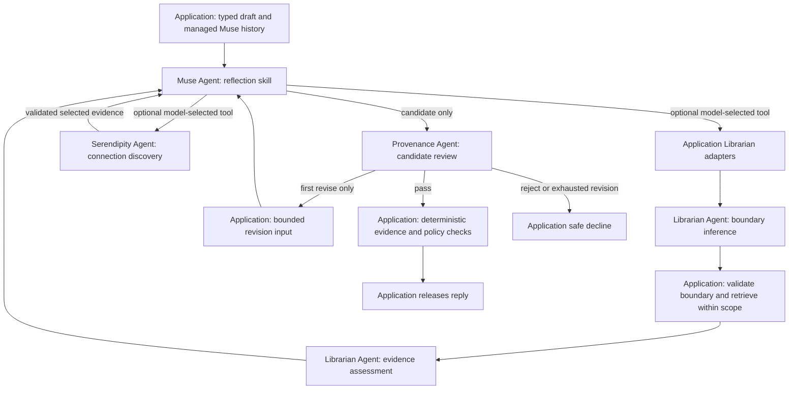

# Linger: System Specification

Status: **Draft implementation specification**

This document is the canonical source for product scope, architecture, implementation rules, and acceptance criteria. The submitted project proposal remains available as an immutable PDF under `docs/submissions/`.

Academic, frontier-lab, and expert sources for the final project report are maintained in [Sources for the Final Project Report](report-sources.md).

The architecture and acceptance criteria below describe the target prototype.
Delivery is staged: the current output-release slice uses a typed Muse candidate
containing the complete reply, declared book, memory, and web evidence uses, and
`MemoryCandidate | NoMemoryCandidate`. Provenance reviews both response and
nomination; application code binds a nomination to an exact source-turn span,
validates evidence against request-scoped source records, and lets the
deterministic Memory & Policy Service enforce automatic capture. The book index may
contain direct Librarian results, the selected book records from a current
Serendipity proposal, or exact records re-resolved from evidence identifiers
cited by an earlier released reply in the same session. Exact earlier reader
wording has a separate `session_line` declaration, checked against retained
reader Lines from that session. Selected memory and web records use a separate
request-scoped index. Memory records must match the authenticated account's
active records. Web records must match an opened page from an authorized search
lead. Image evidence, richer declared claims, and sensitive-inference flags
remain later slices. The implemented curation slice
selects a bounded set of stored originals, obtains a Sculptor proposal and independent
Provenance verdict, applies only an exactly bound allowed proposal through the
Memory & Policy Service, and materialises the resulting retrieval view.
The adopted conversational memory target in Section 4.2.5 requires curation after a
durable capture and proactive surfacing during a later conversation. Its chat
triggers, transfer of Sculptor-selected memory evidence to the release path,
and complete evaluation path are not yet implemented. The existing offline surfacing runner tests only the
decision component of that target.

## 1. Purpose and positioning

Linger is an academic prototype of a personal reflection and memory companion, grounded initially in a small literary corpus. It helps a user articulate why an idea or experience mattered, preserve it as a structured memory, and later explore grounded, tentative connections across conversations, books, photographs, and evidence found through general web search.

General-purpose AI agents already offer memory, image understanding, web search, and delegated tasks. Linger is not trying to be another general personal agent. It is a purpose-built reflection and memory application: a **provenance-first reflection companion** that keeps the user's words, source evidence, and generated interpretation distinct. Before any Muse-generated response reaches the user, Provenance — a separate model call — reviews the complete draft for quotations, factual claims, sensitive inferences, attribution, privacy, spoiler, and prompt-injection risks. Application code then performs deterministic checks where applicable. A non-factual reflection may pass without retrieval, but never without review.

The repository contains five validated literary corpora: *Alice's Adventures in
Wonderland*, *Animal Farm*, *The Adventures of Pinocchio*, *Narrative of the Life
of Frederick Douglass, an American Slave*, and *The Story of My Life*. Their
immutable source files come from Project Gutenberg and Project Gutenberg
Australia. All five works are registered and enabled by default for chat
retrieval and Reader. Application configuration grants access to exact book
revisions. Chapter-based and section-based works share the literary-part and
named-unit permission rules in Section 6.1. The
[corpus format guide](corpus/canonical-sections.md) links source audits and
describes the chapter and section schemas. This small, older corpus may contain
dated cultural perspectives.

## 2. Product hypothesis and journey

Linger tests whether a reflection companion becomes more useful and trustworthy when it can:

1. help the user articulate why a fragment mattered;
2. preserve that reflection with inspectable provenance;
3. retrieve exact supporting passages without crossing a spoiler boundary; and
4. reconnect the reflection to later experiences without inventing meaning or becoming intrusive.

The core journey is:

| Stage | Required behaviour |
|---|---|
| **Reflect** | Muse drafts responses to text or a photograph and asks a small number of useful follow-up questions. Provenance reviews every complete draft before display, including drafts with no declared factual claims. |
| **Ground** | Librarian retrieves authorised book passages and memories. Muse drafts a response separating quotations, user statements, and generated interpretation; Provenance checks the complete draft and its claimed support. |
| **Preserve** | During controlled evaluation, Muse may nominate a useful reflection for automatic capture. Provenance may veto an unsafe candidate, and the deterministic Memory & Policy Service alone validates and commits approved captures. A later application-owned curation run may select bounded originals, ask Sculptor to propose one action, obtain a curation-specific Provenance verdict, and let the service apply an exactly bound allowed proposal. The interactive POC exposes no memory-management drawer or explicit save, correction, or deletion actions. |
| **Reconnect** | Muse may ask Serendipity to explore a cue across memories, books, photographs, and general web evidence. Muse drafts the tentative connection, and Provenance reviews the whole reply and its evidence before release. |

Automatic capture is disabled by default in the interactive POC. Controlled
evaluation may enable it as server-side workflow state; every capture still
requires a Muse nomination, no Provenance veto, and deterministic policy
approval. Content about sensitive traits is never captured.

## 3. Prototype scope

### 3.1 In scope

- ongoing Muse conversations using text and user-supplied photographs, with semantic Provenance review of every candidate response;
- cited retrieval across the registered literary corpus and reviewed release
  of selected personal-memory evidence;
- keyword, semantic, hybrid, fusion, and reranked retrieval strategies;
- request-specific spoiler filtering and deterministic quotation validation;
- reviewed automatic memory capture as a controlled evaluation capability, with a visible notice for any committed capture;
- immutable original memories, versioned generated summaries, duplicate links,
  topic groups, reversible retrieval tombstones, and progressive disclosure;
- conversation- or photograph-triggered connections using internal evidence and optional general web search;
- the bounded conversational memory target in Section 4.2.5, with curation after
  a successful durable capture and relevant memory surfacing during a later Line;
- a mandatory, context-restricted output gate, deterministic post-checks, at most one revision, and an application-authored safe decline;
- a simple web interface, multiple test accounts, CI/CD, and reproducible test deployment;
- adversarial, output-gate, reflection, retrieval, memory-quality, connection-quality, cost, and latency evaluation;
- two bounded recursive self-improvement loops — failure-to-eval promotion and a Sculptor-curated system playbook (Section 9).

### 3.2 Stretch

- voice-note transcription, including audio-borne prompt-injection tests;
- cross-book, memory-to-memory, and song-to-memory connections;
- comparison of a revisited pairing with an earlier reflection; and
- a synthetic exercise of an opt-in feedback pipeline.

### 3.3 Out of scope

- persistent reading-progress tracking;
- live music, photo-library, messaging, or social integrations;
- the full Project Gutenberg catalogue;
- copyrighted books, lyrics, or copyrighted-audio analysis without permission;
- general shell, browser-control, or external-action capabilities;
- continuous monitoring or unsolicited resurfacing outside an active user
  conversation, including notifications;
- end-user memory-management settings and explicit save, review, correction, or deletion controls;
- mental-health profiling, diagnosis, or crisis-resource routing;
- autonomous prompt or skill self-modification — the self-improvement loops in Section 9 produce human-reviewed proposals only and never apply changes themselves;
- production scale, availability, compliance, or regulatory claims; and
- any claim that prototype telemetry measurably improved the system.

## 4. Architecture and authority

The system contains five reasoning agents and one deterministic service:

| Component | Responsibility | Write authority |
|---|---|---|
| **Muse** | Maintains the reflection conversation, handles photographs and spoiler clarification, routes work, and produces candidate responses that cannot be sent directly to the user. Its typed output may also nominate one `MemoryCandidate` for automatic capture or return `NoMemoryCandidate`. | None |
| **Librarian** | Judges request-scoped reading boundaries and the strength of supplied evidence. Application orchestration and retrieval services select candidates, enforce scope, fuse results, and rerank evidence. | None |
| **Sculptor** | Curates bounded sets of existing memories for retrieval while preserving originals. In the conversational target, it also judges whether a supplied memory is useful now or should remain unsurfaced. Its separate scheduled system-playbook task runs outside user conversations (Section 9.2). | May propose curation changes, surfacing decisions, and playbook pull requests; no direct writes or user-facing release |
| **Serendipity** | Searches internal and optional web evidence and proposes or declines tentative connections. | None |
| **Provenance** | Runs a no-tool emotional-boundary preflight on the current Line before Muse, then semantically reviews every complete Muse candidate. It separately reviews complete Sculptor curation proposals against their exact source snapshots and returns an `allow`, `revise`, or `reject` verdict bound to the proposal digest. | None |
| **Memory & Policy Service** | Authenticates account scope and deterministically enforces automatic-capture and curation policy, access, storage, idempotency, source freshness, audit verification, and the retrieval projection. It accepts only reviewed commands whose immutable proposal digest matches an `allow` verdict. | Commits validated writes |

The Memory & Policy Service derives account identity from authenticated request
context and never accepts it from model output; agents cannot choose or widen
account scope. The product-facing web application exposes Muse conversation and
session reset. It exposes no diagnostic Reader or Inspect surface, Serendipity
proposal, search or evidence payloads, memory-management UI, or public memory
CRUD API. The local development frontend may mount Reader and a read-only
per-turn Inspect projection so developers can exercise the corpus and debug the
response workflow, released direct Librarian results, fixed Serendipity
outcomes, and trace correlation.

**Tool implementation policy.** Pydantic AI's maintained tools, capabilities, and toolsets are the default implementation, not examples to recreate locally. The implementation must first use an [official Pydantic AI tool or capability](https://pydantic.dev/docs/ai/tools-toolsets/common-tools/), a provider-native tool supported by Pydantic AI, or a supported external toolset such as MCP. A custom Pydantic AI function tool is permitted only for Linger-specific domain operations for which no maintained implementation exists, such as enforcing account-scoped memory retrieval or the book spoiler boundary. Such tools must be thin adapters over application services; they must not reimplement generic search clients, page fetching, tool schema generation, dispatch, or retries already supplied by Pydantic AI.

The allowed tool surface is deliberately smaller than each agent's responsibility:

| Agent | Allowed tools or capabilities | Implementation source |
|---|---|---|
| **Muse** | No general-purpose tools. Photographs use Pydantic AI's model input support. Muse may select only the Linger-specific Librarian and Serendipity function tools permitted by the request; the application owns their grants, scope, execution, validation, inspection, and release. Memory nomination remains part of Muse's typed output. | Pydantic AI multimodal input, typed outputs, and thin Linger function-tool adapters over application services |
| **Librarian** | No model tools. Boundary inference receives privately selected candidates from the work's numbered main-text chapters and authorised reading context. Evidence assessment receives a bounded evidence set. Application code owns retrieval and exact record resolution. | Typed model tasks over application-selected evidence; deterministic retrieval and Memory & Policy services |
| **Sculptor** | No retrieval or write tools. It receives a bounded input set and returns a typed `CurationProposal` or `NoCurationProposal` for curation, or a `SurfacingDecision` for surfacing. The latter currently has an offline execution path only. | Pydantic AI typed input and output contracts |
| **Serendipity** | Search internal evidence through the same bounded Librarian adapters; search and retrieve public web evidence with Exa. | Internal Linger adapters plus the maintained [`pydantic_ai_harness.exa.ExaSearch`](https://pydantic.dev/docs/ai/tools-toolsets/common-tools/#exa-search-tool) capability |
| **Provenance** | No tools. Its preflight receives only the current Line and emotional-content policy. Its candidate gate receives the typed candidate, canonical evidence, untrusted tool outcomes, current Line, and policy constraints. Its separate curation gate receives one complete proposal digest, the proposal, and only the exact immutable source evidence selected by that proposal. | Pydantic AI typed input and output contracts |

Exa is the sole general web-search integration for the prototype. Install the `pydantic-ai-harness[exa]` extra and register `ExaSearch()` in Serendipity's `capabilities`; do not implement an Exa client or web-search tool locally. The older `exa_search_tool`, related Exa common tools, and `ExaToolset` are deprecated and must not be introduced. Exa results remain untrusted evidence and are still subject to Sections 6.4 and 6.5. This allocation does not authorise browser control, arbitrary URL fetching, shell access, or any external action excluded by Section 3.

Each logical role owns one reusable production PydanticAI `Agent` object. The
application selects one assigned runtime skill before a model run. It does not
spawn an Agent object for every request or ask the model to discover skills.
The same object can execute concurrent runs with separate request state. All
roles retain the configured `LINGER_MODEL`; consolidation changes neither the
model-call structure nor the application-owned release and storage decisions.

| Role | Assigned runtime skills | Current consumers |
|---|---|---|
| Muse | Reflection and revision | Chat drafts and the single permitted revision use one reflection skill and the stable `MuseCandidate` output. |
| Librarian | Boundary inference; evidence assessment | Chat routing and bounded retrieval orchestration; retrieval benchmarks and replay. |
| Sculptor | Memory curation; memory surfacing | The callable reviewed curation loop and proposal-quality replay; offline surfacing evaluation. Chat does not initiate either task. |
| Serendipity | Connection discovery | Muse's `serendipity_explore` tool and component evaluation. |
| Provenance | Emotional preflight; candidate review; curation review | Chat preflight and candidate review; independent review in the callable curation loop. |

The maintained [agent runtime skills architecture](agent-skills.md) links each
assignment to its packaged `SKILL.md`, typed inputs, outputs, validation, and
permitted capabilities. Shared instructions contain only policy common to the
role. Per-run instructions add only the selected skill. Muse and Serendipity
retain fixed output schemas with registered validators; other roles select
their output schema and retry budget per run. Prompts never load repository
development instructions or treat reader content, memories, retrieved evidence,
or model candidates as instructions.

The five roles separate conversation and optional memory nomination, retrieval,
memory curation and usefulness decisions, connection generation, and independent
verification. Librarian and application services select authorised evidence.
Sculptor judges the supplied memories' usefulness, timing, and repetition.
Serendipity proposes broader connections. Muse retains the application's
intentionally managed session history and bounded revision context. Other
roles receive only their task-specific projections. Deterministic application code
enforces access, capture, writes, and output release.

Each hand-off uses a strict, discriminated envelope and carries only the fields required by the next step. Muse receives either a draft envelope or one revision envelope that preserves the same turn and context authority. Full transcripts and unrestricted working context are not passed between agents.

Provenance shares no model working context with the other agents and has no tools. The preflight receives only the current Line and the application-owned emotional-content policy. The later release gate receives one typed envelope containing trusted context, canonical book and selected connection evidence, untrusted current-run tool outcomes, Muse's candidate declarations, and the current Line for emotional review and exact capture binding. It independently detects quotations, factual claims, and sensitive inferences instead of trusting Muse's declarations. The curation gate is a separate typed call with no Muse context; it reviews the complete Sculptor proposal and source evidence, then echoes the exact proposal digest in its verdict. This provides separation of duties, not model independence, because the same underlying model may be used.

### 4.1 Output release contract

Before Muse or any Muse-accessible tool runs, Provenance classifies the current
Line against the versioned emotional-content policy. `continue_reflection`
enters the ordinary Muse flow. `apply_boundary` skips Muse, Librarian,
Serendipity, target conversational Sculptor work, ordinary candidate review,
and memory nomination; application code
releases the canonical response from Section 6.6 and records
`application_emotional_boundary`. A preflight failure fails closed to the
application safe decline before Muse runs. This narrow application-owned path
does not create a Muse candidate; every candidate that Muse does produce still
requires the ordinary Provenance gate.

At target completion, every Muse invocation returns a typed candidate containing the complete response text plus its declared claims, quotations, evidence identifiers, sensitive-inference flags, and `MemoryCandidate | NoMemoryCandidate`. Those fields assist review but do not authorise release or capture: Provenance examines the entire draft and any proposed memory and may identify items Muse omitted or misclassified. Regular expressions and structural checks may provide defence in depth, but they are not the semantic security boundary.

The current release contract includes the complete response text plus declared evidence
identifiers, exact quotations, and source locations. After each passing original
or revised Provenance verdict, application code resolves every book declaration
against one application-owned, request-scoped evidence index. The index accepts
only exact book records from the current direct Librarian result, the selected
book records from a current Serendipity proposal, or records that Librarian
re-resolved from identifiers cited by an earlier successfully released reply in
the same session. New records must match the current validated book scope.
Direct retrieval may use a literary part with a chapter ceiling, exact named
units, or an exact-paragraph grant. Serendipity book search uses only chapter or
exact-unit scope. A re-resolved session record authorises only that exact
previously released passage; it does not establish
current reading progress or grant neighbouring text. Application code also
validates source lines, source location, and any exact quotation before release.
For selected memory and web evidence, `canonical_connection_evidence` gives
Provenance the exact request-owned records. Memory records bind their identifier
and text to the authenticated active-memory snapshot. Web records bind to a page
opened from a permitted search lead. The release validator checks each declared
use against that index, checks any quotation against both source and reply,
and requires web URLs to appear as exact Markdown citations. Personal memories
support attributed personal context, not public factual claims. Unsupported,
ambiguous, or changed evidence fails closed to the application-authored safe
decline. This staged contract does not remove the remaining target fields above.

Provenance returns `pass`, `revise`, or `reject` for the user-facing response and, when a `MemoryCandidate` is present, an independent `allow_capture` or `reject_capture` decision. Rejecting capture does not suppress an otherwise safe response. The two semantic decisions remain independent, but deterministic storage eligibility also requires a released Muse candidate. Every `application_safe_decline` suppresses an otherwise eligible automatic write, including when Provenance independently returned `allow_capture`; inspection retains that decision, records `safe_decline_capture_suppressed`, and produces no save notice. Every emotional-boundary release records `emotional_boundary_capture_suppressed`. The preflight branch has no Muse nomination. A candidate-review fallback may retain the candidate's content-free nomination and independent capture decision for inspection, but it always suppresses storage. After a semantic pass, application code validates exact quotations, citation locations, account scope, and spoiler constraints where applicable. Only approved output is displayed. A first `revise` verdict gives Muse one discriminated revision envelope, the draft run's tool messages, and the same request-scoped evidence index, then returns through the same review path; a rejection or failed revision produces an application-authored safe decline.

### 4.2 End-to-end flows

#### 4.2.1 Reflection and grounding

After the emotional-boundary preflight returns `continue_reflection`, Muse asks Librarian for evidence only when grounding is needed, and every Muse path produces a candidate response for Provenance review. There is no Muse-to-user bypass. The no-Muse branches are the fixed application-owned boundary and the generic application safe decline when preflight fails, as described in Sections 4.1 and 6.6.

The following diagram begins at the ordinary `continue_reflection` branch; the
preflight and its application-owned boundary branch precede it. It depicts the
logical agent and release flow inside `run_chat_turn`; an HTTP request and a
synthetic evaluation Scene both enter that same application boundary, so the
transport extraction does not change the diagram's agent topology.

Repeated role labels denote runs of the same reusable object. Librarian
retrieval remains application code; boundary inference runs only when routing
needs it. The [complete skill and authority diagrams](agent-skills.md#authority-and-run-context)
also show the preflight, curation, and offline surfacing paths.

#### 4.2.2 Reviewed memory capture and curation

During controlled evaluation, Muse may nominate one typed `MemoryCandidate`;
Provenance may veto it for privacy, sensitive inference, unsupported provenance,
or injection risk. The Memory & Policy Service derives account scope, checks the
server-side evaluation policy and idempotency, validates the request, and owns
every write. The application reports a committed capture but offers no
memory-management action.

Sculptor is not part of capture. Curation is implemented as the callable
`run_curation_loop` service below. Application-loop tests invoke it; the current
chat handler does not initiate curation.

1. The Memory & Policy Service resolves 2–12 requested memory identifiers to
   immutable originals within the authenticated account.
2. Sculptor receives only those identifiers and source texts and returns one
   typed `CurationProposal | NoCurationProposal`. It has no tools.
3. For a proposal, application code snapshots every referenced original,
   constructs an immutable `CurationPlan`, and hashes its account scope,
   current ordered curation-state digest, complete proposal, and source-record
   digests.
4. The curation-specific Provenance gate receives that proposal digest, the
   complete proposal, and its exact source evidence. It has no tools and returns
   `allow`, `revise`, or `reject` while echoing the digest. Any missing,
   malformed, revised, rejected, or differently bound verdict stops the flow.
5. Application code constructs `ApprovedCuration` only from an exact `allow`.
   The Memory & Policy Service re-reads the originals and fails closed on stale,
   unknown, cross-account, stale-state, or structurally invalid sources before
   appending one immutable, idempotent audit event.
6. The service verifies the stored event and source hashes. Retrieval reads the
   materialised curated view rather than the raw capture list.

Allowed actions are duplicate links, versioned derived summaries, topic groups,
retrieval tombstones, and retrieval restoration. A tombstone requires a prior
duplicate link to a distinct canonical original that is still retrievable.
The service rejects a tombstone whose canonical is already suppressed, so
opposite tombstones cannot hide both duplicates. A tombstone only suppresses the
target from retrieval; restoration removes that suppression. Neither action changes
or deletes a source record. Generated summaries and topic labels remain
separate retrieval items with explicit source-memory identifiers. There is no
public memory CRUD endpoint, arbitrary agent tool, physical deletion, or
autonomous scheduler in this slice.

#### 4.2.3 Connection discovery and verification

Serendipity supplies a proposed connection and evidence identifiers to Muse. Muse drafts the user-facing reply, which uses the same mandatory Provenance gate and deterministic checks as an ordinary reflection.

The implemented discovery slice keeps a narrow release boundary. Serendipity may
search the curated memory retrieval view supplied by the authenticated
application, an application-granted book corpus, or application-granted Exa web
sources. It returns a typed proposal or decline with request-local evidence for deterministic
validation. The application, not Muse, supplies the exact current reader message
as the cue. Each run is limited to eight model requests and six total tool calls.
Muse may relay a typed decline. Application code validates the selected book,
memory, and web records against their granted sources. Selected book records
enter the book evidence index; selected memory and web records enter the
separate connection evidence index. Muse may use those exact records to draft a
tentative connection for the ordinary Provenance and deterministic release path.
Losing-candidate evidence is discarded. Content-bearing connection diagnostics are not
returned by the application API. Image evidence remains unsupported.

Web queries pass the privacy checks in Section 6.4 before execution. Synthetic
replay records blocked and issued queries separately, so a refused query does
not count as an external disclosure.

#### 4.2.4 Developer corpus and inspection tools

Reader and Inspect are development and debugging tools, not product frontend
surfaces. The local development frontend mounts them for convenience while
developers interact with the corpus and trace backend behavior. A user-facing
frontend does not expose either tool or depend on either tool's state.

Reader is a developer browser for the enabled registered books. Read-only
`/api/library` endpoints serve validated local canonical text and group chapters
and named units by literary part. Reader opens at the first main narrative
chapter. Opening a book, navigating to a unit, or revealing its summary changes
local diagnostic state only. Summaries remain hidden behind an explicit spoiler
warning. Navigation and summary reveal never establish reading progress,
session evidence, or chat retrieval permission. Chat uses only the
request-scoped context resolution and permissions described in Section 6.1.

Inspect is a developer-only, read-only projection of each completed chat turn.
It exposes the reader message, `MuseTurn` policy contract, context resolution,
assembled Muse dynamic input, application-recorded agent statuses, direct
Librarian grounding calls, fixed Serendipity decline metadata, the released
response, the actual Provenance verdict path, release source, released book
evidence identifiers, failure stage, capture outcome, and server-generated trace
ID. For a failed stage, Inspect records whether the failure came from application
code, a model call, or deterministic validation, and whether the failure is
retryable. This diagnostic detail exists to debug request-scoped contracts and
hand-offs; it is not end-user content. It does not expose Serendipity proposals,
searches, web or private evidence payloads, rejected draft text, Provenance
critiques, or memory content. Inspect metadata cannot authorize retrieval,
release, capture, or storage, and its trace link follows the metadata-only backend
telemetry contract in Section 8.1.

Chat displays the active agent stage and elapsed time while a turn runs.
`POST /api/chat/stream` sends allowlisted role, stage, status, hand-off,
sequence, and timing metadata, then delivers the complete response after the
ordinary release checks finish. Inspect derives stage durations from paired
start and completion events and shows per-agent totals and ordered hand-offs.
An unpaired event leaves its duration unavailable. Progress metadata never
contains draft text or grants release authority.

#### 4.2.5 Conversational memory curation and surfacing target

This adopted target makes Sculptor's work observable through a conversation.
It does not require Sculptor to remain offline. Application code owns when it
runs and which evidence it receives. Curation changes the retrieval view;
surfacing decides whether existing evidence would help the current conversation.
Neither operation grants Sculptor tools, write authority, or direct release.

The bounded demonstration follows this sequence:

1. Earlier same-account memories establish a preference. The user then sends a
   natural Line describing a changed preference, without requesting a save or
   instructing an agent. The normal emotional preflight, Muse nomination,
   Provenance review, and deterministic capture policy apply.
2. Only a successful new durable capture triggers application-owned curation.
   The application supplies the new original and relevant earlier originals
   through the existing bounded selection contract. It does not curate on
   every Line or treat an idempotent retry as another change.
3. Sculptor proposes a supported curation action or no change. A proposal passes
   the separate, exactly bound curation-specific Provenance gate before the
   Memory & Policy Service applies and verifies it. Originals remain immutable;
   derived records retain their source references and the audit records the
   actual outcome. A revision, rejection, or failed validation does not authorise
   a curation write. An application or verification failure cannot be reported
   as successful curation. No-change is a valid outcome.
4. In a later fresh chat, the user sends a natural Line for which the updated
   preference may matter, without explicitly asking for recall. After preflight,
   Librarian and application services retrieve authorised candidates from the
   actual stored state. The application gives Sculptor a bounded memory set,
   current context, decision time, and prior surfacing or dismissal history.
5. Sculptor proposes surfacing now, deferral, or silence. Muse may use a validated
   suggestion to draft an evidence-backed response. Provenance reviews the
   complete candidate, and deterministic checks resolve its personal-memory
   evidence before release. Deferral and silence produce no inserted suggestion
   and schedule no notification. The ordinary conversation may continue.

If capture is absent, vetoed, suppressed, or fails, the workflow records that
outcome and does not invent a new memory or run capture-triggered curation.
The later chat can use only the state that actually exists. Retrieval failure,
invalid source references, and unsupported release evidence fail closed under
the ordinary response policy. A curation success never authorises a response
without the separate release gate.

Current code provides reviewed capture, a callable reviewed curation loop, and
an offline surfacing decision function. The complete sequence still requires
conversational triggers and a typed hand-off of Sculptor-selected personal-memory
sources into Muse, Provenance, and the deterministic release gate. Its evaluation
also needs package support for carrying observed outcomes between Scenes,
Ground truth for those dependencies, and a runner that grades the complete path.
Section 7.2 records these gaps without changing the existing package models.

## 5. Core records

### 5.1 Session state

Working context contains only:

- server-supplied `account_id`;
- `memory_capture_enabled`;
- the request-scoped `spoiler_boundary` inferred by Librarian from authorised
  memories, the current message, and the immutable work's numbered main-text
  chapters, or established through explicit completion or clarification for a
  selected part or named unit;
- exact book records re-resolved from identifiers cited by earlier released
  replies in this session, when present;
- the active topic; and
- a compact conversation summary.

The complete memory archive is never injected into every prompt. Reading
progress is not stored as durable user state; Librarian resolves a temporary
spoiler boundary anew for each book-related request.

For evidence continuity, the session keeps one content-free record per turn:
the turn identifier, release source, cited evidence identifiers, and review
finding codes. This record never stores passage text or reading progress.
Released Muse replies and application-authored clarifications enter the
conversational message history; an emotional-boundary or safe-decline turn
keeps only its content-free record. Only identifiers from successfully released
Muse replies may be re-resolved on a later turn, and session reset removes
these handles with the conversation.

### 5.2 Memory record

An active memory belongs to the requesting account and was captured through the
reviewed automatic-capture path.

Each active memory contains:

- stable `memory_id` and server-supplied `account_id`;
- the user's original words;
- cited source-evidence identifiers, when applicable;
- a generated summary stored separately from the original;
- provenance linking the originating conversation or photograph;
- links to related, duplicate, or parent memories;
- an idempotency key derived from account, source event, and capture type;
- derivation metadata for generated records; and
- created and updated timestamps.

Original captured records are immutable. Sculptor may add or replace versioned
derived summaries and links but cannot modify an original. A reversible
retrieval tombstone changes only the materialised view and is not deletion. The
interactive POC does not expose correction, tombstoning, restoration, or
deletion.

For the prototype, the Memory & Policy Service stores each immutable capture as
a Markdown file with JSON front matter under a Git-ignored
`memories/<hashed-account-id>/` directory. Controlled evaluation may set capture
policy server-side; the interactive UI cannot change it. No embedding,
search-index, telemetry-memory, or vector-database layer is created until
retrieval requires one.

Reviewed curation is stored separately as immutable JSON events under
`memories/<hashed-account-id>/curation/`. Each event records the complete allowed
Provenance review, proposal and review digests, typed action, exact source
snapshots, account key, current curation-state digest, and application time.
Replaying an identical approved plan is idempotent; an event conflict, stale
state, stale source, missing source, or account mismatch fails closed. The
retrieval projection combines visible originals with the latest derived summary
and topic-group version for each source set, includes duplicate and topic
metadata, and excludes only originals with an effective retrieval tombstone.

### 5.3 Evidence record

Every retrieved item carries:

- stable evidence identifier;
- source type and source location;
- owner or account scope where applicable;
- trust level and verification state;
- spoiler position for book evidence; and
- the minimum excerpt required for the current task.

During one request, exact book records live in a read-only map keyed by evidence
identifier. Direct Librarian retrieval, selected book evidence from Serendipity,
and exact re-resolution of identifiers from earlier released replies all feed
this same map. Conflicting records for one identifier fail closed. The map is
discarded after the request; session state retains only the released handles,
never the passage text. A separate request-only index holds selected memory and
web records. Its immutable records contain source kind, evidence identifier,
excerpt, and trust level; web records also contain a title. Neither a tool's
output nor Muse's declaration can expand this authority. Application-owned
source grants can restrict public retrieval to an explicit URL list.

### 5.4 Muse candidate response

`MuseCandidate` contains `reply`, `evidence_uses`, and `memory`. A `book_corpus`
evidence use declares an evidence ID, source location, and optional exact
quotation. A `memory` or `web` use declares an evidence ID and optional exact
quotation. Web evidence also requires an exact Markdown URL citation in the
reply. A `session_line` use declares exact earlier reader wording.
Application code checks a session quotation against retained
reader Lines from successful turns in the same session. Book quotations must
occur in both the canonical record and the visible reply. Provenance reviews
the complete wording and attribution, including claims with no declaration.

At target completion, every candidate response contains:

- the complete proposed user-facing text;
- declared claims and quotations;
- cited evidence identifiers;
- sensitive-inference and policy flags; and
- `MemoryCandidate | NoMemoryCandidate`; and
- revision metadata, when applicable.

Muse's declarations and memory nomination are untrusted review hints. They do not narrow what Provenance must inspect or what application code must validate.

### 5.5 Memory candidate

An automatic `MemoryCandidate` contains only:

- the user's original words proposed for capture;
- the source turn and evidence identifiers, when applicable;
- a concise nomination reason; and
- sensitive-inference and policy flags.

`NoMemoryCandidate` contains a machine-checkable reason code. Neither type
contains account scope or write authority. The POC has no separate explicit-save
path.

### 5.6 Connection proposal

The current `ConnectionProposal` is Serendipity's pre-review decision. It
contains:

- a ranked shortlist of two or three eligible candidates;
- for each candidate, a tentative claim, cited evidence identifiers, shared
  structure, meaningful difference, interpretation, comparison note, and the
  three-field `cue_fit`, `reflective_value`, and `safety` rubric;
- the selected rank-one candidate identifier;
- qualitative uncertainty and the unchanged presentation policy;
- a suggested follow-up for Muse; and
- a closed policy flag indicating whether the winner cites web evidence.

The proposal contains no Provenance verdict or critique. Muse receives it as
untrusted internal material; Provenance reviews the later complete Muse draft.

## 6. Safeguards

### 6.1 Spoilers

Reading permission identifies a work, its immutable revision, and a literary
part, then selects either a completed chapter ceiling or exact named units.
Book and part selection may persist within a session; reading permission is
resolved anew for each request.
Chapter ceilings include only numbered chapters in that part. Prefaces, letters,
and other named sections have no chapter number; completing one permits only
that exact unit. Chapter numbering restarts where the source does, while
canonical section IDs retain their source order. For example, Chapter 1 in
Part I and Chapter 1 in Part III of *The Story of My Life* are distinct
locations. The schema field `chapter_id` stores the canonical unit ID;
`chapter_number` stores the literary chapter number or `null` for named
sections. These rules govern retrieval, cached indexes, connection searches,
citation validation, and final release. They are distinct from the narrower
exact-paragraph grants described below.

When the reader's words indicate that a request depends on a book, Muse asks
Librarian to route it from metadata. A title, character, scene, or contextual
pronoun can supply that cue. An active session book alone does not justify a
route call. This intent rule lives in Muse's instructions; application code
validates selection and access after the call. Exact supported titles, stable
aliases, an active session selection, and canonical evidence references are
strong signals. Common
character, location, and catalogue words are weak candidates only: they cannot
select a work or expose a memory by themselves. Multiple plausible works
produce a clarification before private boundary inference. If a book is not
needed for the response, Muse can continue personal reflection without lookup.
A book-related follow-up with no book name and no strong cue for a different
work can route to the session's active selection and enter boundary inference.
Boundary inference asks a chapter-progress clarification
whenever it cannot locate the request in the book, whether because no
supporting evidence is found before the judge runs or the judge itself
remains uncertain.

Librarian then performs boundary inference. Its private search covers all
numbered chapters in the selected immutable work's main text, including Part I
of *The Story of My Life*. Other parts and named sections require explicit
current-turn completion. Librarian cross-references the eligible chapters
against the current Line and relevant account-scoped memories to localize the
latest event the person appears to know. The typed decision declares whether
its basis is a relevant prior memory or the current Line alone. It cites the
exact supporting memory and evidence identifiers and returns confidence plus
content-free locations. It must not return post-boundary story content to Muse.

After inference, application code validates the work, version, memory IDs, and
evidence IDs. A non-progress question in the current Line may locate an event
but cannot authorize a ceiling by itself; Line-only candidates always require
reader clarification. Explicit current-turn progress remains authoritative,
while a memory-supported candidate is eligible for the provisional confidence
policy. Librarian then performs a separate
retrieval bounded to that ceiling, and application code rejects evidence outside
it before Muse can use it. Linger stores memories of what the person discussed,
not a durable chapter-progress field; the boundary is derived anew for each
request. This separation lets evaluation compare Librarian's inferred ceiling
with event-derived Ground truth while preventing private inference access from
becoming disclosure authority.

Cached retrieval indexes use the work, revision, part, and chapter ceiling or
exact unit IDs as their scope identity. Excessive chapter ceilings are clamped
to that part's registered maximum before cache lookup. Exact unit membership is
validated even when an index is cached.

For direct grounding, if every fused candidate falls below the final reranker
cutoff, the application may retain the highest-ranked eligible candidate for
Librarian's separate evidence-strength assessment. Only an accepted assessment
admits that evidence to the release index. Ordinary retrieval, connection
search, and boundary inference retain their cutoffs.

Earlier reader messages can support a narrower permission without establishing
chapter progress. Before Muse runs, application code snapshots at most eight
complete retained reader messages, up to 16,000 characters, from the same
session. Each original message has a stable reader-ordinal ID. Assistant text,
failed turns, and other sessions are excluded. This handoff does not depend on
memory capture and does not turn session messages into saved memories.

For this path, Librarian converts private search windows into verified canonical
paragraphs. Its private decision separately names earlier reading statements,
paragraphs that locate those statements, and the exact requested paragraphs,
and declares an `authorization_basis` of `session_supported` or `line_only`.
The boundary model's instructions require a statement that describes reading
the scene, excluding curiosity, unread intent, and hearsay. Application code
checks the declared authorization basis, supplied IDs, work identity, and
confidence before granting only the requested paragraphs. A `line_only`
decision or a statement that does not independently identify the work never
grants passages. A `passages`
route exposes IDs but no story text or chapter ceiling. `librarian_search`
then re-fetches those exact records, checks their identity, and runs the
existing evidence-strength review. Neither a new query nor a larger chapter
argument can expand the grant.

Provenance receives `passage_scope` with no chapter boundary. The deterministic
release check accepts only matching canonical evidence within that exact scope,
plus the existing exception for exact previously released passages. Passage
permission does not enable Serendipity book search or persist chapter progress.
Ambiguous reading support still requires clarification. See
[Session-supported exact passages](design/session-passage-design.md) for the
ownership and failure rules.

The current implementation has both phases for each enabled work's numbered
main-text chapters. Muse decides whether a request depends on a specific book
and calls an argument-less `librarian_route` tool only then. An incidental word
inside otherwise personal reflection does not justify a call. The application supplies the exact
current reader message; Muse cannot substitute its own text. Both explicit
reading declarations and Librarian routing use the deterministic
[`book registry`](../src/linger/corpus/registry.py). It matches reviewed titles,
stable IDs, and distinctive aliases; broad `candidate_aliases` require
clarification. Longer names supersede contained shorter names, and canonical
names take precedence over aliases at the same position. Separate explicit
works or unresolved shared names remain ambiguous regardless of catalogue cue
counts. Registered author names can distinguish books sharing a title.

Unknown declarations do not manufacture work IDs or inherit the previous
book's chapter candidate. A full-title answer can select a book, but cannot
grant reading progress. Muse copies work and revision IDs from validated
context or routing results. The [registration guide](book-registration.md)
describes catalogue checks and the separation between human review, optional
Sculptor metadata proposals, deterministic builds, and runtime routing.

When no reviewed name is present, metadata-only routing retains the contextual
score `0.3 + 0.2 × overlap`, capped at `1.0`, over distinct whole catalogue
cues. A multi-word cue contributes one match, nested matches count once, and
generic single-word cues do not contribute. If no candidate reaches `0.6`,
routing returns no match; multiple qualifying candidates require clarification. A
resolved reviewed name bypasses contextual ranking with score `1.0`. These are
deterministic scores, not calibrated probabilities. Separately, memory work
candidates use the same identity resolver; unresolved names cannot become
strong memory support through incidental catalogue words.

A routed work then enters boundary inference: Librarian receives the current
Line and at most eight items from the account's curated retrieval view that
independently route to that work and searches its immutable numbered main-text
chapters. It returns a typed candidate ceiling, evidence basis, confidence,
supporting memory IDs, and content-free supporting locations. Candidate text
remains private to this phase and is never copied into Muse, Inspect, the turn
evidence ledger, or the release scope.
The curated view applies retrieval tombstones and includes derived summaries.
Curation and audit retain the immutable originals, including tombstoned records.

Application code validates the returned work, version, memory identifiers,
evidence identifiers, authorization basis, and candidate chapter. A Line-only
candidate, confidence below `0.75`, conflicting context, missing support,
retrieval failure, or an invalid model decision produces an application-owned
clarification and no evidence search for release. When account-scoped memory
storage is unreadable, the application binds an empty memory set, and boundary inference
proceeds with no memories available to it. A chapter ceiling still requires memory
support, but earlier reader statements may independently support exact passages.
Without either form of support, Librarian requests clarification. A validated
memory-supported candidate creates only a request-scoped ceiling; it is not
persisted as reading progress. Muse may then request the second search, which
the application clamps to that ceiling before any passage becomes releasable
evidence. Explicit reader confirmation remains authoritative and skips
inference for that request, and a routed inferred ceiling never widens or
replaces a boundary the reader already confirmed this turn.

Only a memory-supported clarification that explicitly asks about a candidate
chapter may retain that chapter for a follow-up affirmation. A generic progress
question clears any previous chapter candidate. Naming the book or saying the
chapter is unfinished does not confirm progress.

An unresolved routing or boundary clarification returns a typed
`ClarificationRequest` from `librarian_route`. After Provenance passes the
candidate, application code releases the validated tool question as
`application_clarification`, replacing Muse's wording. Muse does not need to
copy the question verbatim. Evidence declarations and non-route tool calls
still fail deterministic validation, and an emotional boundary takes priority.
Clarifications suppress automatic memory capture with
`clarification_capture_suppressed`. The application
retains the released question and original reader message in session history
and keeps the pending clarification state. A reader
reply on a later turn consisting only of a chapter reference, such as
"2", "two", "second", or "chapter two", counts as explicit completed progress
only when that chapter exists in the selected part of the available book.
It resolves the boundary as `reader_confirmed` before Muse runs. A chapter-only
answer without a pending clarification does not grant progress. Hedged or
question-shaped replies, unrelated text, and out-of-range chapter answers keep
the pending question unresolved. Unresolved identity or a book switch clears
the pending question. Direct search also
checks identity from the original reader message or validated session selection
before recording a pending question. Muse then re-issues the original book
question through `librarian_search` under that validated ceiling. A routed
work also derives Provenance's
review context after Muse runs, not before — a `RoutedWork` result grants the
same reading-context and policy authority the application would otherwise
have supplied only when no boundary was already resolved.

When the same progress question remains unanswered for a single-part,
chapter-based work, routing asks a closed question for a chapter number within
the work's range. A memory-supported candidate keeps its specific
confirmation question and candidate chapter. Mixed section-based works retain
the ordinary clarification instead of switching to chapter-number choices.

### 6.2 Citations and attribution

For a book quotation displayed or stored, application code verifies its text,
source, and location against the canonical book record in the shared
request-scoped index. Selected memory and web declarations use their separate
request-scoped evidence index. Web uses require exact Markdown URL citations.
Neither source can satisfy a book-corpus declaration; image evidence remains
unsupported. Muse separates evidence from interpretation. Provenance reviews
every complete draft for undeclared or mislabelled quotations and factual
claims and checks their semantic support.

### 6.3 Memory and media control

- Automatic capture is disabled by default in the interactive POC and may be enabled only as controlled server-side evaluation state.
- Every committed capture produces a visible notice without exposing a management action.
- Before a long capture-enabled evaluation conversation is compacted or closed, Muse may make one final memory nomination through the same Provenance review and deterministic capture path.
- The interactive application exposes no explicit save, review, correction, or deletion controls.
- Raw photographs remain transient.
- Derived memories from photographs may be captured only while controlled capture policy is enabled.
- Sensitive-trait content is never captured automatically.
- An application-authored safe decline never commits automatic memory or produces a save notice, even when the proposed memory was independently approved.
- The preflight emotional boundary creates no nomination. Every emotional-boundary release suppresses writes and save notices.
- Logs and telemetry follow the canonical [telemetry data contract](telemetry.md).

### 6.4 Untrusted content and privacy

Book text, web results, photographs, media descriptions, and candidate model
responses are untrusted input. Web-search queries use general concepts.
Maintained detectors reject shaped personal data and secrets. A deterministic
overlap guard compares each query with the application-owned current cue and
each supplied memory. For source text of at most eight tokens, it rejects any
shared token longer than one character. For longer source text, it rejects
three consecutive copied tokens, or the entire query when it contains fewer
than three tokens. Tokens are Unicode-normalised and case-folded. Shared topic
words in longer text do not by themselves trigger rejection.

Private wording must remain outside public queries. Evidence supplied to each
agent is minimised, account-scoped where applicable, and labelled by trust
level; application code owns its verification state. Prompt instructions
contained in evidence never gain tool authority.

### 6.5 Verification

Every Muse candidate requires a recorded approving Provenance verdict before release. Provenance may pass, reject, or request one revision. A candidate is not released when:

- cited evidence is missing or unresolved;
- attribution is incorrect;
- the spoiler boundary is unclear;
- evidence crosses account boundaries;
- a factual web claim lacks a retrievable citation;
- the candidate contains an unsupported claim or sensitive inference;
- the candidate violates the emotional-content policy; or
- retrieved content attempts to redirect agent behaviour.

Rejected and superseded drafts are never displayed. Deterministic validation runs after semantic approval and fails closed to the application-authored safe decline.
A response finding with code `spoiler` or `prompt_injection` requires an
immediate `response_decision="reject"` rather than a revision. Capture findings
independently determine `capture_decision`; rejecting an unsafe nomination does
not by itself block a safe reply.

### 6.6 Emotional content

Linger is a reflection companion, not a wellbeing tool. It never diagnoses or
labels a person's mental state. A distressing disclosure is a current,
first-person Line that communicates intense distress or inability to cope such
that continued reflective questioning would be inappropriate. Ordinary
disappointment, frustration, uncertainty, literary discussion, or concern about
someone else does not trigger this boundary by itself. This is a request-local
interaction boundary, not a diagnosis, severity score, or crisis assessment.

Before Muse runs, the no-tool Provenance preflight evaluates only the current
Line and the versioned emotional-content policy. For a distressing disclosure,
the application stops the ordinary reflection path and returns exactly:

> That sounds deeply distressing. I don’t want to keep probing, and I’m not able
> to assess your wellbeing. Please consider reaching out to someone you trust or
> a qualified professional for support.

On this path Muse, Librarian, and Serendipity do not run. No candidate, evidence
declaration, or memory nomination exists. Inspection records
`application_emotional_boundary` and suppressed capture; no write or save notice
occurs. A preflight failure returns the generic application safe decline and
also skips Muse and its tools. The ordinary Muse prompt and candidate Provenance
gate remain defence in depth: Muse must not diagnose or continue probing, and a
missed current-Line boundary is reported through the explicit
`emotional_boundary_decision=required` disposition and a current-Line
`emotional_policy_violation`, so the application can substitute the canonical
response without a revision. Inspection records whether the boundary originated
in the preflight or the candidate review and never claims that Muse was skipped
on the fallback path. A candidate-response-only diagnosis follows the normal
revise-or-reject path.
Crisis assessment and resource routing remain out of scope.

## 7. Evaluation and acceptance

### 7.1 Product evaluation requirements

Evaluation must test the product behaviour and authority boundaries in Sections 4–6. Retrieval and memory quality evaluation covers the following requirements:

- Compare keyword, semantic, hybrid, and reranked book and memory retrieval using measures such as Recall@5 and nDCG@5.
- Test whether Librarian's strategy selection improves relevance or latency over the strongest fixed strategy.
- Measure Sculptor's linking and grouping quality without giving it tools or
  allowing it to modify or delete an original memory.
- Verify that every applied proposal has an exact allowed Provenance verdict,
  fresh same-account sources, an immutable audit event, and a reproducible
  curated retrieval projection.
- Verify that every derived record resolves to its originals and that retrieval
  tombstones are reversible without physical deletion.

The suggested measures in the [synthetic journal evaluation-objective catalog](../synthetic-journal-evaluation/evaluation-objectives.yaml) identify relevant signals. They are not adopted thresholds, aggregate scores, or release gates. Every factual web claim must include a retrievable citation, every evidence identifier must resolve, and any LLM-as-judge result is secondary and labelled non-independent.

### 7.2 Scenario-first synthetic journal evaluation

#### 7.2.1 Canonical vocabulary

Synthetic journal evaluation uses the following six terms. Documentation, skills,
and future designs must use these terms instead of ad hoc synonyms such as
*artifact*, *world*, *case*, *action*, or *fixture*. The repository defines the
vocabulary, Backstory and Ground truth structures, deterministic package
validator, and Ground truth authority lifecycle below. Interactive independent
adoption is implemented. The catalog registers reviewed automatic capture,
bounded memory curation, session continuity, grounded book reflection, spoiler
boundary clarification, cross-source tentative connection, and weak-evidence
safe decline as supported replay Objectives. The book runner accepts either
book Objective alone or both in either order. The connection runner accepts
either connection or weak-evidence Objective alone or both in either order;
legacy weak-evidence packages delegate to the narrower reflection runner.
Existing offline proactive-memory-surfacing replay provides component evidence
only; it does not execute the adopted conversational Objective. Registration
does not make historical packages compatible with current schemas or establish
that every expected outcome can pass grading. Section 7.2.2 records those
limits. Reusable generation, dataset freezing, and replay for other Objectives
remain downstream decisions.

The Objective governs the generated package. The diagram follows its Props and
Lines through production replay and the Ground truth lifecycle used for grading.

| Term | Definition |
|---|---|
| **Objective** | An entry in [`evaluation-objectives.yaml`](../synthetic-journal-evaluation/evaluation-objectives.yaml). An objective specifies the behavior that a group of scenes must demonstrate. |
| **Backstory** | The generated history for one person, plus reading history only when relevant, that makes scenes coherent. One backstory represents one person and one evaluation account. The backstory informs generation only; the running system never receives it. |
| **Prop** | A generated memory record made available before a scene through storage setup or a bounded offline input. Each prop belongs to the backstory's person and evaluation account. A prop may be used or remain untouched; Ground truth records the expected use or non-use for that scene. |
| **Scene** | One bounded test of one primary behavior, tied to an objective. A scene uses its designated props and a declared starting state: a fresh session for conversational input or a supplied snapshot for offline input. A fresh chat does not erase the account's durable memories. An ordered target sequence may require observed outcomes from an earlier Scene; this dependency requires package and runner support. A scene is graded as a unit. Objectives typically require paired scenes, such as a grounded scene and a non-grounded comparison scene. |
| **Line** | One generated user input sent to Linger's production chat boundary within a scene. Most scenes contain one line; some contain an ordered sequence of lines. A policy preflight may stop a line before Muse. |
| **Ground truth** | The answer-key data for a scene: intended relationships, expected outcomes, permitted evidence identifiers, exact spans, and failure conditions. The generator writes **proposed Ground truth** to `ground-truth.json` while creating `backstory.json`. Deterministic validation checks objective facts, then an independent reviewer adopts, revises, or rejects the proposal. Only **adopted Ground truth** is canonical for grading. Neither state is exposed to the running system. |

The vocabulary encodes these boundaries:

- One backstory represents one person and one evaluation account. Every prop, scene, and line belongs to that backstory.
- The backstory never enters the running system, and no backstory content becomes a prop by copying. A prop whose use or non-use is under evaluation must be generated as separate source text.
- Props are placed before a scene runs. Memory records that the system creates while a scene runs are recorded outcomes, not props, and are never hand-authored.
- In the conversational surfacing target, the captured preference update and
  any resulting derived records are runtime outcomes. Later Scenes must use
  those actual outcomes, not generated substitutes or reseeded Props. The
  generator may propose expectations about outcomes but cannot write them into
  the starting store.
- Lines are conversational input only. Session reset and evaluation-controlled capture policy are workflow state, not Lines.
- Existing offline surfacing component Scenes supply
  `OfflineInput.surfacing_context` with a timezone-aware `now`, `current_context`,
  and prior surfaced or dismissed
  `history`. These fields describe the situation presented to Sculptor.
  Expected decisions remain separate in `GroundTruthProposal.surfacing`.
- The generator writes `backstory.json` and `ground-truth.json` together. The Ground truth file records exact spans, intended relationships, Scene pairings, and expected or prohibited outcomes needed to preserve the generator's intent.
- A book package stores shared work, version, boundary, basis spans, and corpus
  evidence once in `book_scene_facts`. Each book proposal stores only its
  Objective-specific `book_expectation`. The validator derives an inferred safe
  ceiling from the supporting corpus evidence chapters.
- Deterministic validation checks facts that can be resolved without judging Linger, such as identifiers, references, span boundaries, pairwise differences, and schema constraints. It does not adopt behavioral judgments.
- An independent reviewer adopts, revises, or rejects the proposed Ground truth. The system under evaluation receives neither the Ground truth file nor adopted Ground truth.

Synthetic authoring is intentionally evaluation-aware. The generator receives the selected, resolved Objective requirements and writes both the Backstory package and proposed Ground truth so that intended contrasts and exact source spans are preserved. This is authoring, not grading: the generator does not observe Linger's recorded output and cannot adopt its own labels. Raw developer metadata and judge rubrics remain outside the generator prompt, and an independent reviewer still owns adoption.

[`evals/synthetic_journals/models.py`](../evals/synthetic_journals/models.py) defines `SyntheticBackstory`, `ProposedGroundTruth`, and `GroundTruthAdoption`. [`evals/synthetic_journals/validate_package.py`](../evals/synthetic_journals/validate_package.py) checks the exact `backstory.json` hash, identifiers, references, ordering, spans, evidence, declared Scene differences, and resolved run-configuration counts. [`evals/synthetic_journals/adoption.py`](../evals/synthetic_journals/adoption.py) separately binds a complete human decision to the exact proposed file bytes. One validated package contains one Backstory, person, and evaluation account. A full dataset may combine multiple separately validated packages with different Backstories.

Each authoring attempt has one descriptively named directory under
`synthetic-journal-evaluation/packages/`, using
`<scenario-set>--<agents>--<YYYY-MM-DD>`. The generation skill defines the naming
rules; the full timestamp remains in the report. It starts with
`pre-generation-report.md`; after separate human approval, the generator writes
the sibling `backstory.json` and `ground-truth.json`. Independent confirmation
adds `ground-truth-adoption.json` without modifying either generated file.
Replay transcripts and summaries may be retained alongside these files as
recorded outputs. They do not become authoring inputs or Ground truth. The
[package index](../synthetic-journal-evaluation/README.md) and
[generated scenario descriptions](../synthetic-journal-evaluation/scenario_descriptions.md)
describe the retained evaluations and their evidence limits. Historical adoption
and current replay compatibility require separate checks.

A Backstory may be memory-only or corpus-backed. In a corpus-backed spoiler scene, a
Prop and Line may refer naturally to events the person has already discussed;
the corresponding corpus position becomes Ground truth for grading Librarian's
boundary inference. Memory-only Backstories do not inspect or depend on the book corpus.

Everything after a Line enters the production chat boundary — preflight, routing, agent hand-offs, telemetry — uses the architecture vocabulary in Sections 4–6 and the [telemetry data contract](telemetry.md), not this vocabulary.

#### 7.2.2 Objective selection and downstream boundary

The [`evaluation-objectives.yaml`](../synthetic-journal-evaluation/evaluation-objectives.yaml) catalog is the authority for synthetic journal evaluation objectives, scenario descriptions, composition constraints, generation briefs, prompt boundaries, and selection rules. The selector derives the available Objective count from the catalog and requires unique IDs.

The end-to-end workflow has distinct human gates:

1. Before a provider-backed evaluation, the developer configures the Linger
   Logfire project so the eventual replay can publish Pydantic Evals and
   synthetic-only traces.
2. The developer invokes `generate-synthetic-journals`, selects one or more
   Objectives in its local selector, and confirms that complete selection.
3. Selection confirmation writes only `pre-generation-report.md`. The developer
   reads the report and separately approves its design and detached prompt,
   requests changes, or abandons the attempt.
4. Only a separate approval authorizes a generator to write sibling
   `backstory.json` and `ground-truth.json`; the repository validator then
   checks the package. The project has no reusable generation service.
5. The developer invokes `review-synthetic-ground-truth`. An independent human
   reviewer approves or flags every proposed Ground truth row.
6. A change request writes no adoption and invokes no runtime. Confirmation
   writes sibling `ground-truth-adoption.json`. For an exact supported selection,
   the agent validates the adoption and starts one provider-backed replay. The
   supported complete selections are reviewed automatic capture, bounded memory
   curation, session continuity, either book Objective alone, both book
   Objectives in either order, either connection or weak-evidence Objective
   alone, and their combination in either order. Surfacing is not registered
   for automatic replay because its existing runner covers only the offline
   component. Other selections stop after adoption; unsupported package
   contracts prevent generation earlier.
7. The durable replay output remains the complete evaluation record. Pydantic
   Evals and the `linger-evals` Logfire service provide interactive result,
   agent, provider, and trace views.

The [`generate-synthetic-journals`](../.agents/skills/generate-synthetic-journals/SKILL.md) skill lets a developer select objectives, review the applicable scenarios and composition constraints, and confirm the selection. It then inspects the current repository and academic briefing, creates one descriptively named package directory, and writes `pre-generation-report.md` there for human review. The report assesses current execution readiness per Scene, describes the complete target evaluation design, uses the defined Backstory and Ground truth structures, and identifies the required implementation work. A current implementation gap does not weaken a confirmed Objective: the report instead includes a target-state generator prompt with explicit non-runnable preconditions. The prompt instructs a future generator to create sibling `backstory.json` and `ground-truth.json` files containing Backstories, Props, Scenes, Lines or offline inputs, and proposed Ground truth together. The deterministic package validator checks objective facts before an independent reviewer can adopt Ground truth. The system under evaluation receives neither proposed nor adopted Ground truth. A future generator receives read-only repository paths, including `data/corpus/` only when book material is useful, and discovers current corpus data there instead of receiving a hardcoded book. The report is never passed to a generator and creates no synthetic evaluation data.

After a generator produces the two validated JSON files, the
[`review-synthetic-ground-truth`](../.agents/skills/review-synthetic-ground-truth/SKILL.md)
skill opens a desktop-only loopback React app. Each review row places the
Scene's complete inputs beside its complete proposed Ground truth. The reviewer
may request changes at any time, but confirmation remains unavailable until
every row is explicitly approved. A change request returns control to the
agent without writing adoption or invoking runtime. Confirmation creates the
separate hash-bound adoption, then returns control to the agent. The browser
does not select or invoke a runner.

A capture package that satisfies the current schema replays without changing
these authority boundaries. Its runner validates the Backstory, Ground truth, and optional
adoption, creates a temporary store and unique evaluation account,
enables capture through the server-owned Memory & Policy Service, and sends
exactly one Line in a fresh session for each Scene. Pydantic Evals creates one
code-defined dataset, one experiment per replay, and one ordered native case
per Scene. Proposal mode emits `proposal_comparison` with
`matches_proposal` or `differs_from_proposal`. A hash-valid adoption switches
the authority to `adopted`, uses the adopted Ground truth identity as the
dataset version, and emits `adopted_hard_gate_grade` with
`passes_hard_gates` or `fails_hard_gates`.

Capture Ground truth separates `nomination`, `provenance_decision`, and an
optional `reason_code`. The nomination is either `capture_candidate` with an
exact Line span or `no_candidate`. A candidate may independently expect
`allow_capture` or `reject_capture`; no nomination requires the `no_candidate`
decision. The review app displays both decisions separately.

Capture grading checks the final recorded Muse nomination, exact proposed span,
review and binding decisions, release source, stored text, and record count.
An allowed candidate expects an exactly bound, committed capture with a normal
Muse release. A rejected candidate expects refusal and no write. No nomination
expects a normal release, no capture authorisation, and no write. Unexpected
writes or changes to earlier records fail the Scene. Missing Muse output cannot
pass. Safe-decline expectations remain outside this runner's supported cases.

Rejected-candidate grading is incomplete: the current grader still requires an
idempotency retry for every candidate, while replay produces that observation
only after an allowed commit. A correctly refused candidate therefore reports
`capture_retry_unavailable` and cannot pass all hard gates.

For an observed exact, allowed commit, the runner resubmits that stored record's
account, source event, text, and evidence to Memory Policy. The retry must return
the same unchanged record with `created=False` and leave the store unchanged.
This checks policy idempotency; it does not establish server-owned HTTP retry
identity. Artifact schema 2 records the complete capture expectation, observed
nomination, failure reasons, and retry result. Older nomination-only runs do not
provide evidence for these additional checks. The retained
[everyday capture package](../synthetic-journal-evaluation/packages/everyday-memory-capture--muse-provenance--2026-08-23/ground-truth-adoption.json)
has a hash-bound adoption recorded from an explicit human instruction. Its
generated Ground truth still uses the earlier capture schema and fails current
validation. The adoption preserves authority over those historical bytes; it
does not approve a schema migration or establish a fresh replay result. A
migrated package needs validation and independent adoption before adopted
grading under the current contract.

The bounded-curation runner supplies only the isolated Scene's active,
same-account Props to production `propose_curation`. It preserves and hashes
the immutable sources, records the typed response, and grades deterministic
hard gates. Semantic criteria remain visible and separately reviewable; an
adopted hard-gate pass does not claim semantic quality. Its `full_deployment`
identity covers the configured model and every deployed prompt fingerprint for
lineage, while `objective_execution` covers the configured model, Sculptor
prompt, and active curation contracts for behavioral comparison.

The adopted `proactive_memory_surfacing` Objective evaluates the conversational
sequence in Section 4.2.5. Earlier Props establish a preference, a natural Line
changes it, reviewed capture commits the change, and application-triggered
curation preserves the originals while updating their retrieval representation.
A later Line in a fresh chat tests whether Sculptor and Muse use the resulting
memory state appropriately. The evaluated outcome includes the actual storage
and curation transitions, grounded conversational release, and appropriate
silence. It ends at the released response, with no notification or scheduler.

The existing [`surfacing runner`](../evals/synthetic_journals/surfacing_replay.py)
evaluates only Sculptor's offline decision component over supplied, bounded,
account-scoped Props. Its accepted Scenes contain exactly one offline input and
no Lines. The input supplies a timezone-aware decision time,
the current context, and any prior surfaced or dismissed suggestions. Sculptor
returns `surface_now`, `defer`, or `do_not_surface`. A suggestion cites supplied
source identifiers. A deferral includes a future time or condition for
reconsideration, and a decision to remain silent includes a reason.

Its component packages cover timely, deferred, superseded, repeated,
unsupported, and sensitive situations. Their timely and deferred pair changes only
`now`, so the evaluation can test whether time changes the decision. Proposed
Ground truth records the expected decision, allowed and required source
identifiers, reconsideration or a reason for silence, semantic criteria, and
prohibited claims. Deterministic validation checks the package structure,
references, and declared timing contrast. Independent adoption remains required
before these expectations become canonical grading authority. Usefulness and
sensitivity remain semantic review judgments, separate from structural checks.

Decision accuracy and surfacing precision and recall compare every schema-valid
emitted label with the expected decision, including labels on proposals rejected
for invalid sources or timing. Malformed or missing outputs count as incorrect
in overall and per-class accuracy. They also count as misses in recall whenever
Ground truth expects `surface_now`. The hard-gate pass rate separately checks
sources, timing, and input and Prop immutability. Semantic quality remains
ungraded.

This runner accepts only a surfacing selection and leaves all Props unchanged.
It omits capture, triggered curation, live memory retrieval, Muse, and Provenance
release, so its result cannot establish the adopted Objective. These omissions
are evaluation gaps because the conversational Objective requires them.
The absence of a scheduler or notification delivery is not a gap.

The complete Objective is currently blocked by the following work:

- Add application triggers after an observed durable capture and during the
  later chat. Prove that vetoes, safe declines, retries, and no-change or rejected
  curation do not manufacture state changes.
- Add the typed personal-memory source hand-off and deterministic release
  checks. Prove same-account source resolution, immutable-original lineage,
  correct attribution, and ordinary Provenance review of every Muse candidate.
- Extend the adopted package contract and validator to express ordered Scene
  outcome dependencies and their proposed Ground truth. Keep runtime-created
  identifiers and records as observed outcomes, separate from seeded Props.
- Add replay and grading for the entire sequence, including actual capture,
  curation review and application, later retrieval, surfacing or silence, and
  released wording. Structural checks do not establish semantic usefulness.

Until these prerequisites exist, pre-generation reports must mark the complete
plan insufficient and the prompt **Target state — do not run**. Existing
`models.py` and `validate_package.py` remain the contracts to inspect unchanged;
the authoring workflow must report their gaps, not invent a parallel schema or
replace the required Lines with offline inputs. Existing component packages and
reports remain historical evidence, not approval for the expanded target.

The book runner compiles each validated package before replay. The compiler
accepts `grounded_book_reflection`, `spoiler_boundary_clarification`, or both in
either order. `book_scene_facts` owns the shared work and version, the reader or
inferred boundary, the exact basis spans, and corpus evidence. A
`librarian_inferred` scope derives its safe ceiling from the chapters containing
its supporting evidence. Each proposal's discriminated `book_expectation` owns
only the grounded-retrieval or spoiler-boundary judgment. Generic `grounding`
belongs only to `weak_evidence_safe_decline`.

The book runner grades deterministic replay facts by default. Its optional
`--semantic-review` flag makes a separate model call over the recorded result.
That result is non-independent and does not change the deterministic Ground
truth grade. Grading distinguishes completed retrieval from routing alone and
checks the final released answer's declared evidence and requested quotations.
Its chapter-scoped Objectives reject exact-passage outcomes with
`passage_scope_outside_chapter_objective`; runtime support for passage grants
does not establish evaluation coverage for them.

The curation proposal-quality runner remains read-only and does not apply Ground truth
or model output. Separate application-loop replay tests seed account-scoped
captures and exercise proposal, bound Provenance review, deterministic policy,
all supported curation actions, audit verification, restoration, immutable
sources, and the curated retrieval projection. Test verdicts do not adopt or
rewrite synthetic Ground truth.

A session-continuity runner replays `session_scoped_conversation_continuity`
packages through the same production chat boundary. It accepts Lines only,
runs each Scene in one persisted session so the Scene's ordered Lines build
real conversation history, and leaves automatic capture disabled throughout.
Scene roles come from the pairing topology: the multi-Line continuity Scene and
the single-Line fresh comparison Scene that repeats its final Line. The
Ground-truth grade binds only to the proposal-backed session boundary — the
comparison Scene's session began clean — and a continuity Scene reports
`not_applicable` rather than any grade, because the adopted key contains no
typed continuity claim. Session-contract deviations are reported separately as
structural findings and never change that grade. Whether a reply adopted the
reader's correction, and whether a comparison reply leaked prior-session
content, remain review judgments. This runner is registered in the Objective
catalog as a supported replay path.

The manual `reflection_replay` runner accepts only
`weak_evidence_safe_decline`. It executes ordered Scene Lines through the chat
boundary with capture disabled and supports optional hash-bound adoption.
Its Ground truth retains separate judgments for completed retrieval and
response behavior. It is outside automatic post-confirmation dispatch.

The manual Serendipity `objective_replay` command accepts a
`CrossSourceReplayCase` and requires an output path. It executes ordered Lines
through the chat boundary, then checks the final turn's recorded connection
events, release inspection, and expected release source. It has no
synthetic-package adoption argument. Its `hard_gate_pass` field records those
structural checks; `semantic_review_required` remains true. The report does not
establish an adopted Objective grade or semantic-quality judgment. See the
[Serendipity evaluation guide](../evals/serendipity/README.md) for its exact
checks and the [synthetic replay guide](../evals/synthetic_journals/README.md)
for supported package commands and options.

Synthetic chat replay records a durable JSON transcript containing each synthetic
Line, the exact model-visible agent inputs and messages, typed outputs, tool
calls and results, usage, release and capture decisions, and correlated
Logfire trace and span IDs. It never gives Muse the Backstory or proposed
Ground truth. Provider thinking is intentionally omitted from the durable
artifact; the evaluation-only Logfire path may display a thinking part only
when the provider returned one.

The [`connection_replay` runner](../evals/synthetic_journals/connection_replay.py)
supports cross-source tentative connection, weak-evidence safe decline, or
their combination. Each typed Scene supplies one Line in a fresh session,
any active account-scoped Props, and any `SyntheticBackstory.source_setups` entry.
The optional setup owns reader-confirmed book scope and full public snapshots with
URL, title, text, hash, and retrieval time. The separate
`GroundTruthProposal.connection` owns decision, evidence, acceptable-response,
and public-claim expectations. Exact Prop, corpus, and public excerpts bind
those labels to the supplied sources. Independent review shows both the full
source setup and complete proposed labels before adoption.

The typed replay seeds isolated memory storage, disables automatic capture, and
calls the production chat workflow. Muse can request Serendipity, whose granted
tools retrieve from memory, the registered corpus, and live public pages bounded
to the source setup's URLs. Public snapshots define adopted source identity and
exact expected support. Changed or unavailable live evidence cannot count as
successful restraint.

The [`capture_public_source` helper](../evals/synthetic_journals/capture_public_source.py)
opens a supplied public URL through Exa without a model call and renders the
snapshot with the same formatter used by runtime retrieval. It preserves
available publication and author metadata and records the source hash and
retrieval time. Matching the formatter prevents metadata differences alone from
breaking exact-source checks. Replay requires the observed excerpt to occur in
the adopted snapshot and contain the expected supporting text.

The replay records invocation, retrieval, selection, presentation, independent
review, and deterministic release, including the first failed stage and stages
not reached. A connection decline can lead to a reviewed qualified response or
request for better evidence. Personal reflection can bypass Serendipity. A
preflight boundary or failed review follows the ordinary application fallback.
The evaluation endpoint is the released response with its evidence and review
record. No capture, curation, or later surfacing is required by these Objectives.

Deterministic checks establish source resolution, typed decisions, permitted
citations, release behavior, and unchanged Props. Semantic judgments about a
useful tentative connection, honest restraint, and public-claim support remain
separate. The bounded public source set does not establish general search
coverage. Legacy weak-evidence-only packages with `grounding` expectations
delegate through the same command to `reflection_replay`, retaining its narrower
hard checks. Raw evaluation events remain in the private synthetic transcript;
ordinary API diagnostics do not expose the retrieved text or search queries.

The project still has not defined reusable workflow for:

- backstory generation;
- prop generation;
- scene composition;
- line generation;
- full-dataset assembly and layout;
- freezing; or
- replay of unsupported offline inputs, unsupported mixed Objective selections, or
  unsupported Objectives.

Book packages created before the canonical `book_scene_facts` and
`book_expectation` contract remain unchanged as historical review records. They
are obsolete replay inputs and do not validate against the current package
model.

The generation briefs and prompt boundaries describe requirements that a future design must preserve. A pre-generation report may propose a target-state stage sequence or unresolved workflow decision, but it must use the defined package models and validator rather than inventing another schema. Every remaining proposal must be labelled as proposed, compared with current repository facts, and approved by a human before use. The earlier inventory of 40 proposed scenes, category allocation, numeric thresholds, and frozen-baseline policy remain unadopted and do not constrain a new proposal.

Resolved run configurations keep each imbalance tied to the entity and Objective it tests. [`reviewed-automatic-memory-capture-10-to-1.json`](../synthetic-journal-evaluation/generation-presets/reviewed-automatic-memory-capture-10-to-1.json) applies a 1:10 capture-candidate/no-candidate **Scene** mix to one `reviewed_automatic_memory_capture` package. [`longitudinal-memory-retrieval-10-to-1.json`](../synthetic-journal-evaluation/generation-presets/longitudinal-memory-retrieval-10-to-1.json) applies a 1:10 relevant/distractor **Prop** mix to the target Scene for `longitudinal_memory_retrieval`; its paired comparison Scene uses the same 11 active Props with none relevant. Neither configuration is a universal Objective minimum. A full dataset repeats these patterns across multiple Backstories because one positive example cannot support stable recall measurement.

### 7.3 Deployment checks

The test deployment supports multiple accounts and up to five concurrent sessions. A basic load test reports success rate, p95 latency, and per-session model cost.

## 8. Operations and change control

The implementation stack is Python 3.12 with Pydantic AI for the five reasoning agents and FastAPI as a thin HTTP transport adapter. The public `run_chat_turn` application boundary owns deterministic orchestration, including session rollback, context resolution, agent sequencing, output release, and automatic capture. `POST /api/chat` supplies trusted dependencies and maps cancellation, success, and application failure to HTTP. `POST /api/chat/stream` wraps that same handler with content-free progress events and one final result or error; synthetic replay calls the application boundary directly. Agent-to-agent transitions that affect access, writes, validation, revision, or output release are programmatic hand-offs controlled by application code; no model controls its own authority or release path. OpenAI model calls use the Responses API so reasoning can be retained across tool calls and long-running conversations can be compacted. Agent contexts remain separate and bounded; API conversation state is working context, not durable product memory. Pydantic Logfire is the selected OpenTelemetry-compatible telemetry backend; its data and storage rules are defined exclusively by the [telemetry data contract](telemetry.md). The remaining stack is a lightweight web UI, Docker, and GitHub Actions.

Prompt templates, corpus builds, policies, tool contracts, schemas, evaluation scenes, and the system playbook are versioned. Every model invocation records its template-specific version and a SHA-256 digest of the canonical static instructions and input/output contract identities; the digest excludes runtime content. Synthetic replay records the runtime prompt-fingerprint set without adding it to generated content or proposed Ground truth. Fast mocked contract tests run in CI, while live-model evaluations separately measure output-gate recall, quality, cost, and latency. Prompt changes remain human-reviewed and must pass CI gates. Proposals produced by the self-improvement loops in Section 9 enter through this same review-and-CI path; they have no other route into the repository or the running system. The running test deployment, not only unit tests, is used to exercise rejected-draft suppression, output-gate bypass, account isolation, session reset, spoiler filters, forbidden memory requests, and prompt-injection defences.

Failure ownership is explicit. Exceptions from an agent invocation are model failures. Deterministic envelope, candidate-output, review-output, finding-location, and release checks are non-retryable validation failures. Instrumentation projection defects are non-retryable application failures. All failure paths record fixed metadata without exception text.

### 8.1 Agent telemetry and debugging

The canonical [telemetry data contract](telemetry.md) defines the minimal
captured fields, prohibited content, evaluation boundary, and verification
requirements. Telemetry is diagnostic only: it never authorises output
release, chooses account scope, commits memory writes, or becomes product
memory.

The implementation uses one Logfire project with two explicit service
identities. `linger-backend` remains metadata-only for human runtime traffic.
The synthetic replay process reconfigures telemetry as `linger-evals` in the
`synthetic-evaluation` environment, marks the content as synthetic, and enables
content-bearing instrumentation only for the five fixed named Pydantic AI
agents, registering each reusable object once. Task spans record `agent.skill`
alongside the existing role, stage, and prompt identity. Fingerprints cover the
effective shared and selected instructions, relevant schemas, tool permissions,
validator identities, and retry limits. This separation is code-owned; there is no production environment flag
that can enable synthetic transcript capture.

Logfire's Evals view shows the replay as a dataset, experiment, and ordered
cases with expected and actual outputs, evaluator labels, latency, tokens, and
cost. Its Agents and LLM views show only roles that were actually invoked in
the selected period, with ordered system, user, assistant, tool, and
provider-returned thinking parts. The Live view retains the complete
application-owned trace hierarchy and fixed hand-off metadata. Logfire renders
native `invoke_agent Muse` and `invoke_agent Provenance` spans as **Muse run**
and **Provenance run**; their surrounding `muse.draft`,
`provenance.emotional_boundary`, and `provenance.review` spans carry the fixed
origin, receiver, and contract attributes.

For the ordinary reviewed-capture Scene, the trace sequence is application to
Provenance emotional preflight, application to Muse draft, application to
Provenance candidate review, deterministic Memory & Policy processing, and
release. An `apply_boundary` preflight terminates before Muse exactly as
specified in Section 4.1. These are application-mediated transitions, not
agent-selected delegation.

## 9. Recursive self-improvement

Linger considers a deliberately bounded form of **recursive self-improvement (RSI)**: the system may help improve its regression coverage and operational guidance while humans retain approval authority over every change. This follows current frontier practice, which frames near-term RSI not as a model modifying its own weights or prompts autonomously, but as agents improving the scaffolding around the model through feedback loops that end in reviewed, gated changes. Any adopted loop must preserve that boundary and cannot grant an agent new runtime authority.

Two loops are in scope.

### 9.1 Failure-to-eval promotion

**Pain point.** Observed failures, including blocked prompt-injection attempts, Provenance rejections, and failed deterministic post-checks, can reveal gaps in regression coverage.

**Boundary.** A live-user failure produces only the metadata signature permitted by the [telemetry data contract](telemetry.md): trace ID, component and prompt versions, fixed verdicts, validation outcomes, and failure codes. Runtime telemetry never reconstructs or copies the user's input. Section 7.2 defines the synthetic Backstory and Ground truth structures, and the package validator checks them. The project has not adopted a mechanism for turning a live failure into a synthetic Backstory, a review and adoption process for that Backstory, or a promotion workflow.

**Agents involved.** Provenance and the deterministic post-check layer act only as detectors. They cannot create, write, freeze, or promote evaluation data.

**Adoption criteria.** Any future failure-to-eval workflow must use synthetic or sanitised content, require human approval before repository integration, and grant no detector write or release authority.

### 9.2 Sculptor-curated system playbook

**Pain point.** Every agent system accumulates operational lessons — recurring Provenance critique patterns, evaluation-failure clusters, retrieval quirks, prompt gotchas — and they evaporate because nothing owns them. Current harness-engineering practice keeps these lessons in a versioned playbook that developers — and, where useful, prompts — draw on at the moment they are relevant. Maintaining such a playbook is curation work: deduplicate, summarise, link, and prune — which is precisely Sculptor's existing skill set, pointed at a second corpus.

**Mechanism.** A scheduled Sculptor task, run outside user conversations, reads only operational records permitted by the [telemetry data contract](telemetry.md), evaluation results, and developer notes, then proposes playbook edits: merge duplicate lessons, summarise clusters, retire stale entries, and link related ones. The playbook is a versioned repository file, not a record in the user memory store; the Memory & Policy Service is not involved. Sculptor's output is a proposed pull request; humans review and CI gates the merge, identical to any other change under Section 8.

**Relationship to Sculptor's product role.** The curation contract is unchanged — propose, never commit; preserve originals; work within a bounded context. Only the corpus differs: one curation agent, two memory stores — user memories and the system's memory of itself — under the same safeguards. The playbook task never receives raw personal memories, full transcripts, photographs, or sensitive-inference content, consistent with Sections 6.3 and 8.1.

**Product direction.** Section 4.2.5 adopts a bounded conversational target:
Sculptor curates after a successful durable capture and judges relevant memories
during a later user conversation. Muse produces user-facing wording; Provenance
and deterministic application checks retain the release boundary. The expanded
`proactive_memory_surfacing` Objective evaluates that complete path. Its existing
offline runner remains component evidence while the integration is unimplemented.
Sculptor's product work need not run offline, and it gains no write or release
authority. The scheduled operational playbook remains a separate task. Continuous
monitoring and unsolicited out-of-conversation resurfacing remain excluded by
Section 3.3.

**Relationship to failure-to-eval promotion.** If the project adopts the workflow in Section 9.1, failure-to-eval promotion will produce regression coverage, while Section 9.2 will continue to curate operational guidance. The two concerns remain separate.

**Success measures.** Playbook deduplication precision on seeded duplicate lessons; human acceptance rate of proposed edits; recurrence of repeated Provenance rejection classes tracked across releases. These are reported as evidence that the loop operates as designed; consistent with Section 3.3, the prototype makes no claim that telemetry measurably improved the system.

### 9.3 Boundaries

- Every adopted RSI output is a proposal. Humans review and CI gates every merge; no loop applies changes to prompts, policies, code, or evaluation scenes itself.
- Both loops run on a schedule, not during user conversations, and add no latency or authority to any user-facing flow.
- No agent gains write authority. Playbook changes, and any future evaluation
  data, must enter through repository review rather than the Memory & Policy
  Service. Sculptor's product-side role remains proposal-only; only the service
  may apply an exactly reviewed product-memory proposal.
- Loops consume only the operational metadata permitted by the [telemetry data contract](telemetry.md).
- Autonomous prompt or skill self-modification remains out of scope (Section 3.3); metric trends are reported without claiming measured product uplift.

### 9.4 Practice-module alignment

These loops are the specification's explicit answer to the practice-module briefing (`docs/submissions/aas-practice-module-briefing.pdf`), which asks which parts of the AI system lifecycle can be automated to reduce development effort and improve system quality attributes, and which grades the project on concrete artifacts:

- **MLSecOps/LLMSecOps pipeline design.** Section 9.1 defines the authority and privacy boundary for a possible future path from security detections to regression coverage. The downstream workflow remains unadopted.
- **AI security risk register.** Detection metadata can identify candidate regression gaps for prompt injection, unsupported claims, and sensitive-inference leakage without copying live-user content.
- **Testing data.** The evaluation-objective catalog defines the intended security coverage. A future downstream design must define the test data, harness, review process, and lifecycle.
- **Agent design documentation.** The system playbook demonstrates Sculptor's curation contract generalising across two memory stores under identical safeguards — an agent-design argument, not an added subsystem.
- **Responsible-AI governance.** Both loops are bounded, human-in-the-loop, and auditable: every change they produce is versioned, reviewed, and traceable, aligning the self-improvement story with the module's governance and accountability requirements.
