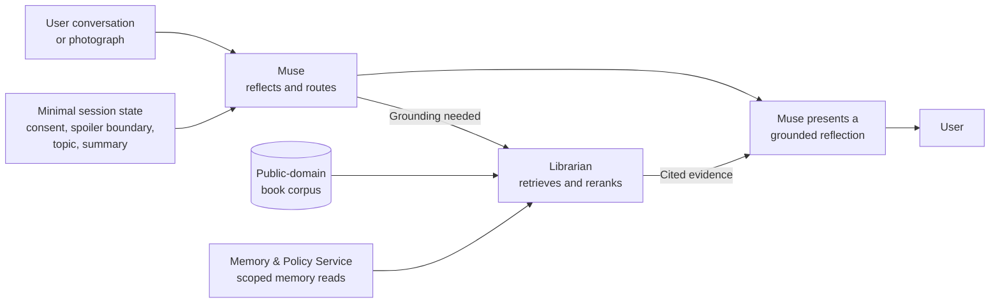
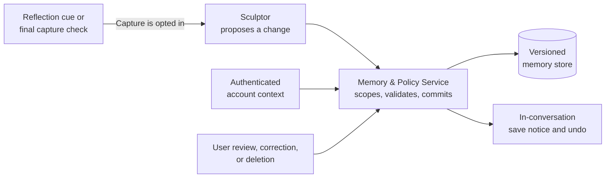
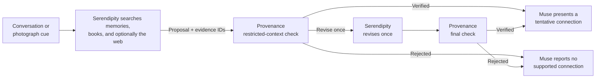

# Project Proposal - Linger: A Personal Reflection and Memory Companion

**Graduate Certificate in Architecting AI Systems - Practice Module**  
**Team:** _Team 9_  
**Date:** 2026-07-26

---

## 1. Project Title

**Linger** - an academic prototype of a personal reflection and memory companion, grounded initially in a small literary corpus. It helps a user articulate why an idea or experience mattered, preserve it as a structured memory, and later explore grounded, tentative connections across conversations, books, photographs, and evidence found through general web search.

## 2. Project Sponsor

Not applicable (self-sourced project idea).

## 3. Project Members

| Member | Name | Agent / component owned |
|---|---|---|
| 1 | _Member 1 (placeholder)_ | **Muse** - reflection-companion agent |
| 2 | _Member 2 (placeholder)_ | **Librarian** - retrieval-and-reranking agent |
| 3 | _Member 3 (placeholder)_ | **Sculptor** - memory-organisation agent |
| 4 | _Member 4 (placeholder)_ | **Serendipity** - connection agent |
| 5 | _Member 5 (placeholder)_ | **Provenance** - verifier agent |

Package ownership and the planned per-member effort allocation are shown in Section 7.

## 4. Overview

People retain fragments from books and everyday life: a passage, question, photograph, or personal interpretation. The pain points are concrete: highlights and notes accumulate in capture tools (Kindle, Readwise, Notion, photo rolls) but are rarely revisited; the *reason* a fragment mattered is lost because nothing prompts the user to articulate it at the moment of capture; and rediscovery depends on the user remembering to search for something they have, by definition, forgotten.

General-purpose AI agents (ChatGPT, Claude, OpenClaw, Hermes) already offer memory, image understanding, web search, and delegated tasks. Linger is not trying to be another general personal agent. It is a purpose-built reflection and memory application: a **provenance-first reflection companion** that keeps the user's words, source evidence, and generated interpretation distinct. It also checks evidence, privacy, and spoiler boundaries before showing the user a proposed connection.

The primary users are people who want to preserve the meaning behind an experience or idea, not merely the raw artefact.

The stakeholders are the end users; the project team, acting as system builder and prototype operator; and the hosted model and web-search providers on which the prototype depends. There is no external business sponsor.

### 4.1 User journey

Linger supports a continuous journey from reflection to rediscovery:

| Stage | User experience | How Linger helps |
|---|---|---|
| **1. Reflect** | The user talks with Muse or adds a photograph. | **Muse**, the reflection companion, maintains an ongoing conversation and asks useful follow-up questions. When books are discussed, it avoids introducing spoilers. |
| **2. Ground** | When grounding is useful, the user receives relevant, cited passages or memories, clearly separated from Muse's interpretation. | **Librarian** retrieves and reranks evidence across books and structured memories; Muse separates source evidence, the user's words, and generated interpretation. |
| **3. Preserve** | After onboarding opt-in, a useful memory is retained without interrupting the conversation for per-memory approval. | **Sculptor** automatically creates, structures, and organises the memory; the user may immediately undo or later review, edit, or delete it. |
| **4. Reconnect** | A conversation or photograph suggests a potentially meaningful connection. | Muse may hand the cue to **Serendipity**, which searches internal evidence and, when useful, performs a general web search. **Provenance** checks the proposed connection before it reaches the user. |

Automatic memory capture is available only after explicit onboarding opt-in and then runs without per-memory approval. Each captured memory is visibly disclosed in the conversation with an immediate undo control; users can pause capture or later review, edit, and delete memories. Content about sensitive traits is excluded from automatic capture and may be saved only through an explicit user action. Deletion cascades to derived summaries, links, embeddings, indexes, and application traces. Raw photographs remain transient unless the user chooses to save them, and derived memories are captured only while the opt-in remains active.

### 4.2 Agent roles

The prototype uses five agents with distinct reasoning responsibilities. Sculptor is the only agent permitted to request memory creation or updates; the Memory & Policy Service validates and commits those requests under deterministic application controls. User review, correction, and deletion actions go directly from the web interface to the service rather than through a model.

| Agent | Role in the journey | Key autonomous decisions | Tools Given |
|---|---|---|---|
| **Muse** | Maintains an ongoing reflection conversation across text and photographs while respecting spoiler boundaries when books are discussed. | Whether to ask a follow-up, request evidence, create a memory cue, invoke Serendipity, or report uncertainty. | Conversation state, image analysis, ask user, call Librarian, call Sculptor, call Serendipity |
| **Librarian** | Plans and executes retrieval across the book corpus and Sculptor-maintained memory store, returning reranked evidence with stable citations. | Which sources and retrieval strategy to use, how to formulate or expand the query, how to fuse and rerank candidates, and when evidence is sufficient. | Corpus search, scoped memory-query API, rerank |
| **Sculptor** | Automatically creates and maintains structured memories, preserving originals while improving their organisation for retrieval. | What to summarise, which memories are duplicates or related, how to group them, and when derived summaries should be refreshed. | Scoped memory search/create/update APIs, cluster |
| **Serendipity** | Responds to cues from Muse or photographs and proposes useful connections across memories, books, and general web search results. | Whether to search internally or on the web, what evidence to request, whether a connection is supportable, and how to revise against critique. | General web search, image analysis, call Librarian |
| **Provenance** | Verifies Serendipity's proposed connections in a separate invocation with restricted context before they reach the user. | Whether to accept, request revision, or reject based on attribution, grounding, privacy scope, and prompt-injection checks. | Read cited evidence, policy check, injection scan |

Five agents separate conversation, retrieval, memory curation, connection generation, and independent verification. Scoped hand-offs keep each invocation within a bounded task context; deterministic application code enforces access and writes.

## 5. General Flow

Working context contains only session essentials: capture consent, spoiler boundary, active topic, and a compact conversation summary. Long-term structured memories are retrieved only when needed rather than placed in every prompt.

An *active memory* is a memory record owned by the requesting account and not deleted. It may have been captured automatically while memory capture was enabled or saved explicitly by the user. Each memory is a structured record with fields for the user's own words, source citations, a generated summary, provenance links to the originating conversation or photograph, version metadata, and created/updated timestamps. Every write carries an idempotency key derived from its account, source event, and capture type so retries cannot create duplicates. Original user records remain immutable; a correction creates a linked active version, while derived summaries are versioned and replaceable.

The deterministic Memory & Policy Service obtains account identity from authenticated request context rather than agent or model output. It exposes scoped read, create, update, review, and delete operations and enforces account isolation and deletion on every request. Agents cannot choose or widen their access. Retrieved evidence carries its source type, owner or account scope, trust level, and verification state.

The end-to-end design comprises three related flows. A normal turn uses the reflection flow; memory capture and connection discovery run only when their respective conditions are met.

### 5.1 Reflection and grounding

Muse keeps the conversation coherent and asks Librarian for evidence only when grounding is needed.

### 5.2 Opt-in memory capture and control

Sculptor may propose a memory change, but deterministic application code owns access control and every write. The same path is used by the bounded final capture check before compaction or close.

### 5.3 Connection discovery and verification

Connection discovery is optional. A proposal reaches the user only after a separate restricted-context check, with at most one revision.

Six safeguards govern the flow:

- **Spoiler control:** the user states their position in the book at the start of each session; when unstated, Muse defaults to the most conservative boundary (no content beyond the opening), and pre-emptively asks which chapter the user has reached whenever it is unsure. Muse confirms this boundary before Librarian retrieves unfinished text.
- **Citation validation:** whenever an exact quotation is displayed or stored, application code verifies its text, source, and location against the corpus. Muse separates evidence from interpretation; Provenance additionally checks semantic support for proposed connections.
- **Memory control:** Sculptor captures and organises memories automatically, but preserves the original record and provenance. It may link, group, or summarise memories but cannot delete them; the user retains review, correction, and deletion controls. Before a long opted-in conversation is compacted or closed, one bounded Sculptor pass checks for an important uncaptured reflection under the same notice, undo, and sensitive-content rules.
- **Verification:** Provenance runs as a separate model invocation that receives only the proposed connection, cited evidence, and applicable policy constraints; it receives neither Serendipity's working context nor write tools. It may use the same underlying model. Rejection returns a structured critique for one bounded revision, and verified connections are presented through Muse.
- **Media handling:** raw photographs remain transient unless the user chooses to save them; derived memories may be captured automatically only while the user's memory opt-in remains active.
- **Emotional content:** Muse is a reflection companion, not a wellbeing tool. It never diagnoses or labels the user's mental state and stops reflective probing after a distressing disclosure. It uses a fixed boundary response encouraging appropriate human support; crisis assessment and resource routing are out of scope.

Orchestration follows an explicit **plan → act → check → refine** pattern implemented in application code. Agents coordinate through typed contracts carrying only the claims, evidence identifiers, confidence, and policy flags needed by the next step; full transcripts and unrestricted working context are not passed between agents. Each agent can respond to incomplete evidence or decline, and the policy service is application code, not an agent, so security guarantees never depend on model instructions.

## 6. Scope of Work

### 6.1 Prototype boundaries

The prototype accepts conversation and photographs as memory cues. Source-grounded book retrieval remains limited to 3–5 public-domain books from Project Gutenberg; Serendipity may also use general web search when looking for evidence supporting a connection.

- **In scope:** ongoing Muse conversations; photograph understanding; cited retrieval across the book corpus and structured memories using keyword, semantic, and hybrid strategies plus reranking; opt-in automatic memory capture; structured summaries, duplicate linking, topic grouping, and progressive disclosure through Sculptor; Serendipity connections triggered by conversations or new photographs, with general web search; request-specific spoiler filtering; quotation and citation validation; separate verification of connections; user-controlled review and deletion; adversarial tests; simple web UI; CI/CD and test deployment.
- **Stretch:** voice-note transcription as a third memory cue (including audio-borne injection tests); cross-book, memory-to-memory, and song-to-memory connections; comparing a revisited pairing with the earlier reflection; a synthetic exercise of an opt-in feedback pipeline.
- **Out of scope:** persistent reading-progress tracking; live music, photo-library, messaging, or social integrations; the full Gutenberg catalogue; copyrighted books or lyrics; music or copyrighted-audio analysis; production-scale or compliance claims; mental-health profiling or crisis-resource routing; any claim that telemetry measurably improved the system.

### 6.2 How the implementation demonstrates key considerations

| Consideration | Implementation |
|---|---|
| **Explainability & trust** | Exact book quotations and source locations carry inspectable citations; quotations, user statements, and generated interpretations are visually and structurally separated; connections are presented as hypotheses with visible uncertainty; workflow tracing records why each step happened. |
| **Responsible AI & governance** | Automatic memory capture requires explicit onboarding opt-in and remains visibly controllable through save notices, undo, pause, review, correction, and cascading deletion. Content about sensitive traits is excluded from automatic capture. Sculptor preserves originals and provenance when creating derived records, and raw photographs remain transient unless saved. In this personal-use setting, the small, older public-domain corpus and its dated cultural perspectives are disclosed rather than presented as neutral. Muse uses a fixed boundary response for distressing disclosures rather than attempting diagnosis or crisis assessment. Data minimisation and alignment with the IMDA Model AI Governance Framework remain in scope. |
| **Security** | Retrieved book text, general web-search results, and photographs are treated as untrusted input; each item carries source, ownership, trust, and verification metadata, and private memory text is never copied verbatim into a web-search query. Authenticated account identity is supplied by application code, never by an agent. Deterministic controls enforce access, cascading deletion, spoiler filters, and isolation **between user accounts**. The test deployment uses multiple accounts so cross-account retrieval is tested rather than merely asserted. Automated adversarial cases cover prompt injection, fabricated claims, spoiler leakage, forbidden memory requests, log leakage, and deleted-data retrieval. |
| **Agent autonomy & orchestration** | Explicit application-code orchestration implementing plan → act → check → refine: agents select tools, respond to incomplete evidence, decline unsafe actions, and coordinate through typed contracts carrying bounded, role-specific context. |
| **Controlled improvement** | Provenance returns structured critiques for bounded revision. Prompt changes remain human-reviewed, versioned, and gated by the CI evaluation suite; no improvement claim relies on prototype user telemetry. |
| **MLOps / LLMSecOps** | Versioned prompts, corpus builds, tool contracts, policies, and JSON/YAML evaluation cases; fast mocked contract tests in CI; separate live-model evaluation of quality, cost, and latency; and logs scrubbed of raw personal memories. The system is deployed to a reproducible test environment so user isolation, prompt-injection defences, forbidden memory requests, and deletion are exercised against a running system, not just unit tests. |

**Candidate stack (subject to team confirmation):** either TypeScript with Pi Agent Core, or Python with PydanticAI core and FastAPI, for the agent layer and backend; OpenAI Responses API for OpenAI model calls; lightweight web UI, Docker, and GitHub Actions CI/CD. The Responses API supports retained reasoning across tool calls and compaction for long-running conversations, while each agent retains a separate, bounded context.

### 6.3 Trade-offs and validation

| Question | Proposal |
|---|---|
| **Benefits and trade-offs** | Specialised agents improve separation of duties, traceability, context isolation, and independent verification, but add latency, cost, orchestration complexity, and new failure paths. The time-boxed prototype validates the multi-agent design directly rather than implementing a monolithic baseline. |
| **Scale** | The prototype targets up to five concurrent user sessions, not production scale. A basic load test will report success rate, p95 latency, and per-session model cost. |
| **Retrieval evaluation** | A fixed set of citation-labelled book and memory queries compares keyword, semantic, hybrid, and reranked retrieval using Recall@5 and nDCG@5. The same set tests whether Librarian's strategy selection improves relevance or latency over the strongest fixed approach. |
| **Memory-quality evaluation** | Seeded duplicate and noisy memories test Sculptor's linking and grouping precision and the resulting change in Recall@5 and nDCG@5. Every derived summary must remain traceable to its original memories, and Sculptor must never delete an original. |
| **Demo success criteria - safety** | A fixed 40-case set is defined before implementation as versioned JSON or YAML. Each case has one primary behaviour and records its inputs, expected outputs or evidence identifiers, and forbidden outputs as applicable: 15 safety/adversarial cases, 5 reflection cases, 5 memory-capture cases, 10 expected-connection cases, and 5 weak-evidence cases. Shared deterministic checks validate citations, evidence identifiers, and disclosure boundaries across the set. No cross-account, deleted, or post-boundary content may be revealed; every seeded text-, web-, or image-borne injection must be blocked or safely ignored; sensitive-trait content must never be captured automatically; and ambiguous spoiler boundaries must trigger clarification. |
| **Demo success criteria - quality** | Reflection cases define the expected action and acceptable follow-up intent; memory-capture cases define whether a memory should be saved and its required fields; expected-connection cases define acceptable target memory/source pairs; and weak-evidence cases require decline. The harness reports reflection-action accuracy, memory-capture precision and recall, target-connection hit rate, evidence recall, citation precision, exact-quotation accuracy, and weak-evidence decline rate. Success requires at least 80% reflection-action accuracy, at least 80% memory-capture precision and recall, at least 80% target-connection hits, at least 90% evidence recall, at least 95% citation precision, 100% exact-quotation accuracy, and at least 80% weak-evidence declines. Any LLM-as-judge score is secondary and explicitly labelled non-independent. |

## 7. Effort Estimates

The WBS below lists the top-level work packages, an accountable owner for each, and rough estimates in person-days. Each package will be broken into assignable tasks at kick-off, with actual effort tracked in the fortnightly progress reports. Owners (M1–M5) correspond to the members in Section 3; the owner is accountable for the package, not its sole contributor.

Guideline: 5 members × 15 person-days ≈ **75 person-days**. The core plan uses 70 person-days and reserves 5 for integration and evaluation risks; stretch items are excluded.

| # | WBS work package | Owner | Est. (person-days) |
|---|---|---|---|
| 1 | Corpus ingestion, indexes, and citation scheme (3–5 Gutenberg books) | M2 | 4 |
| 2 | Memory & policy service (opt-in automatic storage, isolation, review, deletion) + data model | M3 | 5 |
| 3 | Muse - reflection-companion agent (multi-turn dialogue, multimodal input routing, follow-ups, agent hand-offs) | M1 | 5 |
| 4 | Librarian - retrieval agent (book and memory retrieval, query planning, keyword/semantic/hybrid search, fusion, reranking) | M2 | 6 |
| 5 | Sculptor - memory-organisation agent (structured summaries, duplicate linking, grouping, progressive disclosure) | M3 | 5 |
| 6 | Serendipity - connection agent (conversation/photo cues, internal and web search, decline behaviour, revision loop) | M4 | 6 |
| 7 | Provenance - verifier agent (evidence, privacy, injection, and overreach checks; critiques) | M5 | 5 |
| 8 | **Orchestration & integration** (application-code orchestration, typed tool contracts, end-to-end flow, failure handling) | M1 | 6 |
| 9 | Security test suite & AI risk register (text-, web-, and image-borne injection, fabrication, cross-account access, deletion) | M5 | 5 |
| 10 | Evaluation harness: retrieval, reflection, memory, and connection-quality benchmarks, authored cases, quantitative scoring | M4 | 5 |
| 11 | Web UI for conversation, photograph, and memory-management flows | M3 | 4 |
| 12 | CI/CD, tracing, cost/latency measurement, test deployment | M2 | 4 |
| 13 | Group report, architecture and agent documentation, presentation | M5 (coordinator) | 4 |
| 14 | Individual reports (1.2 days per member × 5 members) | All members | 6 total |
| 15 | Contingency for integration and evaluation risks | M1 (coordinator) | 5 |
| | **Total** | | **75** |

The owner named above is accountable for a package, while implementation and review effort may be shared. The planned allocation reconciles the 75-person-day guideline:

| Member | Shared project work, integration, and contingency | Individual report | Planned total |
|---|---:|---:|---:|
| M1 | 13.8 | 1.2 | 15.0 |
| M2 | 13.8 | 1.2 | 15.0 |
| M3 | 13.8 | 1.2 | 15.0 |
| M4 | 13.8 | 1.2 | 15.0 |
| M5 | 13.8 | 1.2 | 15.0 |
| **Total** | **69.0** | **6.0** | **75.0** |

Effort will be tracked and reported in fortnightly progress reports per the module schedule (proposal due 31 Jul 26; project conduct 10 Aug – 9 Oct 26; presentations from 12 Oct 26; final reports 30 Oct 26).
