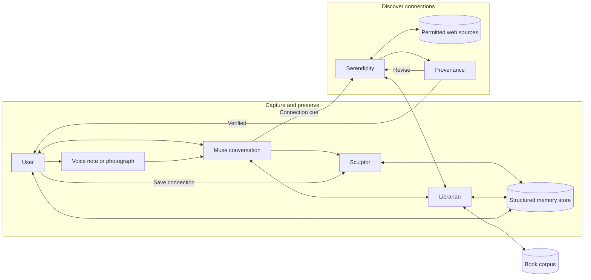

# Project Proposal - Linger: A Personal Reflection and Memory Companion

**Graduate Certificate in Architecting AI Systems - Practice Module**  
**Team:** _Team 9_  
**Date:** 2026-07-26

---

## 1. Project Title

**Linger** - an academic prototype of a personal reflection and memory companion, grounded initially in a small literary corpus. It helps a user articulate why an idea or experience mattered, preserve it as a structured memory, and later explore grounded, tentative connections across conversations, books, voice notes, photographs, and permitted web sources.

## 2. Project Sponsor

Not applicable (self-sourced project idea).

## 3. Project Members

| Member | Name | Agent / component owned |
|---|---|---|
| 1 | _Member 1 (placeholder)_ | **Muse** - reflection-companion agent |
| 2 | _Member 2 (placeholder)_ | **Librarian** - retrieval-and-reranking agent |
| 3 | _Member 3 (placeholder)_ | **Sculptor** - memory-organisation agent |
| 4 | _Member 4 (placeholder)_ | **Serendipity** - connection agent |
| 5 | _Member 5 (placeholder)_ | **Provenance** - verifier agent |

Each member's WBS is estimated in Section 7.

## 4. Overview

People retain fragments from books and everyday life: a passage, question, photograph, voice note, or personal interpretation. Existing tools can store these fragments, but do little to help a user articulate why they mattered, organise them over time, or rediscover their meaning later.

The primary users are people who want to preserve the meaning behind an experience or idea, not merely the raw artefact.

### 4.1 User journey

Linger supports a continuous journey from reflection to rediscovery:

| Stage | User experience | How Linger helps |
|---|---|---|
| **1. Reflect** | The user talks with Muse or adds a voice note or photograph. | **Muse**, the reflection companion, maintains an ongoing conversation and asks useful follow-up questions. When books are discussed, it avoids introducing spoilers. |
| **2. Ground** | The user explores why the fragment mattered and how it relates to existing memories or source material. | **Librarian** retrieves and reranks evidence across books and structured memories; Muse separates source evidence, the user's words, and generated interpretation. |
| **3. Preserve** | A useful memory is retained without interrupting the conversation for approval. | **Sculptor** automatically creates, structures, and organises the memory; the user may later review, edit, or delete it. |
| **4. Reconnect** | A conversation, voice note, or photograph suggests a potentially meaningful connection. | Muse may hand the cue to **Serendipity**, which searches internal evidence and, when useful, the web. **Provenance** checks the proposed connection before it reaches the user. |

Automatic memory capture is enabled by default and does not require per-memory approval. Users can review, edit, or delete memories at any time. Raw voice notes and photographs remain transient unless the user chooses to save them.

### 4.2 Agent roles

The prototype uses five agents with distinct reasoning responsibilities. The Memory & Policy Service performs storage, account isolation, and deletion under deterministic application controls.

| Agent | Role in the journey | Key autonomous decisions | Tools Given |
|---|---|---|---|
| **Muse** | Maintains an ongoing reflection conversation across text, voice notes, and photographs while respecting spoiler boundaries when books are discussed. | Whether to ask a follow-up, request evidence, create a memory cue, invoke Serendipity, or report uncertainty. | Read, write, speech-to-text, image analysis, ask user, call Librarian, call Serendipity |
| **Librarian** | Plans and executes retrieval across the book corpus and Sculptor-maintained memory store, returning reranked evidence with stable citations. | Which sources and retrieval strategy to use, how to formulate or expand the query, how to fuse and rerank candidates, and when evidence is sufficient. | Read, keyword search, vector search, rerank |
| **Sculptor** | Automatically creates and maintains structured memories, preserving originals while improving their organisation for retrieval. | What to summarise, which memories are duplicates or related, how to group them, and when derived summaries should be refreshed. | Read, write, memory search, cluster |
| **Serendipity** | Responds to cues from Muse, voice notes, or photographs and proposes useful connections across memories, books, and permitted web sources. | Whether to search internally or on the web, what evidence to request, whether a connection is supportable, and how to revise against critique. | Read, web search, image analysis, speech-to-text, call Librarian |
| **Provenance** | Independently verifies Serendipity's proposed connections before they reach the user. | Whether to accept, request revision, or reject based on attribution, grounding, privacy scope, and prompt-injection checks. | Read, grep, policy check, injection scan |

## 5. General Flow

An *active memory* is an automatically captured memory owned by the requesting account and not deleted. The deterministic Memory & Policy Service enforces account isolation and deletion on every read; agents cannot widen their own access.

Four safeguards govern the flow:

- **Spoiler control:** Muse confirms a conservative boundary before Librarian retrieves unfinished text.
- **Memory control:** Sculptor captures and organises memories automatically, but preserves the original record and provenance. It may link, group, or summarise memories but cannot delete them; the user retains review, correction, and deletion controls.
- **Verification:** Provenance independently checks each proposed connection; rejection returns a structured critique to Serendipity for bounded revision.
- **Media handling:** raw voice notes and photographs remain transient unless the user chooses to save them; derived memories may still be captured automatically.

Orchestration follows a graph-based **plan → act → check → refine** pattern: agents coordinate through typed tool contracts and structured inputs/outputs, each agent can respond to incomplete evidence or decline, and the policy service is application code, not an agent, so security guarantees never depend on model instructions.

## 6. Scope of Work

### 6.1 Prototype boundaries

The prototype accepts conversation, voice notes, and photographs as memory cues. Source-grounded book retrieval remains limited to 3–5 public-domain books from Project Gutenberg; Serendipity may also use permitted web sources when searching for a connection.

- **In scope:** ongoing Muse conversations; voice-note transcription and photograph understanding; cited retrieval across the book corpus and structured memories using keyword, semantic, and hybrid strategies plus reranking; automatic memory capture; structured summaries, duplicate linking, topic grouping, and progressive disclosure through Sculptor; Serendipity connections triggered by conversations or new media, with permitted web search; request-specific spoiler filtering; citation validation and independent verification of connections; user-controlled review and deletion; adversarial tests; a single-agent baseline; simple web UI; CI/CD and test deployment.
- **Stretch:** cross-book, memory-to-memory, and song-to-memory connections; comparing a revisited pairing with the earlier reflection; a synthetic exercise of an opt-in feedback pipeline.
- **Out of scope:** persistent reading-progress tracking; live music, photo-library, messaging, or social integrations; the full Gutenberg catalogue; copyrighted books or lyrics; music or copyrighted-audio analysis; production-scale or compliance claims; mental-health profiling; any claim that telemetry measurably improved the system.

### 6.2 How the implementation demonstrates key considerations

| Consideration | Implementation |
|---|---|
| **Explainability & trust** | Book quotations and factual source claims carry inspectable citations; quotations, user statements, and generated interpretations are visually and structurally separated; connections are presented as hypotheses with visible uncertainty; workflow tracing records why each step happened. |
| **Responsible AI & governance** | Automatic memory capture is enabled by default and clearly disclosed; users can inspect, correct, or delete memories at any time. Sculptor preserves original records and provenance when creating summaries or groupings. Raw voice notes and photographs remain transient unless saved. Data minimisation, sensitive-trait restrictions, documented source limitations, and alignment with the IMDA Model AI Governance Framework remain in scope. |
| **Security** | Retrieved book text, web content, voice notes, and photographs are treated as untrusted input; deterministic application code enforces access control, deletion, spoiler filters, and isolation **between user accounts**. The test deployment uses multiple accounts so cross-account retrieval is tested rather than merely asserted. Automated adversarial cases cover prompt injection, fabricated claims, spoiler leakage, forbidden memory requests, log leakage, and deleted-data retrieval. |
| **Agent autonomy & orchestration** | Graph-based orchestration implementing plan → act → check → refine: agents select tools, respond to incomplete evidence, decline unsafe actions, and coordinate through typed contracts. The same evaluation cases run against a single-agent baseline to quantify any quality and traceability gains against added latency and cost. |
| **Controlled improvement** | Provenance returns structured critiques for bounded revision. Prompt changes remain human-reviewed, versioned, and gated by the CI evaluation suite; no improvement claim relies on prototype user telemetry. |
| **MLOps / LLMSecOps** | Versioned prompts, corpus builds, tool contracts, and policies; automated contract, retrieval, security, and end-to-end tests in CI/CD; cost and latency measurement; logs scrubbed of raw personal memories. The system is deployed to a reproducible test environment so user isolation, prompt-injection defences, forbidden memory requests, and deletion are exercised against a running system, not just unit tests. |

**Proposed stack (subject to team confirmation):** Python, LangGraph for orchestration, a hosted LLM API, FastAPI backend, lightweight web UI, Docker, GitHub Actions CI/CD.

### 6.3 Trade-offs and validation

| Question | Proposal |
|---|---|
| **Benefits and trade-offs** | Specialised agents improve separation of duties, traceability, and independent verification, but add latency, cost, orchestration complexity, and new failure paths. The single-agent baseline will test whether the added complexity is justified. |
| **Scale** | The prototype targets up to five concurrent user sessions, not production scale. A basic load test will report success rate, p95 latency, and per-session model cost. |
| **Retrieval evaluation** | A fixed set of citation-labelled book and memory queries compares keyword, semantic, hybrid, and reranked retrieval using Recall@5 and nDCG@5. The same set tests whether Librarian's strategy selection improves relevance or latency over the strongest fixed approach. |
| **Memory-quality evaluation** | Seeded duplicate and noisy memories test Sculptor's linking and grouping precision and the resulting change in Recall@5 and nDCG@5. Every derived summary must remain traceable to its original memories, and Sculptor must never delete an original. |
| **Demo success criteria - safety** | A fixed 60-case set is defined before implementation: 20 safety/adversarial cases, 30 expected-connection cases, and 10 weak-evidence cases. All quotations and web claims must match their cited source; no cross-account, deleted, or post-boundary content may be revealed; and every seeded text-, web-, image-, or audio-borne injection must be blocked or safely ignored. Ambiguous spoiler boundaries must trigger clarification. |
| **Demo success criteria - quality** | On held-out connection cases spanning conversation handoffs, voice notes, and photographs, two independent human raters score grounding, relevance, tentativeness, and non-triviality on a four-point rubric. At least 80% of expected-connection cases must score 3 or 4 for both grounding and relevance; at least 80% of deliberately weak-evidence cases must be declined. Inter-rater agreement is reported, and the single-agent baseline uses the same cases and rubric. |

## 7. Effort Estimates

The WBS below lists the top-level work packages, an accountable owner for each, and rough estimates in person-days. Each package will be broken into assignable tasks at kick-off, with actual effort tracked in the fortnightly progress reports. Owners (M1–M5) correspond to the members in Section 3; the owner is accountable for the package, not its sole contributor.

Guideline: 5 members × 15 person-days ≈ **75 person-days**. The core plan uses 70 person-days and reserves 5 for integration and evaluation risks; stretch items are excluded.

| # | WBS work package | Owner | Est. (person-days) |
|---|---|---|---|
| 1 | Corpus ingestion, indexes, and citation scheme (3–5 Gutenberg books) | M2 | 4 |
| 2 | Memory & policy service (automatic storage, isolation, review, deletion) + data model | M3 | 5 |
| 3 | Muse - reflection-companion agent (multi-turn dialogue, multimodal input routing, follow-ups, agent hand-offs) | M1 | 5 |
| 4 | Librarian - retrieval agent (book and memory retrieval, query planning, keyword/semantic/hybrid search, fusion, reranking) | M2 | 6 |
| 5 | Sculptor - memory-organisation agent (structured summaries, duplicate linking, grouping, progressive disclosure) | M3 | 5 |
| 6 | Serendipity - connection agent (conversation/voice/photo cues, internal and web search, decline behaviour, revision loop) | M4 | 6 |
| 7 | Provenance - verifier agent (evidence, privacy, injection, and overreach checks; critiques) | M5 | 5 |
| 8 | **Orchestration & integration** (LangGraph graph assembly, typed tool contracts, end-to-end flow, failure handling) | M1 | 6 |
| 9 | Security test suite & AI risk register (text, web, image-, and audio-borne injection, fabrication, cross-account access, deletion) | M5 | 5 |
| 10 | Evaluation harness: retrieval and memory-quality benchmarks, authored cases, quality rubric, single-agent baseline | M4 | 5 |
| 11 | Web UI for conversation, voice-note, photograph, and memory-management flows | M3 | 4 |
| 12 | CI/CD, tracing, cost/latency measurement, test deployment | M2 | 4 |
| 13 | Group report, architecture and agent documentation, presentation | M5 (coordinator) | 4 |
| 14 | Individual reports | Each member | 6 |
| 15 | Contingency for integration and evaluation risks | M1 (coordinator) | 5 |
| | **Total** | | **75** |

Effort will be tracked and reported in fortnightly progress reports per the module schedule (proposal due 31 Jul 26; project conduct 10 Aug – 9 Oct 26; presentations from 12 Oct 26; final reports 30 Oct 26).
